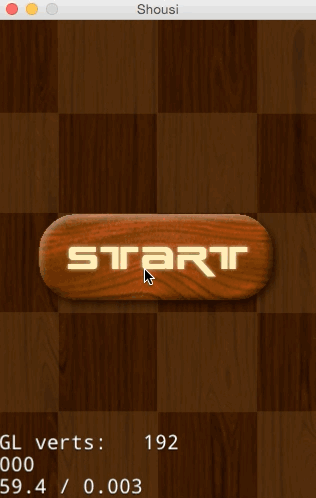

# 3.5 场景转换

##概述

在前面的章节，我们创建了带开始按钮的StartScene场景和不断下落的Sushi精灵PlayScene场景。如何把两个场景串联起来，更加生动的切换场景？接下来，我将展示如何实现场景的转换。

##基础知识

Cocos2d-JS游戏中游戏界面以场景Scene为单位，每个场景中都设定了一定的主题，包括背景、精灵以及场景规则，将不同的Scene联系起来就组成了游戏全局。一般来讲，游戏在不同场景之间切换时，为了避免游戏的切换看起来特别生硬或突兀，程序设计者们往往需要在切换时加入一定的过渡衔接效果。那么如何在场景间实现华丽丽的切换呢？

这就需要了解一个新的概念，导演（Director）。

一款游戏好比一部电影，它们的基本原理都是一样的，只是游戏具有更强的交互性，所以Cocos2d-JS中把统筹游戏大局的类抽象为导演类（Director）。导演类是游戏的组织者和领导者，是整个游戏的导航仪、总指挥。游戏开始和结束时都需要调用Director的方法来完成游戏初始化或销毁工作。

Director负责控制游戏场景的切换。在Director中常用的替换场景的方法有三个：

- pushScene 终止正在运行的场景，把它放到暂停场景的堆栈（内存）中去，新的场景将被执行。由于将场景放置内存中，场景并没有release。  
- popScene 将经过pushScene的场景从堆栈（内存）中pop出来执行（前提是堆栈内存中存在场景），而当前执行的场景将被删除。  
- replaceScene 用一个新的场景去替换掉正在运行的场景，正在运行的场景将被终止。    

pushScene和popScene这两个方法用来在不释放旧场景内存下运行新的场景，它旨在加快场景交替的速度。不过这里有个令人头疼的问题：如果新、旧场景对内存的需求都不大，可以共享内存，那么无论如何它们切换起来都很快;但如果这两个场景都非常复杂，加载起来很慢，那么使用pushScene和popScene以后，这两个场景会互相争夺宝贵的内存资源，内存使用很快就会达到一个非常危险的级别。

所以这里需要注意的就是，使用pushScene()时，我们应尽量避免将一个大的场景压入堆栈以减少内存的占用。通常情况下常使用的是replaceScene()方法。


##场景切换

在main.js,将StartScene作为我们初始化运行的场景，代码如下：

```
	cc.LoaderScene.preload(g_resources, function () {
    	cc.director.runScene(new PlayScene());
    }, this);
```

在StartScene的开始菜单按钮的响应函数中加入场景切换代码。点击开始按钮切换场景进入到我们的PlayScene。代码如下：

```
	var startItem = new cc.MenuItemImage(
			res.Start_N_png,
			res.Start_S_png,
			function () {
				cc.log("Menu is clicked!");
				cc.director.replaceScene( cc.TransitionPageTurn(1, new PlayScene(), false) );
			}, this);
```

`cc.director`用来获取导演单例实体，`cc.TransitionPageTurn`创建了一个翻页效果的场景切换动画，当然你也可以不使用转场动画。直接传入`new SecondScene()`。

Cocos2d-JS中场景之间通过TransitionScene系列类来实现过渡跳转的效果。TransitionScene继承于Scene，该系列类主要是与场景切换特效相关的一些使用类。如TransitionFadeDown、TransitionPageTurn、TransitionJumpZoom等等。

> 注意：转场动画需要小心浏览器的兼容性。比如翻页效果就在浏览器上不支持

点击运行可以看到下面的效果。

