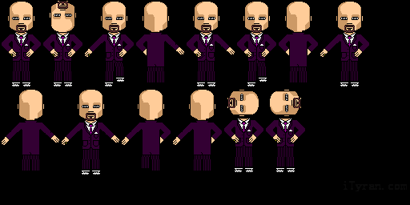

# 序列帧动画 Flipbook Animations #

## 帧动画

你可以通过多张图片文件来创建一个动画，比如:

```
	CCAnimation *animation = CCAnimation::create();
	
	// load image file from local file system to CCSpriteFrame, then add into CCAnimation
	for (int i = 1; i < 15; i++)
	{
		char szImageFileName[128] = {0};
		sprintf(szImageFileName, "Images/grossini_dance_%02d.png", i);
		animation->addSpriteFrameWithFileName(szImageFileName);  
	}
```
注意CCAnimation是由sprite frame帧组、单个frame延时，持续时间等组成的，它是一组”数据”. 而CCAnimate是一个action，它是基于CCAnimation对象创建的。

## 序列帧动画 Sprite Sheet Animation


尽管帧动画是非常易于理解的,但事实上，它在真实游戏项目中是非常少用到的.相反，sprite sheet animation是2D动画中最常见的解决方案.


下面是一个典型的sprite sheet.它是动画中的一连串sprite frames，或者是可以在一个场景中用到的一组图片. 



在OpenGL ES 1.1时代，sprite sheets被广泛使用是得益于:

减少文件I/O时间.加载一个大的sprite sheet文件比加载多个小文件要快得多.

 
- 减少内存消耗.OpenGL ES 1.1仅可用2幂次方大小的texture（通常为 2,4,864,128,256,512,1024,…的宽高）.换言之，如果宽高比较小的话，OpenGL ES 1.1甚至为每个texture分配2幂次方大小内存.所以使用成组的 sprite sheet图片会减少内存碎片.

- 减少 OpenGL ES 调用方法绘制，加速渲染.

Cocos2d-x v2.0已更新，是基于OpenGL ES 2.0的.OpenGL ES 2.0不再为textures分配2的幂次方内存块，但减少文件系统I/O和绘图调用时间的好处仍然是有效的.


那该如何动画呢？正如我们看到的，sprite sheet与动画没有的必然关系.但考虑到上面这些益处，sprite sheet是有效的.在cocos2d中有很多种不同的方法来创建sprite sheet.

## Creating from .png and .plist file

在Cocos2d-x 0.x和1.x版本中，CCSpriteSheet便是为此目的而生的.而CCSpriteBatchNode在v2.0版本之后替换了CCSpriteSheet

CCSpriteBatchNode对象包含了所有sprite frames中用到的真实图片texture.你必须在场景中添加它，甚至它自身什么都不用画;它只需要放到那里，这样它就成了rendering pipeline的组成部分.比如:

```
	CCSpriteBatchNode* spritebatch = CCSpriteBatchNode::create("animations/grossini.png");
```

接下来，你需要使用CCSpriteFrameCache单例对象来保存frame名字如何对应到frame bounds——
也就是，sprite sheet中的矩形区域.例如:

```
	CCSpriteFrameCache* cache = CCSpriteFrameCache::sharedSpriteFrameCache(); cache->addSpriteFramesWithFile("animations/grossini.plist");
```

一旦你的sprite sheet和frames已经加载完毕，并且sprite sheet已经增加到场景中了，你可以通过这些frame创建sprite，使用 “createWithSpriteFrameName” 方法，把它添加为sprite sheet的子对象:

```
	m_pSprite1 = CCSprite::createWithSpriteFrameName("grossini_dance_01.png"); spritebatch->addChild(m_pSprite1); addChild(spritebatch);
```

createWithSpriteFrameName方法会查找相应坐标和grossini.plist中定义的矩形，接着”裁剪”texture grossini.png到sprite frame.


现在，我们需要创建CCArray对象，增加动画中的所有frame到此对象中。在这个动画例子中，我们知道这14个frame都有一模一样的尺寸,所以我们使用了嵌套循环来迭代，当我们完成增加第14个frame的时候中断循环.

```
	CCArray* animFrames = CCArray::createWithCapacity(15);
	 
	char str[100] = {0};
	
	for(int i = 1; i < 15; i++)
	{
	sprintf(str, "grossini_dance_%02d.png", i);
	CCSpriteFrame* frame = cache->spriteFrameByName( str );
	animFrames->addObject(frame);
	}
```

最后，我们需要创建CCAnimate动作实例，该实例能在CCSprite对像上运作.下面，我们还将CCAnimate动作封装到CCRepeatForever动作中，此动作正是你所需要的:重复动画,像这样:

```
	CCAnimation* animation = CCAnimation::createWithSpriteFrames(animFrames, 0.3f);
	m_pSprite1->runAction( CCRepeatForever::create( CCAnimate::create(animation) ) );
```

CCAnimationCache 可以加载xml/plist文件，此文件可以非常好的描述批量node,sprite frame names和它们的矩形. 这个接口更简单易用.

```
	CCAnimationCache *cache = CCAnimationCache::sharedAnimationCache(); // "caches" are always singletons in cocos2d
	cache->addAnimationsWithFile("animations/animations-2.plist");
	CCAnimation animation = cache->animationByName("dance_1"); // I apologize for this method name, it should be getAnimationByName(..) in future versions
	CCAnimate animate = CCAnimate::create(animation); // Don't confused between CCAnimation and CCAnimate :)
	sprite->runAction(animate);
```

简单易用吧？哈哈


标签：`Animations` `Cocos2d-x官方文档` `动画` 