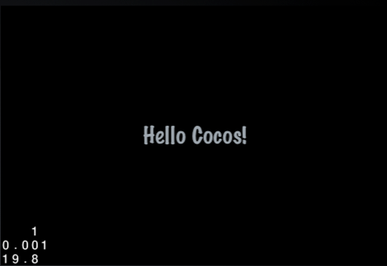
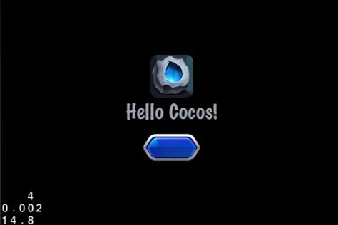

# GUI System

## Introduction

It was difficult to design complex UI before GUI system was introduced. Even if you can design specific UI for specific kind of game, such as MMORPG, still you can't reach your expectation because of abundant of UI. We can design a GUI system ourselves, but it's a huge program to pursue. Now Cocos2d-x has its own solution-GUI system. Let's get started.

## GUI Widgets

Let's take a glance of these widgets in following list. Details about these widgets will be shown later.

Name                                   | Description                                  | Name                                 | Description
--------------------|---------------------------------|-------------------|----------------------------
**UIWidget**            | Base of all the GUI elements      | UILoadingBar  | Loading prograss bar
**UILayout**            | Layer widget and basic container | UIScrollView  | Scrolling view
**UIRootWidget**        | Root widget                       | UIListView    | List view
UIButton                | Button                            | UISlider      | Slider bar
UICheckBox              | Check box                         | UITextField   | Text field
UIImageView             | Image display                     | UILabelBMFont | Image label
UILabel                 | Character label                   | UIPageView    | Page view
**UIHelper**            | Help class                        | UILabelAtlas  | Atlas label 
**UILayer**             | Layer

## Usage of General Widgets

### Let's get started with Hello Cocos

Every element in GUI system is a **UIWidget** element and UIWidget is inherited from cocos2d::Object. Although UIWidget element can build a tree structure, however, it's independent of the structure created by Node. These two structure can be linked by **UILayer**, which is inherited from Layer class. And Layer is also a Node, there is a **UIRootWidget** inside, every UIWidget added to UILayer will be a UIWidget in the top-level to build GUI. Now you can see "Hello Cocos!" in the center of the scene by following code:

```
    auto size = Director::getInstance()->getWinSize();
    
    auto uLabel = UILabel::create();
    uLabel->setText("Hello Cocos!");
    uLabel->setFontName("Marker Felt");
    uLabel->setFontSize(30);
    uLabel->setColor(Color3B(159, 168, 176));
    uLabel->setPosition(Point(size.width / 2, size.height / 2));

    auto uLayer = UILayer::create();
    uLayer->addWidget(uLabel);
    addChild(uLayer);

```



Note: UILayer can manage current running scene and UI widgets, but it is impracticable to add a UILabel to a running Node because of type mismatch.

In addition, UILabel has other properties:

General properties and Methods             | Description 
--------------------------------------------|--------------------
setText(const std::string& text)            | Setting of display text label
getStringValue()                            | Get displayed text
getStringLength()                           | Get the length of string(Chinese character is more than English's, in iOS is 3)
setFontName(const std::string& name)        | Set font
setFontSize(int size)                       | Set the size of font
setScale(float fScale)                      | Set the scale factor
setAnchorPoint(const cocos2d::Point &pt)    | Set the position of the anchor
setTouchEnabled(bool enable)                | Enable the touch
setTouchScaleChangeEnabled(bool enable)     | Enable zoom when touch(enable touch is required)

UILabel usually used for display static text, but you can also get the same function by adding `addTouchEventListener`.

### Usage of UIButton

The code below shown a UILabel and then we'll add a UIButton. When touch the UIButton the content of the UILabel will be changed:

``` c++
    auto uButton = UIButton::create();
    uButton->setTouchEnabled(true);
    uButton->loadTextures("cocosgui/animationbuttonnormal.png", "cocosgui/animationbuttonpressed.png", "");
    uButton->setPosition(Point(size.width / 2, size.height / 2) + Point(0, -50));
    uButton->addTouchEventListener(this, toucheventselector(HelloWorld::touchEvent));
    uLayer->addWidget(uButton);

```

We used `addTouchEventListener` to add touch event callback function. _lbl is a private variable and the reference of the UILabel. The implementation of `touchEvent` in the following code will show you how it listens the every status of the button(such as click, move, end touch and cancel touch):

``` c++
    void HelloWorld::touchEvent(Object *pSender, TouchEventType type)
    {
        switch (type)
        {
            case gui::TOUCH_EVENT_BEGAN:
                _lbl->setText("UIButton Click.");
                break;
            case gui::TOUCH_EVENT_MOVED:
                // TODO
                break;
            case gui::TOUCH_EVENT_ENDED:
                // TODO
                break;
            case gui::TOUCH_EVENT_CANCELED:
                // TODO
                break;
            default:
                // TODO
                break;
        }
    }
    
```


General properties and methods             | Description
--------------------------------------------|-------------------------
setTouchEnabled(bool enable)                | Enable touch, default is unenabled
loadTextures(const char* normal,const char* selected,const char* disabled,TextureResType texType = UI_TEX_TYPE_LOCAL); | Loading button image resource, such as normal status, pressed status and unenabled status.
setPosition(const Point &pos)       | Set widget's position
addTouchEventListener(Object *target, SEL_TouchEvent selector)  | Set button's callback function

Note: Some widgets can not enable touch, such as UILabel and UIImageView, however, UIButton and UIScrollView has to enable `setTouchEnabled`, and this function is inherited from UIWidget.

### General properties and Usages of UIImageView

To enrich the UI we added a image display widget-UIImageView, as following code:

```
    UIImageView *imageView = UIImageView::create();
    imageView->loadTexture("cocosgui/ccicon.png");
    imageView->setPosition(Point(size.width / 2, size.height / 2) + Point(0, 50));
    uLayer->addWidget(imageView);
```




General properties and methods             | Description
--------------------------------------------|-------------------------
loadTexture(const char* fileName,TextureResType texType = UI_TEX_TYPE_LOCAL);       | The method of image display widget loading image resource
setTextureRect(const Rect& rect)            | Set image's rectangle area
setScale9Enabled(bool able)                 | Enable Scale9 image

## Import resource from CocoStudio

We've got the basic steps to use widgets by the contents we've mentioned above. First we need a **UILayer** to be the container of the UI, then adding other widgets into it. In the meantime, set some general properties such as click when you need interaction actions. If the widgets are not too much we can easily manage it, however, when the UI widgets are too much to control it maybe a trouble. So we introduce a new way to load UI resource by CocoStudio.

What are the advantages of using CocoStudio? CocoStudio UI editor allows you preview the result you just designed by every widgets in the editor. It saves you much time to code for the widgets properties because you can set them in the editor. For example, you can set UIImageView display image, set UILabel display text, set button image for UIButton and enable touch. It's efficient to use CocoStudio and GUI lib together.

## Load GUI Resource

Now we use the method provided by `cocostudio::GUIReader` loading UI widgets from json file:

``` c++
    UILayer* m_pLayer = UILayer::create();
    addChild(m_pLayer);
    
    UILayout* m_pLayout = dynamic_cast<UILayout*>(cocostudio::GUIReader::shareReader()->widgetFromJsonFile("cocosgui/UITest/UITest.json"));

    m_pLayer->addWidget(m_pLayout);

    UILabel* m_pSceneTitle = dynamic_cast<UILabel*>(m_pLayer->getWidgetByName("UItest"));

```

Note: The UI resource loaded by the loader are UILayer. As mentioned before, UILayer is required if you want to add UI resource to a scene. Create a UILayer object first, then add the resource from UI json file to this UILayer, otherwise, resource can not be displayed. UILayer is a bridge, which link the UI widgets and scene.

Note: The UITest.json file here is generated by CocoStudio UI editor, usually we don't change the content to change every property. You can find more details about how to use CocoStudio from CocoStudio document.

**UITest.json** file contains all the defines of UI, layout of UI and every setting of properties. When GUIReader loaded resource, corresponding widgets can be created and fill their properties. By using CocoStudio UI editor saves a lot of coding work.

### UI Resource Using Procedure

As discussed, the first resource you got from UI resource is a UILayer resource, and it's the Panel widget in CocoStudio. It always be the root widget of UI widget for layout work. We can add button, label, text box, image and scrollview, etc to Panel. Also, it's possible to add a Panel as sub-area to a Panel. This json file is a dictionary data structure, which "key" stores the property name and "value" stores the value. There is no concern about the implementation of the GUIReader.

When UILayout added to UILayer, we can use `m_pLayer->getWidgetByName("UItest")` to get an existing widget in UI resource from UILayer. **Note: The getWidgetByName() method here belongs to UILayer rather than UILayout**. Remember UILayout is just one kind of widget, however, UILayer is the bridge that
linked game scene and UI. By the way, all the UI widgets can be got by UILayer. All the widgets in a UILayer are supposed to get from UILayer by `getWidgetByName()` and `getWidgetByTag()` method.
