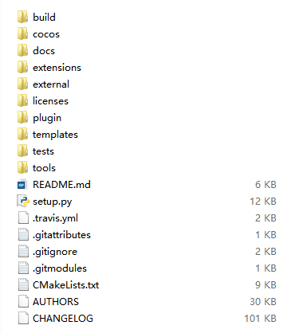
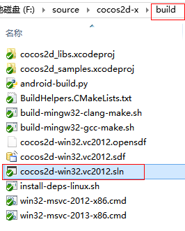
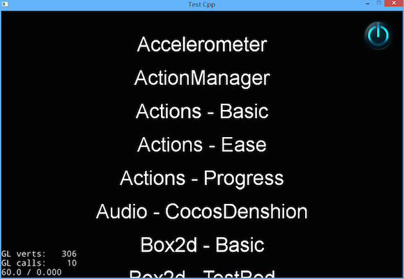
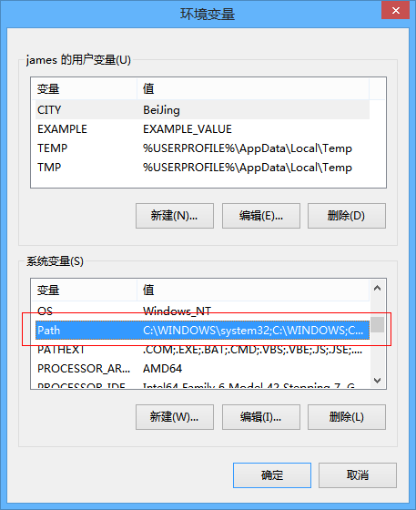
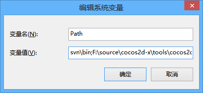
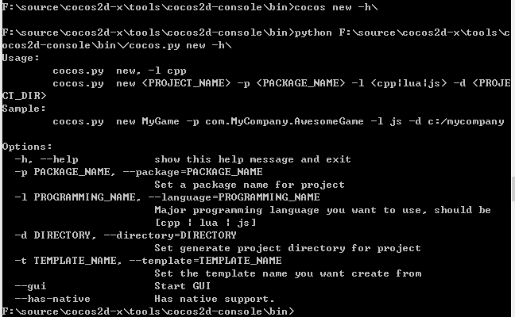
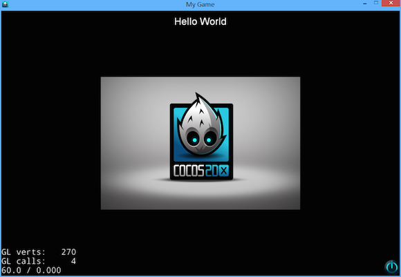

# Win32でcpp-testsを実行する方法

この記事では、あなたのPC上でcpp-testsを実行する方法を紹介します。

## 環境要件

- Cocos2D-X バージョン: Cocos2d-x v3.0 ([https://github.com/cocos2d/cocos2d-x/](https://github.com/cocos2d/cocos2d-x/ "cocos2d-x"))

- IDE: Visual Studio 2012

- 依存関係: python 2.7

## TestCppプロジェクトのコンパイルと実行

- こちらの[ダウンロードページ](http://cocos2d-x.org/download)からCocos2d-xのダウンロードして、あなたの作業ディレクトリに解凍します。ディレクトリの構造は次のようになります

- 以下のように「build」フォルダ内の「cocos2d-win32.vc2012.sln」　ファイルを開く

- 「TestCpp」プロジェクトを右クリックし、「スタートアッププロジェクトに設定」を選択。次にコンパイルを
することでTestCppプロジェクトを実行することができます。ここのはスクリーンショットです

##  空のプロジェクトを作成する方法

### 前提条件

初めに、次のステップを完了するためには「Python2.7」をダウンロードしてインストールする必要があり
ます。

その後は、パスを追加する必要があります。追加するパスは "[Cocos2d-x root]\tools\cocos2d-console\bin\" です。
";"を区切り文字として、お使いのシステム環境パスに追加することを忘れないでください。
例えば、私の場合、"F:\source\cocos2d-x\tools\cocos2d-console\bin"をパスの最後に追加します。
私のbinパスは次の通りです

（注：[Cocos2d-x root]はあなたがダウンロードしたCocos2d-xのパッケージの解凍パスです）

 
binパスを現在のパスに変更し、コマンドプロンプトを開く, そこで"cocos -h"と入力し、ヘルプメッセージが出れば、正しく環境変数の追加ができました。これで"cocos2d-console"を使用してプロジェクトを作成することができます。

"cocos new -h"と入力することで次の結果が得られます。

この時間は、空のプロジェクトを作っている時間です。

 例えば私がｃｐｐプロジェクトを作成したいとき、次のように入力します。"cocos new MyGame -p com.MyCompany.AwesomeGame -l cpp -d F:/MyProject". このコマンドは、F:/MyProjectディレクトリの下にプロジェクトを作成します。ここのはスクリーンショットです。

### コンパイルし、空のプロジェクトを実行する

proj.win32フォルダのMyGames.slnを開く。 Ctrl-F5を押すことで、コンパイルし、プロジェクトを実行します。あなたはすべてのエラーなしでコンパイルして実行した場合は、次のような結果が得られます。

