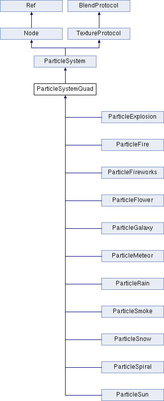
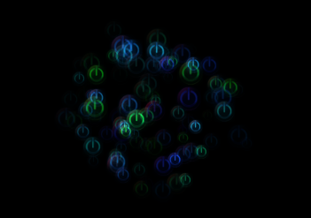

# 粒子系统

## 简介
粒子系统是指计算机图形学中模拟特定现象的技术，它在模仿自然现象、物理现象及空间扭曲上具备得天独厚的优势，为我们实现一些真实自然而又带有随机性的特效（如爆炸、烟花、水流）提供了方便。Cocos2d-x引擎中就为我们提供了强大的粒子系统，以下是粒子系统的继承关系图：


 
## 粒子属性

一个强大的粒子系统它必然具备了多种多样的属性，这样才能配置出多样的粒子。下面就来看看粒子系统的主要属性吧。

### 主要属性：

- _duration				发射器生存时间，即它可以发射粒子的时间，注意这个时间和粒子生存时间不同。单位秒，-1表示永远；粒子发射结束后可点击工具栏的播放按钮再次发射
- _emissionRate			每秒喷发的粒子数目
- _emitterMode			喷发器模式，有重力模式（GRAVITY）和半径模式（RADIUS，也叫放射模式）两种
- _totalParticles		场景中存在的最大粒子数目，往往与_emissionRate配合起来使用
- _isAutoRemoveOnFinish	粒子结束时是否自动删除

### 重力模式（modeA）：
顾名思义，重力模式模拟重力，可让粒子围绕一个中心点移近或移远，它的优点是非常动态，而且移动有规则。下列各属性只在重力模式下起作用。

- gravity			重力X
- radiaAccel		粒子径向加速度，即平行于重力方向的加速度
- radiaAccelVar		粒子径向加速度变化范围
- speed				速度
- speedVar			速度变化范围
- tangentialAccel		粒子切向加速度，即垂直于重力方向的加速度
- tangentialAccelVar	粒子切向加速度变化范围

### 半径模式（modeB）：
半径模式可以使粒子以圆圈方式旋转，它也可以创造螺旋效果让粒子急速前进或后退。下列各属性只在半径模式下起作用。

- endRadius 			结束半径
- endRadiusVar 		结束半径变化范围，即结束半径值的范围在 （endRadius - endRadiusVar） 和 （endRadius + endRadiusVar ）之间，下面类似。
- rotatePerSecond		粒子每秒围绕起始点的旋转角度
- rotatePerSecondVar	粒子每秒围绕起始点的旋转角度变化范围
- startRadius			初始半径
- startRadiusVar		初始半径变化范围
-  
### 生命属性：

- _life				粒子生命，即粒子的生存时间 
- _lifeVar			粒子生命变化范围
 
### 大小属性：

- _endSize				粒子结束时的大小，-1表示和初始大小一致
- _endSizeVar			粒子结束大小的变化范围
- _startSize			粒子的初始大小
- _startSizeVar			粒子初始大小的变化范围
  
### 角度属性：

- _angle				粒子角度
- _angleVar				粒子角度变化范围
  
### 颜色属性：

- _endColor				粒子结束颜色
- _endColorVar			粒子结束颜色变化范围
- _startColor			粒子初始颜色
- _startColorVar		粒子初始颜色变化范围

如果你不想编辑出五颜六色的粒子效果，那应该把_endColorVar，_startColorVar尽量设置为（0, 0, 0, 0)。

### 位置属性:

- _positionType			粒子位置类型，有自由模式（FREE）、相对模式（RELATIVE）和打组模式（GROUPED）三种
- _posVar				发射器位置的变化范围（横向和纵向）
- _sourcePosition		发射器原始坐标位置
  
Free自由模式，相对于屏幕自由，不会随粒子节点移动而移动（可产生火焰、蒸汽等效果）；Relative相对模式，相对于被绑定的Node静止，粒子发射器会随Node移动而移动，可用于制作移动角色身上的特效等等；Grouped打组模式是相对于发射点的，粒子随发射器移动而移动。


### 自旋属性：

- _endSpin			粒子结束自旋角度
- _endSpinVar			粒子结束自旋角度变化范围
- _startSpin			粒子开始自旋角度
- _startSpinVar		粒子开始自旋角度变化范围
   
### 纹理渲染属性:

- _texture			粒子贴图纹理
- _blendFunc		纹理的混合模式方法，有DISABLE、ALPHA_PREMULTIPLIED、ALPHA_NON_PREMULTIPLIED、ADDITIVE四种类型。

DISABLE = {GL_ONE, GL_ZERO};         
ALPHA_PREMULTIPLIED = {GL_ONE, GL_ONE_MINUS_SRC_ALPHA};          
ALPHA_NON_PREMULTIPLIED = {GL_SRC_ALPHA, GL_ONE_MINUS_SRC_ALPHA};         
ADDITIVE = {GL_SRC_ALPHA, GL_ONE};         

- GL_ZERO：      表示使用0.0作为因子，实际上相当于不使用这种颜色参与混合运算。
- GL_ONE：       表示使用1.0作为因子，实际上相当于完全的使用了这种颜色参与混合运算。
- GL_SRC_ALPHA：表示使用源颜色的alpha值来作为因子。
- GL_DST_ALPHA：表示使用目标颜色的alpha值来作为因子。
- GL_ONE_MINUS_SRC_ALPHA：表示用1.0减去源颜色的alpha值来作为因子。
- GL_ONE_MINUS_DST_ALPHA：表示用1.0减去目标颜色的alpha值来作为因子。

Cocos2dx使用OpenGL混合原理对图形进行渲染绘制。混合就是指把两种颜色混在一起，具体一点就是把某一像素位置原来的颜色和将要画上去的颜色，通过某种方式混在一起，从而实现特殊的效果。它是一种常用的技巧，通常可以用来实现半透明，你也可以通过不同的设置得到不同的混合结果，产生一些有趣或者奇怪的图象。

## ParticleBatchNode

ParticleBatchNode 和批处理节点一样，它将通过一次调用OpenGL来绘制它的子节点。
ParticleBatchNode 实例可以引用一个且只能引用一个 texture 的对象。
只有 ParticleSystem 包含 texture 的时候它才可以被添加到SpriteBatchNode中。 
所有添加到SpriteBatchNode里面的ParticleSystem都会在同一OpenGL ES调用里面被绘制. 
如果 ParticleSystem 没有被添加到ParticleBatchNode中，那么OpenGL ES会调用每个粒子系统的绘图函数，这样做效率会很低。

局限性: 

- 目前只支持 ParticleSystemQuad  
- 所有的系统都使用相同的参数被绘制：混合函数、纹理等

最为有效的用法 

- 为所有粒子系统初始化ParticleBatchNode纹理和足够的容量
- 初始化所有粒子系统，并将其添加为批处理节点的子节点

## 程序中的应用

创建一个粒子系统，同时初始化它的粒子总数：

```
auto _emitter = ParticleSystemQuad::createWithTotalParticles(50);
```
ParticleSystemQuad是粒子系统的一种，早前的Cocos2d-x版本中，粒子系统是有两种类型的，既：ParticleSystemQuad 和 ParticleSystemPoint（现已被移除）。

例子：

```
	auto _emitter = ParticleSystemQuad::createWithTotalParticles(50);
	addChild(_emitter, 10);
	_emitter->setTexture(Director::getInstance()->getTextureCache()->addImage("CloseNormal.png"));
	_emitter->setAnchorPoint(Point(0, 0));
	// duration
	_emitter->setDuration(ParticleSystem::DURATION_INFINITY);
	
	// radius mode
	_emitter->setEmitterMode(ParticleSystem::Mode::RADIUS);

	// radius mode: start and end radius in pixels
	_emitter->setStartRadius(4);
	_emitter->setStartRadiusVar(1);
	_emitter->setEndRadius(ParticleSystem::START_RADIUS_EQUAL_TO_END_RADIUS);
	_emitter->setEndRadiusVar(0);
	
	// radius mode: degrees per second
	_emitter->setRotatePerSecond(100);
	_emitter->setRotatePerSecondVar(0);
	
	// angle
	_emitter->setAngle(90);
	_emitter->setAngleVar(0);
	
	// emitter position
	auto size = Director::getInstance()->getWinSize();
	_emitter->setPosVar(Point::ZERO);
	
	// life of particles
	_emitter->setLife(0.5);
	_emitter->setLifeVar(0);
	
	// spin of particles
	_emitter->setStartSpin(0);
	_emitter->setStartSpinVar(0);
	_emitter->setEndSpin(0);
	_emitter->setEndSpinVar(0);
	
	// color of particles
	Color4F startColor(0.0f, 0.8f, 0.9f, 1.0f);
	_emitter->setStartColor(startColor);
	
	Color4F startColorVar(0, 0, 0, 1.0f);
	_emitter->setStartColorVar(startColorVar);
	
	Color4F endColor(1.0f, 1.0f, 1.0f, 0.1f);
	_emitter->setEndColor(endColor);
	
	Color4F endColorVar(0, 0, 0, 0.1f);
	_emitter->setEndColorVar(endColorVar);
	
	// size, in pixels
	_emitter->setStartSize(20);
	_emitter->setStartSizeVar(1);
	_emitter->setEndSize(0);
	
	// emits per second
	_emitter->setEmissionRate(_emitter->getTotalParticles() / _emitter->getLife());

	// additive
	_emitter->setBlendAdditive(false);
	
	//addChild(_emitter);
	_emitter->setPosition(Point(200,200));
```
效果图：

   