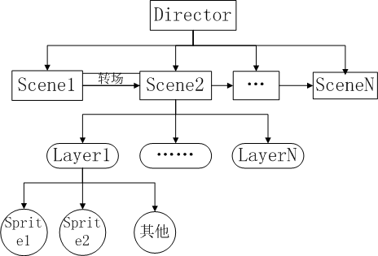

# 2.2.1 新建文件

游戏项目中可以创建多种类型的文件，这些文件共同构成一个完整游戏所需的资源。Cocos Studio提供了场景、图层、节点、合图四种文件类型，您可以在新建文件时选择文件类型。

官方示例项目中图标样式为 均是Cocos Studio文件，均可通过下列方式创建这类文件。

 
文件名称：您为此文件设置的名称，作为存储、查找的标志。文件名支持英文及其字符，但不包括\ / : * ? “ < > |；

类型：点击选择需要创建的文件类型；

描述：对文件类型的描述性说明；

大小：文件被创建后的画布大小，图层文件可编辑修改，其他文件不可设置。

####场景文件
场景是Cocos2d-x中必不可少的元素，可用来创建关卡、菜单等。游戏里关卡、版块的切换也就是一个一个场景的切换，就像在电影中变换舞台和场地一样。

场景的一个重要作用就是控制流程，因此需要新建多个场景来一步步完成游戏制作。

场景文件就是存储场景的文件，您可以在场景文件中存储独立的场景，便于复用。

####图层文件
图层通常包含直接在屏幕上呈现的内容，我们需要在图层中加入精灵、文本标签或、其他游戏元素，并设置这些元素的属性，如位置、方向和大小以及设置游戏元素的动作等。

通常，图层中的对象功能类似，耦合较紧，与图层中游戏内容相关的逻辑代码也编写在图层中，在组织好图层后，只需要把图层按照顺序添加到场景中就可以显示出来了。对于场景而言，通常我们添加的节点就是图层，先添加的图层会被置于后添加的图层之下。图层可以包含任何节点作为子节点。

图层文件就是存储图层的文件，可以在其他项目、其他文件中引用。

####节点文件
节点是场景图的基本元素，场景图的元素必须是节点对象或者是节点对象的子类。节点有以下主要特点：

可以包含其他节点对象；

可以设置定期回调；

可以执行一些操作。

节点文件用来存储节点，可以在其他类型文件中复用。

####合图文件
将多个碎图合成为一张大图的操作称为合图操作，合成的.plist文件称为合图。
	
在游戏开发过程中会用到非常多图片资源，无论导入还是导出这些资源都会影响速度。合图功能可以将多个图片合成为一张，从而大幅提升加载、导出时的运行效率。
	
合图文件就是存储合图的文件。建议您的合图小于1024*1024，很多设备对大于这个尺寸图片的读取很耗损性能。

####该如何选择文件类型
	
熟悉Cocos的用户应该了解，在Cocos2d-x引擎中采用节点树形结构来管理游戏对象，一个游戏可以划分为不同的场景，一个场景又可以分为不同的层，一个层又可以拥有任意个可见的游戏节点。

每一个时刻都有一个场景在独立运行，通过切换不同的场景来完成一个游戏流程，游戏流程的管理由Director来执行，其基本框架类图如下。

 
因此，您可以依据下列规则进行选择（仅作为一种方式）：
当需要改变改变游戏主体功能时使用场景文件，如登陆界面、主界面、战斗界面。

当需要改变呈现内容，但不改变操作时使用图层文件，如人物属性，物品背包，应用商店，技能学习等。

当资源需要重复利用或无法通过简单控件来实现时使用节点文件，如人物，菜单栏，状态栏等。

当需要将众多零散的图片合并成一张大图时使用合图文件，如一个人物的所有图片。
