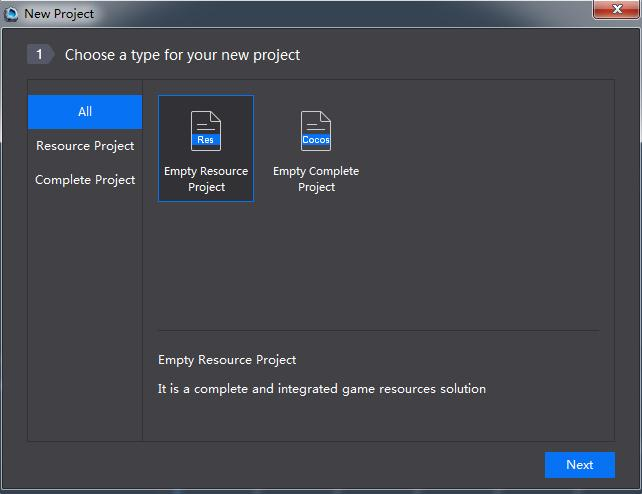
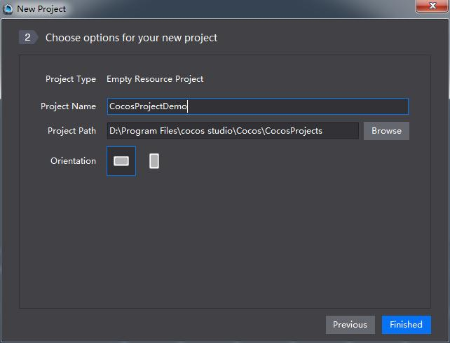
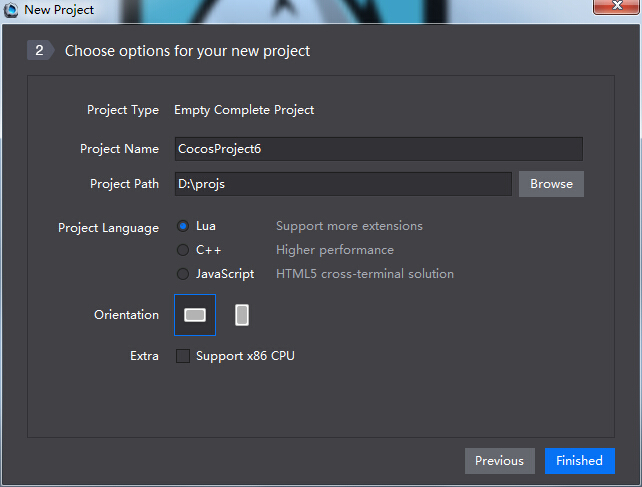

# 3.2.1 第一步：新建游戏项目

####项目

项目是一个将包含场景、图层、节点、合图、资源等文件组织起来的工程。Cocos Studio中可以创建包含源代码的项目也可以创建不包含源代码的项目。

####新建项目

新建Cocos项目有两种方式。

（1）启动Cocos后点击新建Cocos项目。

（2）启动Cocos Studio后，通过菜单“文件-新建项目”进行新建。

新建Cocos项目时需要选择新建项目的类型，“空白资源项目”和“空白完整项目”。

（1）空白资源项目是一套基本的游戏资源解决方案，提供部分部分Cocos Studio基础功能。

选择新建空白资源项目类型，下一步设置项目名称、路径与画布方向后，点击“完成”，即可新建一个Cocos项目。

 

（2）空白完整项目是一套完整的游戏解决方案，依托Cocos Studio的强大功能，配合Cocos Framework和IDE，从项目创建到游戏发布，一气呵成。

选择新建空白完整项目类型，下一步设置项目名称、路径与项目语言（包括C++、Lua、JavaScript）等后，点击完成，即可创建一个既包含游戏界面，也包含游戏源代码的工程，当然在创建这些工程后还是需要相应的工具来进行源代码的编写，Cocos Studio将使界面编辑到代码编辑的流程更加通顺流畅。

 

在新建好的项目中您可以制作游戏中需要使用的各种资源，从启动界面到注册登录，从游戏主场景到战斗场景，从装备背包到人物动画均可在Cocos Studio中轻松实现，并最终输出游戏资源给编程人员。

###目录结构

 
其中cocosstudio文件夹放置您项目中使用的所有资源

XXX.ccs文件为项目的启动文件，双击该文件可以开启您的项目

XXX.cfg文件为项目配置文件，用于管理您的项目配置信息

其他文件为Cocos2d-x代码项目文件，如果您想使用编写代码的IDE启动您的项目，您可以访问projects文件夹下的文件找到对应IDE的启动项来启动您的项目。
