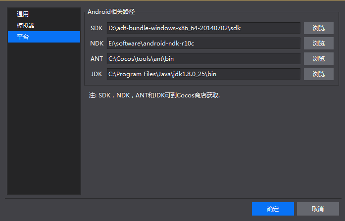
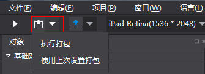
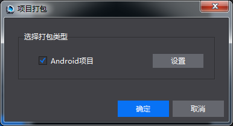
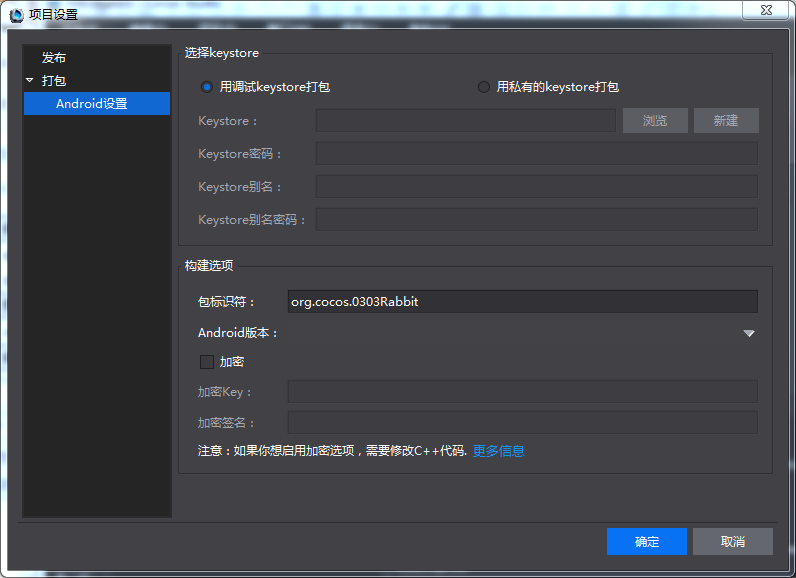
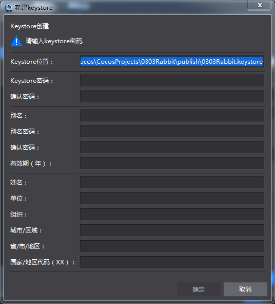
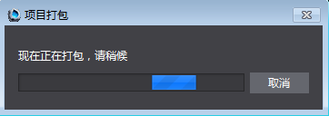
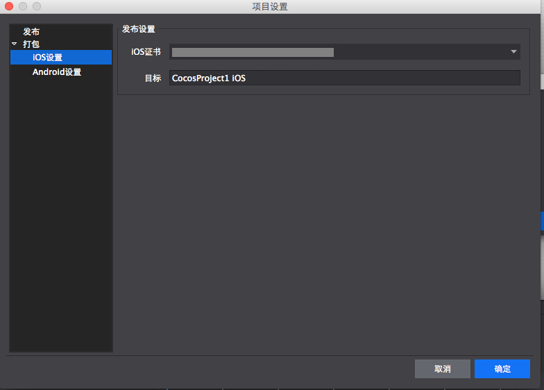
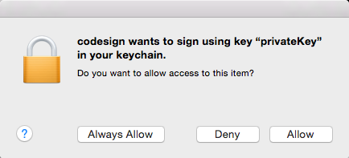

#3.2.6.2 打包游戏项目

Win32平台可以进行Android项目打包，Mac平台可以进行Android项目和iOS项目的打包。下面分别描述两个平台的打包流程。

Win32平台的打包
=======

Win32平台可以进行Android项目打包，步骤如下。

1、环境配置

从Cocos Store下载并安装Android SDK、NDK r10c、JDK、Cocos Framework。

在Cocos Studio菜单栏-编辑-偏好设置-平台 进行配置，配置路径如下图所示：

注: CocosFrameworks中包含Ant

2、打包设置

点击工具栏的打包按钮或菜单栏-项目的“执行打包”，弹出打包设置窗口，点击设置，可进行相关设置后执行打包；点击“使用上次的设置打包”，则直接使用上次的设置执行打包。

执行打包前，可使用调试Keystore，也可新建私有Keystore文件。

如果是新建出的Keystore，此处会自动填写新建时的相关校验信息（密码，别名，别名密码）。如果是通过浏览选择的Keystore，此处需要手动填写校验信息，如果和Keystore文件中信息不符，则接下来打包会失败。 

3、确认执行打包，出现打包状态窗口。

4、执行打包时，输出栏会实时输出打包的过程信息，并最后提示项目打包成功/失败。

Mac平台的打包
=======

Mac平台可以进行Android项目和iOS项目的打包。

Mac平台需要先去苹果官方申请开发者证书，并设置XCODE。

Mac平台的Android打包设置和iOS打包设置与Win32平台类似，下面简述iOS打包的不同之处。

1、在Cocosstudio的iOS打包设置中，将IOS证书状态修改至如图所示：

2、在打包过程中如果出现如图对话框，选择Always Allow

