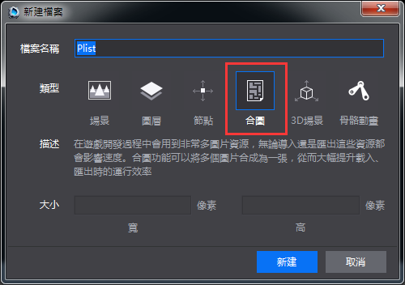
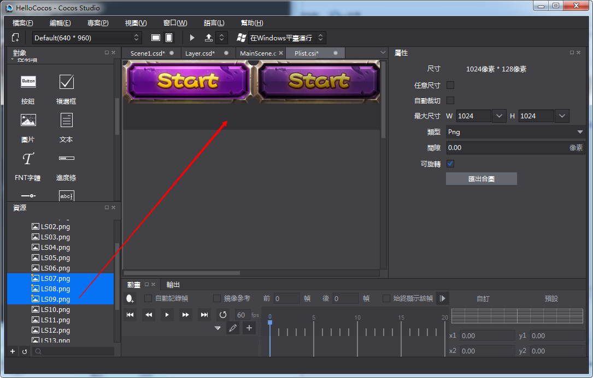
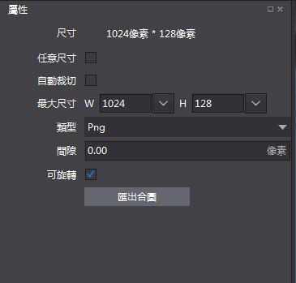

#製作合圖

1、新建合圖

&emsp;&emsp;新建合圖檔可以通過三種方式：

&emsp;&emsp;1）在工具列點擊新建檔圖示
 
 

&emsp;&emsp;2）在彈出新建檔視窗後，選擇“合圖”，點擊新建按鈕；
 

 

&emsp;&emsp;3）在資源面板取圖片資源，拖拽至畫布面板。目前僅圖片類型（.png和.jpg）資源。如下圖：

 

&emsp;&emsp;4）可通過屬性面板修改合圖類型檔的屬性，如下圖：

 
 
&emsp;&emsp;尺寸：當前合圖的尺寸，該屬性隨其他屬性改變而改變。

&emsp;&emsp;任意尺寸：勾選後合圖的尺寸會根據素材的實際佔用尺寸為准，不勾選的話，尺寸僅支援2的N次冪的尺寸。

&emsp;&emsp;自動裁切：勾選後，會自動將合圖的邊緣進行裁切，保證合圖尺寸最小化.

&emsp;&emsp;最大尺寸：合圖允許的最大尺寸，如果素材過多，超過了合圖的最大尺寸，那麼多餘的素材將會被排除在合圖內。

&emsp;&emsp;類型：生成合圖檔的圖片類型，目前支援png、jpg類型。

&emsp;&emsp;間隙：素材和素材之間的間隙，該屬性可以避免素材重疊。

&emsp;&emsp;可旋轉：勾選後，素材會根據演算法要求，自動旋轉至最佳角度參與合圖。

&emsp;&emsp;匯出合圖：可以匯出已經編輯好的合圖，輸出plist和png。
