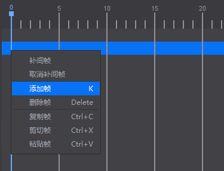

# 添加关键帧
&emsp;&emsp;首先介绍概念：帧——动画中最小单位的单幅影像画面，相当于电影胶片上的每一格镜头。在Cocos Studio的时间轴上帧表现为一刻度。关键帧——相当于二维动画中的原画，指角色或者物体运动或变化中的关键动作所处的那一帧。

&emsp;何时应该添加关键帧 

&emsp;我们以“脚印”这个动作为例，来说明如何创建关键帧。

&emsp;1.首先我们要添加四个脚印，将它们放置在合理的初始位置。

&emsp;2.实现脚印走的过程，需要四个脚印交替出现并消失，那么假设脚印出现到消失需要10帧，那么我们便可以为第一个脚印在第0帧和第10帧设置关键帧，第二个在第10帧和第20帧设置，以此类推。为什么同一空间要设置两个关键帧？原因在于要制作脚印从出现逐渐消失的动画，需要首尾两个关键帧来实现。

&emsp;添加关键帧

&emsp;关键帧记录的是运动或变化的关键动作，设置好关键帧的状态对动画制作至关重要。添加关键帧有四种方式：

&emsp;(1)在时间轴的刻度线上按下鼠标右键，选择“添加帧”来添加：

&emsp;&emsp;&emsp;

&emsp;(2) 点击“添加帧”按钮。

&emsp;&emsp;&emsp;

&emsp;(3) 在时间轴的刻度线上按下鼠标左键，按下键盘按键K键，添加关键帧。

&emsp;(4) 使用自动记录帧功能。

&emsp;&emsp;&emsp;

&emsp;自动记录帧

&emsp;Cocos Studio提供了一种便捷记录关键帧的方式：自动记录帧。当您勾选了这个选项时，移动刻度线至所需的位置，调整控件直到理想效果，系统将会在此刻度线上为您所有改变状态的控件和属性记录关键帧。

在使用自动记录帧时，有一点需要注意：一定要先移动刻度线至所需的位置，再改变控件的状态。

&emsp;编辑关键帧 

&emsp;您可以对单个关键帧进行以下操作：左右移动、复制、剪切、粘贴、删除。 您也可以选择多个帧进行上述操作。