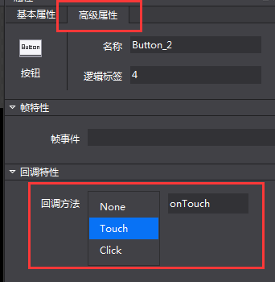

# **回檔特性** #

現在可以直接在編輯器裡邊指定某個控制項的事件的處理函數。 
不再需要一個一個去get控制項啦。也不再需要因為修改了控制項名或者其他屬性後，就得去改程式了。 
以下分別提供C++、Lua如何使用callback方法。

C++：

1，在編輯器點擊根節點，如下圖：

   
  
2，在高級屬性->回檔特性->自訂類 添加類名，比如MyClass，如圖：

   

3，選中想要設置回檔特性的控制項，進入高級屬性->回檔特性->回檔方法，選擇接受的回檔類型以及輸入回檔方法名稱：
如：Touch方法，名稱為onTouch： 

   

4，在C++中，創建一個自己的自訂類：

這個類必須遵循如下要求： 

a.繼承WidgetCallBackHandlerProtocol和Node(或其他繼承自Node的類) 

b.重寫如下介面： 

      onLocateTouchCallback 
      onLocateClickCallback 
      onLocateEventCallback 

返回對Touch、Click、Event三種事件的處理函數。（可以只重寫你使用到的回檔類型）。 

如： //.h file 

    #ifndef __TestCpp__MyClass__ 
    #define __TestCpp__MyClass__ 
    #include "cocos2d.h" 
    #include "cocostudio/CocoStudio.h" 
    #include "cocostudio/WidgetCallBackHandlerProtocol.h" 
    class MyClass : public cocos2d::Node, public cocostudio::WidgetCallBackHandlerProtocol 
    { 
    public: 
        CREATE_FUNC(MyClass) 
        MyClass(); 
        virtual cocos2d::ui::Widget::ccWidgetTouchCallback 
        onLocateTouchCallback(const std::string &callBackName); 
        virtual cocos2d::ui::Widget::ccWidgetClickCallback 
        onLocateClickCallback(const std::string &callBackName); 
        virtual cocos2d::ui::Widget::ccWidgetEventCallback 
        onLocateEventCallback(const std::string &callBackName); 
        void onTouch(cocos2d::Ref* sender, cocos2d::ui::Widget::TouchEventType type); 
        void onClick(cocos2d::Ref* sender); 
        void onEvent(cocos2d::Ref* sender, int eventType); 
     private: 
        std::vector<std::string> _touchTypes; 
        std::string _click; 
        std::vector<std::string> _eventTypes; 
    }; 
    //.cpp file 
    #include "MyClass.h" 
    #include "ui/UIText.h" 
    
    USING_NS_CC; 
    using namespace std; 
    using namespace cocos2d::ui; 
    
    MyClass::MyClass() 
    {} 
    
    Widget::ccWidgetTouchCallback MyClass::onLocateTouchCallback(const string &callBackName) 
    { 
        if (callBackName == "onTouch")//判斷事件名，返回對應的函數。下同 
        { 
            return CC_CALLBACK_2(MyClass::onTouch, this); 
        } 
        return nullptr; 
    } 
    
    Widget::ccWidgetClickCallback MyClass::onLocateClickCallback(const string &callBackName) 
    { 
        if (callBackName == "onClick") 
        { 
            return CC_CALLBACK_1(MyClass::onClick, this); 
        } 
        return nullptr; 
    } 
    
    Widget::ccWidgetEventCallback MyClass::onLocateEventCallback(const string &callBackName) 
    { 
        if (callBackName == "onEvent") 
        { 
            return CC_CALLBACK_2(MyClass::onEvent, this); 
        } 
        return nullptr; 
    } 
    
    void MyClass::onTouch(cocos2d::Ref* object, cocos2d::ui::Widget::TouchEventType type) 
    { 
        CCLOG("onTouch"); 
    } 
    
    void MyClass::onClick(cocos2d::Ref* sender) 
    { 
        CCLOG("onClick"); 
    } 
    
    void MyClass::onEvent(cocos2d::Ref* sender, int eventType) 
    { 
        CCLOG("onEvent"); 
    } 

4，為第3步編寫的類創建工廠類：

        這個類必須繼承cocostudio::NodeReader，並重寫如下三個介面 
       getInstance —— 返回工廠類的單例 
     purge —— 銷毀工廠類 
     createNodeWithFlatBuffers —— 創建第3步編寫的類，並調用setPropsWithFlatBuffers 
如： 
   
   //.h file 
   
    #ifndef __cocos2d_libs__MyClassReader__
    #define __cocos2d_libs__MyClassReader__

    #include "cocos2d.h"
    #include "cocostudio/CocosStudioExport.h"
    #include "cocostudio/WidgetReader/NodeReader/NodeReader.h"

    class MyClassReader : public cocostudio::NodeReader
    {       
    public:
        MyClassReader() {};
        ~MyClassReader() {};   
        static MyClassReader* getInstance();
        static void purge();
        cocos2d::Node* createNodeWithFlatBuffers(const flatbuffers::Table* nodeOptions);
    };

    #endif /*defined(__cocos2d_libs__MyClassReader__) */ 

    //.cpp file
    #include "MyClassReader.h"
    #include "MyClass.h"

    USING_NS_CC;
    
    static MyClassReader* _instanceMyClassReader = nullptr;
    MyClassReader* MyClassReader::getInstance()
    {
        if (!_instanceMyClassReader)
        {
            _instanceMyClassReader = new MyClassReader();
        }
        return _instanceMyClassReader;
    }

    void MyClassReader::purge()
    {
        CC_SAFE_DELETE(_instanceMyClassReader);
    }

    Node* MyClassReader::createNodeWithFlatBuffers(const flatbuffers::Table *nodeOptions)
    {
        MyClass* node = MyClass::create();
        setPropsWithFlatBuffers(node, nodeOptions);
        return node;
    } 

5，在載入節點之前註冊這個介面到CSLoader中
  
    CSLoader* instance = CSLoader::getInstance();
    //注意第一個參數必須是第一步填寫的自訂類名加“Reader ”如上述的"MyClassReader" 
    instance->registReaderObject("MyClassReader",(ObjectFactory::Instance)MyClassReader::getInstance);

6，使用CreateNode載入你的節點，因為你的自訂類的create已經委託給工廠類，只要你註冊工廠類的時候沒寫錯，工廠類會在createNode裡邊create你的自訂類並調用onLocateTouchCallback，onLocateClickCallback，onLocateEventCallback實現代碼回檔與編輯器的綁定。 

Lua：
   參考啟動器教程頁《Cocos如何綁定Lua自訂類》。
