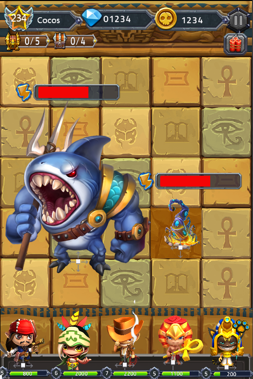
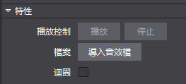

#基礎物件：
###1.地圖控制項：
 

&emsp;&emsp;地圖控制項可支援導入Tiled地圖編輯器匯出的tmx格式檔，地圖是製作遊戲關卡地形圖的控制項，對於即時戰略類型遊戲的製作，為了使玩家流暢的切換遊戲畫面，經常會使用超過螢幕尺寸的地圖。如果選擇使用不用的背景圖片切換場景，不僅造成資源浪費，載入速度也會變的很慢。

&emsp;&emsp;地圖控制項很好的解決了這一問題：採用瓦片地圖的形式。一張大的背景圖由幾種地形表示，每種地形對應一張小圖片，即瓦片，把這些瓦片拼接起來，就組成了一個完成的地圖。對一些不同地形的場景切換時，只需載入瓦片，大大提升效率。

&emsp;&emsp;使用場景

&emsp;&emsp;在官方示例的戰鬥場景中，我們使用了地圖控制項作為背景，即節約了資源，又提升了效率：

 
&emsp;&emsp;場景1：導入並使用地圖檔。

&emsp;&emsp;您可以為地圖控制項導入特定效果的檔(TMX檔)：

&emsp;&emsp;從資源面板拖動tmx檔至地圖控制項 特性-〉檔，鬆開滑鼠即實現檔導入；

&emsp;&emsp;在屬性面板的“特性”中，點擊“導入地圖檔”按鈕，選擇檔導入；

&emsp;&emsp;在畫布中選中地圖控制項右鍵選擇“設置地圖檔”，選擇檔導入。
    
###2.粒子

&emsp;&emsp;粒子是帶有隨機性特效的控制項，是電腦圖形學中類比特定現象的技術實現：如爆炸、煙花、水流等效果。在遊戲製作時，粒子可以製造酷炫的效果，使場景表現更豐富。

&emsp;&emsp;粒子控制項可支援導入Particle Designer匯出的plist文件。

&emsp;&emsp;使用場景。

&emsp;&emsp;為了增加顯示效果，遊戲中很多細節都會使用粒子效果，在官方示例中，我們就在顯示金幣和鑽石的位置，使用了粒子效果，以突出它們：
 

&emsp;&emsp;場景1：導入並使用粒子。

&emsp;&emsp;您可以為粒子導入特定效果的檔(plist檔)：

&emsp;&emsp;(1) 從資源面板拖動檔至粒子控制項 特性-〉檔，鬆開滑鼠即實現檔導入； 

&emsp;&emsp;(2) 在屬性面板的“特性”中，點擊“導入粒子檔”按鈕，選擇檔導入；

&emsp;&emsp;(3) 在畫布中選中粒子控制項右鍵選擇“設置粒子檔”，選擇檔導入。

###3.聲音

 
&emsp;&emsp;聲音是控制音樂與音效的控制項。在遊戲製作時，聲音對表現效果有至關重要的作用。Cocos Studio聲音控制項支援mp3、wav兩種格式的音效檔。

使用場景：

&emsp;&emsp;在官方示例的勝利介面中，我們使用了聲音控制項來作為勝利的音效，您可以獲取官方示例進行查看
 

&emsp;&emsp;場景1：導入文件

&emsp;&emsp;您可以為聲音導入特定效果的檔(mp3/wav檔)：

&emsp;&emsp;.    從資源面板拖動檔至聲音控制項 特性-〉檔，鬆開滑鼠即實現檔導入；

&emsp;&emsp;.    在屬性面板的“特性”中，點擊“導入音效檔”按鈕，選擇檔導入；

&emsp;&emsp;.    在畫布中選中粒子控制項右鍵選擇“設置音效檔”，選擇檔導入。

&emsp;&emsp;場景2：能否讓音效迴圈播放。

&emsp;&emsp;勾選特性-迴圈播放“支持”項時，在實際遊戲項目中音效檔將會迴圈播放，未勾選時，音效檔只播放一遍即停止。

 
###4.節點

&emsp;&emsp;節點是場景圖的基本元素，在遊戲製作時，經常需要用節點標記或創建父子關係。節點有三個主要特點：可以包含其他節點物件；可以執行一些操作。

&emsp;&emsp;使用場景：

&emsp;&emsp;在2D，3D製作中，我們大量應用了節點控制項用於管理多個控制項間的聯動效果。

 
###5.精靈

 
&emsp;&emsp;添加一張精靈控制項，可導入圖片資源。精靈控制項和圖片控制項比，具有以下特性：

&emsp;&emsp;.不具備九宮格屬性，但其性能開銷低，經常被用來設置遊戲中大部分圖片資源。

&emsp;&emsp;.在Cocos Studio中精靈也常被用來做序列幀動畫。

&emsp;&emsp;使用場景：

&emsp;&emsp;精靈控制項使用十分頻繁，我們給出一張官方示例中的介面圖，您能想到哪些是由精靈控制群組成的麼？
 

&emsp;&emsp;您可以獲取官方示例後，打開DifficultSelect.csd檔查看我們是如何使用精靈控制項的，也許會對您的項目有所啟發。

&emsp;&emsp;場景1：何時使用精靈控制項？

&emsp;&emsp;上圖中，視窗的邊框都是由精靈控制群組成的，為什麼要這樣做？有以下兩個原因：1．節約資源浪費，減少資源大小。2．從複用做起，遊戲中不同大小的視窗，均可使用同一套資源拼接。 拼接上圖的邊框，我們只使用了如下資源：

 
&emsp;&emsp;在畫布上添加一個圖片後，選擇該圖片控制項，在屬性面板的特性部分會展示控制項當前的圖片資源縮略圖，您可以通過按兩下縮略圖修改控制項的圖片資源，也可以將圖片資源拖動到當前的樣式資源上以替換為新的資源。 除此之外也能通過圖片控制項的右鍵功能表添加新的資源。

