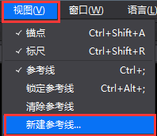
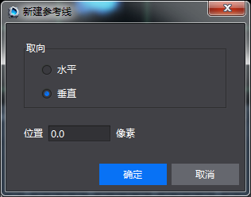
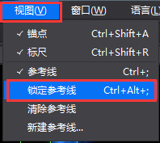
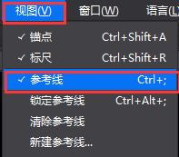
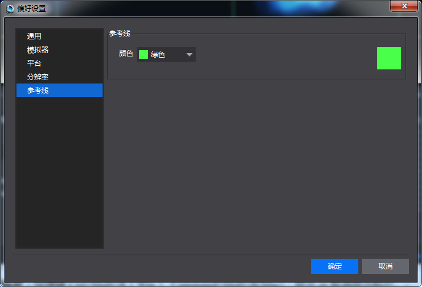

#标尺与参考线功能
&emsp;&emsp;为了方便用户进行布局定位等图片编辑操作，Cocos在2.3.0版本及以上增加了标尺与参考线的功能。下面介绍标尺与参考线的使用方法

标尺

&emsp;&emsp;标尺有横向标尺和纵向标尺，横向标尺位于画布面板底端，纵向标尺位于画布左侧。其中横、纵标尺以画布的左下角为零点，分别向左向右和向上向下增加。标尺默认显示，菜单栏-视图-标尺为勾选状态，您可以通过点击取消或勾选来控制标尺的显示与隐藏。快捷键为Ctrl+Shift+R（Win）、Command+Shift+R（Mac）。标尺显示状态适用于所有项目，即当显示标尺时，打开其他项目也都显示标尺，当隐藏时，后续打开项目也都隐藏。

参考线

&emsp;&emsp;参考线：包括新建、移动、锁定、隐藏、清除参考线、参考线设置及保存参考线等功能。

&emsp;&emsp;以下是参考线的使用介绍：

&emsp;&emsp;新建参考线

&emsp;&emsp;方式一：从标尺处点击拖动鼠标，拖动过程中出现灰色预览参考线和位置标签，拖动至画布区域您想要的位置，松开鼠标后参考线位置落定。从横向标尺拖出的是横向参考线，纵向标尺拖出的是纵向参考线（拖出参考线后，鼠标不放松，同时按住Alt键，参考线将切换为另一方向，释放鼠标，参考线落定）。拖动过程中可以看到参考线的位置数据，位置数据与当前单位对应。

&emsp;&emsp;方式二：在菜单栏-视图，点击“新建参考线”弹出窗口，选择方向和位置，其中位置与当前标尺单位对应。内容如下图。确定后，出现相应位置的参考线，如下图：

&emsp;&emsp;&emsp; 

&emsp;&emsp;&emsp; 
          
&emsp;&emsp;移动参考线

&emsp;&emsp;当鼠标指向参考线，变成两边延伸的箭头时，拖动鼠标，可以改变参考线位置，松开鼠标，参考线位置落定（拖动参考线时，鼠标不放松，同时按住Alt键，参考线将切换为另一方向，释放鼠标，参考线落定）。移动过程中可以看到参考线的位置数据，位置数据与当前单位对应。

&emsp;&emsp;锁定参考线

&emsp;&emsp;在菜单栏-视图，勾选“锁定参考线”，所有参考线被锁定，不能被拖动，只能消除；取消勾选“锁定参考线”，则恢复可选中并能拖动状态。快捷键为：Ctrl+Alt+; （Win）、Command+Alt+;（Mac），如下图：

&emsp;&emsp; 
        
&emsp;&emsp;隐藏参考线

&emsp;&emsp;参考线默认是显示的。在菜单栏-视图，当取消勾选“参考线”时，则所有参考线隐藏。当勾选“参考线”，显示之前的参考线。快捷键为：Ctrl+;（Win）、Command+;（Mac） 。
        
&emsp;&emsp; 

&emsp;&emsp;消除参考线

 &emsp;&emsp;消除单个参考线：拖动单个参考线至标尺区域，松开鼠标，参考线消失。

 &emsp;&emsp;消除全部参考线：在菜单栏-窗口，点击消除参考线，所有参考线消失。

&emsp;&emsp;参考线设置

&emsp;&emsp;参考线的默认颜色为青色，您可以通过菜单栏-编辑-偏好设置-参考线处，选择下拉列表中的颜色选项后点击确定，改变参考线的颜色，如下图：

 
  
&emsp;&emsp;保存参考线

&emsp;&emsp;参考线随文件（.csd）保存，即保存文件（.csd）则参考线随之保存。当切换到其他文件时，将显示切换后的文件中的参考线。关闭项目后参考线消失。

