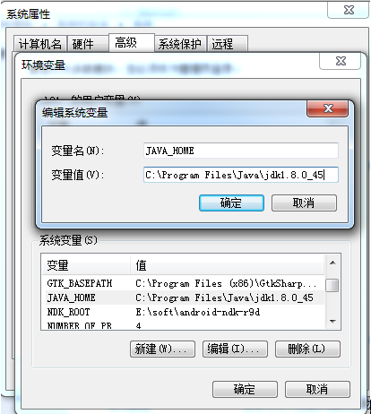

#如何修复打包以及运行失败？#

&emsp;&emsp;1，JDK，SDK，NDK，Framework，Cocos项目都必须放到英文目录，非英文目录可能会导致打包出现异常问题。

&emsp;&emsp;2，JDK安装成功后，Java目录下会生成2个文件夹，分别以jdk和jre开头。需要将这2个文件夹下的bin路径配置到系统变量里面。添加系统变量JAVA_HOME，变量值是jdk文件夹路径。如下截图：

&emsp;&emsp;
 
&emsp;&emsp;编辑系统变量Path，在后面追加jre文件夹下的bin路径，注意，需要先输入一个半角分号，再输入bin路径，例如： C:\Program Files\Java\jre1.8.0_45\bin，如下截图：

&emsp;&emsp;

&emsp;&emsp;3，增加cpp文件，需要添加到VS工程、XCode工程，同时必须需要修改android.mk文件，位置在proj.android/jni/Android.mk。

&emsp;&emsp;4，Cpp代码编码格式一定要是UTF-8，使用Visual Studio可以方便的查看文件编码格式，如下图：

&emsp;&emsp;

&emsp;&emsp;

&emsp;&emsp;5，由于 python 对 windows 系统中路径的支持存在缺陷，目前暂不支持直接运行 U 盘中的项目。请将项目拷贝到硬盘中然后运行。

&emsp;&emsp;6，未找到头文件（No such file of directory），案例：

    WARNING [Project: :app] Current NDK support is deprecated.  Alternative will be provided in the future.
	:app:preBuild UP-TO-DATE
	:app:preDebugBuild UP-TO-DATE
	:app:compileDebugNdk
	/Users/zhongcs/Documents/CocosProjects/CocosProjecttest/testandroid2/app/src/main/jni/hellocpp/main.cpp:1:25: fatal error: AppDelegate.h: No such file or directory
	 #include "AppDelegate.h"
	                         ^
	compilation terminated.

&emsp;&emsp;解决方法：查下Android.mk中LOCAL_C_INCLUDES里面有无添加AppDelegate所在的目录。

&emsp;&emsp;7，未定义引用（undefined reference to …..），案例：
 
	./obj/local/armeabi/objs-debug/cocos2dcpp_shared/__/__/Classes/Gem.o:Gem.cpp:vtable for Gem: error: undefined reference to 'cocos2d::Sprite::setDisplayFrameWithAnimationName(std::string const&, int)'
	collect2.exe: error: ld returned 1 exit status
	make.exe: *** [obj/local/armeabi/libcocos2dcpp.so] Error 1

&emsp;&emsp;解决方法：Android.mk文件中加入源文件。

&emsp;&emsp;8，被声明已否决，案例：

	1>d:\cocos2d-x\project\xiaochuxinxin\classes\xmlparser.cpp(15): warning C4996: 'cocos2d::CCString': 被声明为已否决
	1>          d:\cocos\frameworks\cocos2d-x-3.6\cocos\deprecated\ccdeprecated.h(1050) : 参见“cocos2d::CCString”的声明
	1>d:\cocos2d-x\project\xiaochuxinxin\classes\xmlparser.cpp(15): warning C4996: 'cocos2d::CCDictionary': 被声明为已否决

&emsp;&emsp;原因：低版本引擎升级高版本引擎，会有一些过时的函数，而这些函数依旧可以使用，但是会提示这个错误。

&emsp;&emsp;解决办法：F12进入提示错误的函数的声明处，即可找到替换的代码。

&emsp;&emsp;9，系统找不到指定路径，案例：

	Based on: cocos2d-x-3.6
	Updated project.properties
	Updated local.properties
	Updated file d:\cocosSample\Cocos\CocosProjects\CocosProject1\proj.android\proguard-project.txt
	It seems that there are sub-projects. If you want to update them
	please use the --subprojects parameter.
	系统找不到指定的路径。
	Running command: compile
	Building mode: debug
	Android platform not specified, searching a default one...
	running: '"D:\Android\sdk\android-sdk\tools\android" update project -t android-21 -p d:\cocosSample\Cocos\CocosProjects\CocosProject1\proj.android'
	building native
	NDK build mode: release
	NDK_TOOLCHAIN_VERSION: 4.8
	running: '"D:\Android\ndk\ndk-build" -C d:\cocosSample\Cocos\CocosProjects\CocosProject1\proj.android -j3 NDK_MODULE_PATHd:\Cocos\frameworks/cocos2d-x-3.6;d:\Cocos\frameworks/cocos2d-x-3.6/cocos;d:\Cocos\frameworks/cocos2d-x-3.6/external NDK_TOOLCHAIN_VERSION4.8'
	Ndk build failed!

&emsp;&emsp;解决办法：cocos命令，是否是你当时创建这个项目时的同一个cocos.py。如果系统里装有多个引擎版本，注意不要混用它们的cocos console
如果你用Cocos里带的framework创建的项目，而用引擎里的console去编译，那就很可能出现问题。所以你要注意一个原则：如果你电脑里有多个引擎版本、framework等，那么你用哪个创建的，就要用哪个下面的tools/cocos2d-console/bin下面的去编译它。

&emsp;&emsp;10，JSB绑定导致编译错误，案例：

	AppDelegate.cpp  register_all_autogentestbindings ns' was not declared in this scope

&emsp;&emsp;解决办法：[http://www.cocos2d-x.org/docs/manual/framework/native/v2/scripting-and-translating-between-programming-languages/javascript-binding/how-to-bind-c++-to-Javascript/zh](http://www.cocos2d-x.org/docs/manual/framework/native/v2/scripting-and-translating-between-programming-languages/javascript-binding/how-to-bind-c++-to-Javascript/zh)
请按这篇文档操作即可，每步都很具体，基于3.6.1版本，跳过文中“修改“autogentestbindings.cpp”中的注册函数如下：”这一步即可。已经测试过可以，
测试例在你的项目 /tools/bindings-generator/test 下面。

&emsp;&emsp;11，工程移植后编译错误，案例：

    07-04 12:58:01.362: E/linker(7506): soinfo_relocate(linker.cpp:992): cannot locate symbol "atof" referenced by "libcocos2djs.so"...

&emsp;&emsp;解决办法：创建一个新的空项目，然后将res,src, project.json,config.json等复制过来就可以了。

&emsp;&emsp;12，工程移植后编译错误：

&emsp;&emsp;原因：.vxproject的配置未变。

&emsp;&emsp;解决办法：.vxproject配置改为新引擎版本。

&emsp;&emsp;13，缺少类型说明符（语法错误）,案例：

&emsp;&emsp;

&emsp;&emsp;原因：

&emsp;&emsp;1.未声明标识符，是未声明就使用造成的。

&emsp;&emsp;2.缺少 “：”，语法错误，仔细检查语句是否缺少“：”号。

&emsp;&emsp;3.缺少类型说明符，函数类型未声明。

&emsp;&emsp;解决办法：

    CC_ENABLE_CHIPMUNK_INTEGRATION=1更改为CC_ENABLE_BOX2D_INTEGRATION=1

已经加入工程引用的，参考一下[http://www.bkjia.com/Androidjc/889857.html](http://www.bkjia.com/Androidjc/889857.html)

PS:3.6的BOX2D-TEST有BUG，修复地址：[https://github.com/cocos2d/cocos2d-x/issues/12104](https://github.com/cocos2d/cocos2d-x/issues/12104)

&emsp;&emsp;14，sh: cocos: command not found, 案例：

	//3.5、3.6的话，将工程导入到Eclipse中，会报sh: cocos: command not found的错误，但是用控制台能正常打包。这是一个Bug。
	**** Build of configuration Release for project CocosProjectTest ****
	python /Users/zhongcs/dev/cocosworkspace/CocosProjectTest/proj.android/build_native.py -b release all 
	sh: cocos: command not found
	Please use cocos console instead.
	Traceback (most recent call last):
	  File "/Users/zhongcs/dev/cocosworkspace/CocosProjectTest/proj.android/build_native.py", line 43, in 
	    build(opts.build_mode)
	  File "/Users/zhongcs/dev/cocosworkspace/CocosProjectTest/proj.android/build_native.py", line 28, in build
	
	    raise Exception("Build dynamic library for project [ "   app_android_root   " ] fails!")
	Exception: Build dynamic library for project [ /Users/zhongcs/dev/cocosworkspace/CocosProjectTest/proj.android/../ ] fails!
	**** Build Finished ****

   解决方法：[http://www.cocoachina.com/bbs/read.php?tid-296022.html](http://www.cocoachina.com/bbs/read.php?tid-296022.html)

&emsp;&emsp;15，cocos2d-x 2.X + R9d使用c++11正则表达式，打包APK正确，真机运行黑屏： 

&emsp;&emsp;原因：pC上能编译成功说明pc上IDE自带的库支持C++新特性（c++11的新库文件）。
但是手机是GCC库来判定的
 gcc4.9才支持c++11的regex，然而NDK 10以上才有gcc4.9。

&emsp;&emsp;解决方法：搜一些类似于你说的第三方正则解析库，例如：c语言的正则库，或者使用r10C及其以上的版本进行编译。

&emsp;&emsp;16，未能正确加载解决方案中的一个或者多个项目，案例：

    Based on: cocos2d-x-3.6
    Microsoft (R) Microsoft Visual Studio 2012 11.0.50727.1 版。
    版权所有(C) Microsoft Corp。保留所有权利。
    D:\Cocos_Project\js\test\frameworks\runtime-src\proj.win32\test.vcxproj : error  : 未找到与约束 
	ContractName	Microsoft.VisualStudio.Project.IProjectServiceAccessor
	RequiredTypeIdentity	Microsoft.VisualStudio.Project.IProjectServiceAccessor 匹配的导出
    未能正确加载解决方案中的一个或多个项目。
    有关详细信息，请参见“输出”窗口。
    未能完成操作。参数错误。 
    用法: 
    devenv  [解决方案文件 | 项目文件 | 任意文件.扩展名]  [开关]

&emsp;&emsp;解决方法：修复Visual Studio或者重装Visual Studio。

注：出错不要慌，先看log日志，它才是解决问题的最重要途径。

