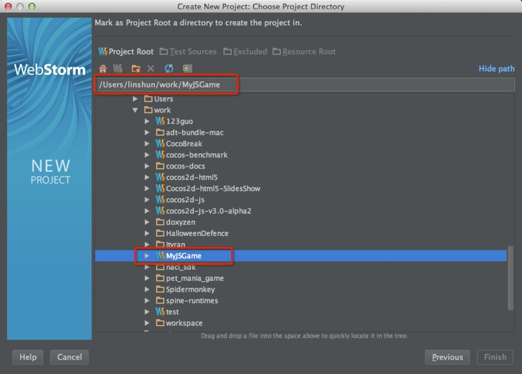
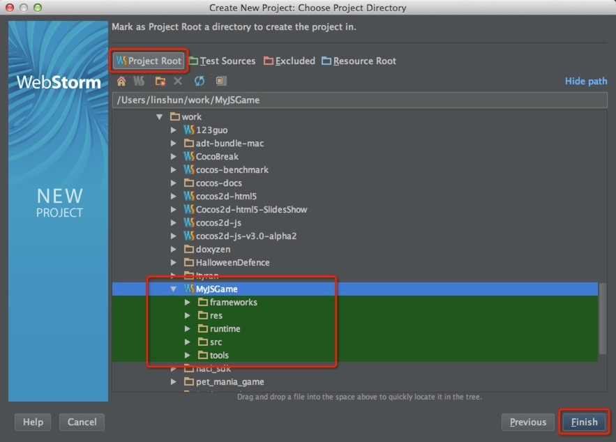

#Cocos2d-JS 개발 환경 설정
이 문서에서는, MacOS 10.9를 기준으로 Cocos2d-JS 개발 환경을 설정하는 방법을 보여줍니다 -- Yeah! 매버릭스.

##필요 소프트웨어 패키지 다운로드

1. WebStrom을 다운로드하고 설치합니다. [WebStorm](http://www.jetbrains.com/webstorm/download/index.html) 왜 WebStorm을 선택하냐구요? 왜냐하면 자바스크립트 코드 문법 완성, 디버깅, 문법 하이라이팅, 버전 ㅣ스템 통합 등 많은 기능을 제공하기 때문입니다. WebStorm의 공식 사이트를 방문하여 더 많은 정보를 보실 수 있습니다.

2. Cocos2d-x의 공식 웹사이트에서 Cocos2d-JS v3.0 다운로드 받습니다. [다운로드 링크](http://cocos2d-x.org/download) Cocos2d-JS v3.0을 다운 받으셨으면 적절한 위치에 압축을 해제합니다. 우리의 경우, ~/work/Cocos2d-js-v3.0에 압축을 해제했습니다. ~는 당신의 홈 디렉토리 경로를 나타내며 우리의 경우에는 /Users/linshun입니다.

**주의점:** 
	
당신은 또한 Github에서 Cocos2d-JS의 다른 버전을 구할 수 있습니다. [Cocos2d-JS github repository](https://github.com/cocos2d/cocos2d-js) 개발 중인 작업이 완료된 브런치는 **develop**입니다.

3. 크롬과 [JetBrains-IDE-support](https://chrome.google.com/webstore/detail/jetbrains-ide-support/hmhgeddbohgjknpmjagkdomcpobmllji) 확장 프로그램을 다운로드하고 설치합니다. 
 
이제 Cocos2d-JS 어플리케이션을 개발하고 디버그하기 위해서 Webstrom을 설정해보겠습니다.

## 새로운 프로젝트 만들기
Cocos2d-JS는 보다 간단하고 보다 편리한 개발을 위한 콘솔 도구를 제공합니다. 이를 통해 새로운 프로젝트를 생성하고 android, iOS, Mac OS, Web 등 각 플랫폼으로 아주 쉽게 배포할 수 있습니다.

### 콘솔 도구 설정
첫번째로, 도구를 사용하기에 앞서 설정이 필요합니다. Cocos2d-JS repository를 clone하고 모든 sub module을 업데이트하세요. 콘솔창에서 Cocos2d-JS 폴더를 열고 ./setup.py를 실행합니다. NDK, Android SDK,ANT의 경로를 설정해야 합니다. 주의사항으로 해당 도구는 파이썬으로 개발되었으며, 파이썬(32비트) 2.7.5나 이후 버전이 설치되어 있어야 합니다(그러나 파이썬3는 지원하지 않습니다). **주의사항:** ~/.bash_profile를 실행하면 바로 환경 설정 효과를 볼 수 있습니다.

### 새로운 프로젝트 만들기

```
// Cocos2d-x JSB와 Cocos2d-html5를 포함하는 프로젝트 만들기:
cocos new -l js

// Cocos2d-html5만을 포함하는 프로젝트 만들기:
cocos new -l js --no-native

// 특정한 이름의 프로젝트를 특정한 경로에 만들기:
cocos new projectName -l js -d ./Projects
```
튜토리얼에서는, cocos new -l js로 현재 workspace 안에 MyJSGame을 만듭니다.

### 프로젝트 실행하기

* Cocos2d-JS 프로젝트 웹서버 실행하기:

```
cd ~/work/MyJSGame
cocos run -p web
```

* Cocos2d-x JSB로 프로젝트 컴파일하고 실행하기 :

```
cd ~/work/MyJSGame
cocos compile -p ios|android|mac
cocos run -p ios|android|mac
```

* 유용한 옵션

```
-p platform : 플랫폼을 선택할 수 있습니다 ios|mac|android|web.
-s source   : 프로젝트의 디렉토리, 특정하지 않으면 현재 디렉토리를 사용합니다.
-q          : 콰이어트 모드(Quiet mode), 로그 메시지를 삭제합니다.
-m mode     : 릴리스 또는 디버그 모드, 디버그가 기본입니다.
--source-map: General source-map file. (웹 플랫폼만)
```

## WebStorm에서 Cocos2d-JS 설정하기

처음으로, WebStorm을 실행합니다. WebStorm을 실행하는 것이 처음이시라면, 키 맵핑을 선택하는 것과 같은 개인 설정을 해야합니다.

저의 WebStorm 실행 스크린샷은 다음과 같습니다:

   **Figure 1**

  


**주의사항:** 
WebStorm을 처음 실행했다면 Recent Project 부분은 비어있습니다.

이제, WebStorm에서 Cocos2d-JS를 시작해봅시다.

1. Open an exsiting project - MyJSGame

	**Create New Project from Exisiting Files** 선택하시면 다음과 같은 화면을 보실 수 있습니다.
	
	그러면 다음과 같은 옵션들을 볼 수 있습니다:
	
	**Figure 2**
	
	

2. **Source files are in a local directory, no Web server is yet configured**를 선택하시고 **Next**을 클릭합니다.

	**Figure 3**

	

3. 이번에는, 디렉토리 트리를 확장해서 MyJSGame 소스 코드가 위치한 경로를 입력합니다. 제대로된 경로를 입력해도, **Finish** 버튼은 여전히 비활성화 상태일 것입니다.
4. Now we should set the directory as **Project Root**. Click the **Project Root** button and the **Finish** button will be activate.
4. 이제 **Project Root** 디렉토리를 설정합니다. **Project Root** 버튼을 클릭하면 **Finish** 버튼이 활성화될 것입니다.

	**Figure 4**

	

5. 축하합니다! 성공적으로 WebStorm에서 Cocos2d-JS 프로젝트를 설정했습니다.

## Cocos2d-JS와 놀아보기

WebStorm에 모든 Cocos2d-JS 프로젝트를 추가했다면, WebStorm은 Cocos2d-JS의 모든 소스 코드를 파싱해줄 것입니다. **MyJSGame/src/myApp.js** 열어본다면, 정확한 문법 완성을 보실 수 있습니다.

**Figure 5**


Cocos2d-JS 게임 앱에 써드파티 자바스크립트 라이브러리가 있다면, 실시간 문법 완성이 가능하도록 WebStorm 라이브러리에 추가할 수 있습니다.

여기에 방법이 있습니다:

### (선택) 파싱을 위한 써드파티 라이브러리 추가

1. **Settings**을 클릭해서 프로젝트 설정 다이얼로그를 띄웁니다:

	**Figure 6**

	

2. **Settings** 메뉴를 클릭한 후에, 다음과 같이 선택합니다:
	
	**Figure 7**
	
	

3. **Add...** 버튼을 클릭하면 자바스크립트 라이브러리의 위치를 설정할 수 있는 화면이 보입니다. 
	
	**Figure 8**
	
	

### WebStorm으로 Cocos2d-JS 자바스크립트 디버그
이제 Cocos2d-JS 코드를 디버깅할 시간입니다.

#### WebStorm과 Chrome의 JB chrome extensions를 연결합니다
1. **~/work/MyJSGame**의 **index.html**을 우클릭하고 **Debug 'index.html'**를 선택합니다:
	
	**Figure 9**
	
	
2. 이제 크롬이 자동으로 실행됩니다. WebStorm과 연결되는 JB 플러그이 생긴 것을 볼 수 있습니다.

	**Figure 10**
	
	

**주의사항** 일단 --"JetBrains IDE support" 플러그인을 설치하면, 이 단계는 아주 간단합니다. WebStorm에서 디버그 메뉴를 클릭하면, 크롬으로 자동 연결됩니다. 얼마나 편리합니까! 또한 크롬 사이드바의 우측에 위치한 **JB**를 클릭하면 즉시 WebStorm IDE를 활성화합니다.

#### WebStorm에서의 자바스크립트 코드 디버그
WebStorm으로 돌아가서 **MyJSGame/src/myApp.js**를 더블 클릭해서 소스 코드를 살펴봅시다.

1. 중단점을 설정합니다. myApp.js 소스 코드 뷰포트의 왼쪽 사이드바를 우클릭합니다.

	**Figure 11**
	
	

2. 디버깅을 시작합니다. WebStorm은 크롬 브라우져를 자동으로 실행하며, 같은 프로젝트를 실행합니다. 크롬의 JB 아이콘을 클릭하면 WebStorm으로 돌아갑니다. 그리고 설정한 중단점에서 프로그램이 중지됩니다. 그러면 에디터가 디버그뷰로 바뀝니다:

	**Figure 12**
	
	

3. 이제 당신은 step out, step into, step over 등과 같은 디버깅을 할 수 있습니다.

## 요약
이 튜토리얼에서, WebStorm과 Cocos2d-html5가 함께 작동하도록 문법자동완성과 디버깅을 포함하는 간단한 설정법을 보여줬습니다. 이 과정은 아주 간단하고 쉽습니다. 이 튜토리얼에 대한 어떠한 질문이나 제안이 있을 때 우리에게 알려준다면 무척이나 감사할 것입니다.

## 다음은
다음 튜토리얼은, 어떻게 새로운 Cocos2d-JS 프로젝트를 설정하는 방법을 보여줄 것입니다. 그리고 Cocos2d-JS의 샘플 게임과 테스트들을 살펴볼 것입니다.
