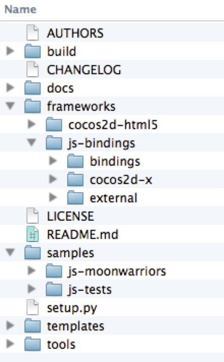
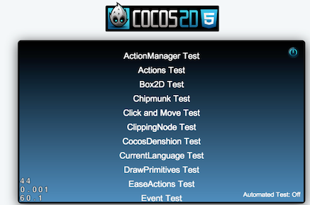

#Hello World of Cocos2d-JS
在这个教程中,我将会从头开始向你展示如何去建立一个新的 Cosos2d-JS 工程。在开始之前，我先简短地介绍一下 Cocos2d-JS 总体的目录结构。
## Cocos2d-JS 目录结构概览
下面是 Cocos2d-JS 的目录结构:

**图片1**



###理解目录结构

目录结构可以被分成4个部分来理解:

#### 第一部分: 引擎相关文件

* **frameworks** 目录包含了 Cocos2d-html5 引擎和 Cocos2d-x JavaScript 代码的汇集.
    * **Cocos2d-html5** 目录包含了所有 Cocos2d-html5 的引擎模块,例如引擎核心模块、音频模块、外部物理库，CocosBuilder Reader, CocoStudio Reader 和其他的模块。所有的模块都用JS实现并且可以在WEB环境中运行。 
    * **js-bindings** 目录包含了 Cocos2d-x 引擎, 绑定的和外部预置 SpiderMonkey 库的项目文件。外部接口采用 JS 编写,但是基础模块使用 Cpp 实现，可以在许多不同的本地平台上运行，例如IOS,android,MAC,win32等平台。 
    
#### 第二部分: 测试文件，游戏样本和模板

* **template** 目录是被用来创建一个新的Cocos2d-JS 工程。它包括了 HTML5 工程和默认的本地工程。cocos 控制台使用它来创建一个新的工程。
* **samples directory** 包含了 Cocos2d-JS 全部的测试工程。它还包括了一个可以运行的游戏样本，MoonWarriors。全部的测试工程和游戏可以从 cocos 控制台执行，也可以通过 javascript 的接口绑定机制在WEB或者本地平台运行。 

#### 第三部分: 其他

* **README** 包含一些对 Cocos2d-JS 的介绍。
* **LICENSE** 正如我们之前提到的，Cocos2d-JS 的许可证是 MIT,你可以查阅在引擎根目录下的 the license 文件夹来获得更多关于 Cocos2d-html5 and Cocos2d-x 的许可证细节。 
* **tools** 目录包括 cocos 控制台工具和 绑定生成工具（bingings-generator）。template 文件夹下包含一个 build.xml 文件，里面存放着闭包编译器的控制信息，通过 ANT 这个命令,你可以将你的游戏打包成为一个单个文件。 
* **build** 目录包含着内置的工程样本文件。
* **docs** 目录包含 JavaScript 编码风格指导和 release 的信息。 
* **CHANGELOG** 包含所有版本的修改信息。
* **setup.py** 是一个环境搭建的 python 脚本。


## 查看内置样本

当你已经成功地下载和配置好你的 Cocos2d-JS 开发环境之后，去看看 Cocos2d-JS 内置的样本工程是非常好的一个选择。它也是你正确地学习 Cocos2d-JS 中一个非常好的学习资源。
 
### 查看测试文件
进入目录 **Cocos2d-JS/samples/js-tests**, 然后通过 cocos 控制台执行测试文件。

```
    cocos run -p web
```

它将会向你展示全部 Cocos2d-JS 的内置测试工程。 以下是屏幕截图:

**图片 2**



这些测试工程是你最好的学习资源。它们很好地展示了 Cocos2d-html5 的每个特性。你可以调整这些测试文件，然后在你刷新浏览器后你会立即得到对应的反馈信息。在开始的学习中，通过这种方式学习 Cocos2d-html5 比在开始时就阅读大量的文档更有效。

你也可以在 IOS,android,Mac 上运行这些测试工程文件。

```
    cocos run -p ios|android|mac
```


### 浏览游戏样本 

这里有一个使用 Cocos2d-JS 完成的完整游戏样本。全部的源代码都是免费和开源的。以下是对这个游戏样本的简单介绍。

#### MoonWarrior

这个游戏的名字叫 MoonWarrior。你可以通过 cocos 控制台进入 **js-moonwariors**的根目录来运行它。 

```
    cocos run -p web|ios|android|mac
```

这是一个纵向的射击游戏。很多有用的游戏技术被应用到这个游戏里面，包括瓦片地图（tiled-map）, 动画（animation）, 视差背景（parallax background）等等。 这里是屏幕截图，你可以在源代码中获得更多的信息。

**图片 3**


## 创建你的第一个 "Hello World" 工程

最后，我们开始教程最终也是最重要的一部分。 我不会真的创建一个 "Hello World" 工程。我将会把 跑酷（Parkour）游戏作为一个例子。在以后，所有的这些精品教程都将会围绕怎么去完成一个在Cocos2d-JS 下的的跑酷（Parkour）游戏这个主题。

你还可以忍受等待吗？来，让我们马上开始！

### 完成Parkour工程框架

正如之前所说，我们可以使用一个指定的名字来创建一个新的工程。进入你的工作台（workspace），使用 cocos 控制台去创建**Parkour** 游戏。

```
    cocos new Parkour -l js
```

现在运行你的 WebStorm ，打开 Parkour 的目录。现在这个工程的结构是这个样子：

**图片 4**


在 WebStorm 中右击 **index.html** ，选择**Debug 'index.html'**。它将会自动打开你的 Chrome 浏览器，然后你就成功地创建了一个新的工程。恭喜你！当前浏览器的地址是：

```
http://localhost:63342/Parkour/index.html
```

这是一张经典的 **Hello World** 截图:

**图片 5**


### 游戏样本模板的代码分析

虽然 **template** 带给我们这么多礼物, 但是我们甚至对它一无所知。

这个模板工程的主入口在哪里？这些文件是如何组织的？每个文件又完成什么工作？在这节中，我将会帮助你解答这些问题。

#### 查看整个工程的文件

首先, 我们一起查看在图片4中全部的文件和目录结构：
在图片4, 我们可以看到:

- **res** 目录.它包含了工程中所有被需要的资源文件。现在它仅仅包含一些图片样本。 但是如果你想要增加一些游戏的元素或者一些极好的游戏音乐，你应该将它们放在这个文件夹下并给为每个文件取一个合适的名字。

- **src** 文件夹. 它包含你真实游戏的所有逻辑代码。如果这里有成千上百个 javascript 源文件，你最好将它们用子文件夹分成许多小部分。现在，我们的模板工程拥有2个 javascript 源文件夹。 **app.js** 包含我们模板的第一个场景代码。在**resource.js** 定义了许多资源的全局变量。

- **index.html** 文件是 HTML5 基于web应用程序的入口点。它是一种 HTML5 兼容的格式。它定义了许多元数据，例如设置视角和全屏参数等。 

- **project.json** 文件是我们工程的配置文件。请参考网站[project.json](http://www.cocos2d-x.org/docs/manual/framework/html5/v3/project-json/en)获得更多详情 。

- **main.js** 是一个创建你的第一个游戏场景和在浏览器显示这个场景的一个文件。 在这个文件里，你也可以定义你的分辨率策略和预加载你的资源。

好了, 你已经知道了这些文件和文件夹是什么。现在，该是我们理解这些源代码和执行路径的时候了。

#### 分析工程执行路径

知道一个工程的执行路径是非常重要的。

这个工程被装载进index.html。然后它执行 **frameworks/Cocos2d-html5/CCBoot.js**。它将会尝试从 project.json 文件中装载工程的设置信息。

```
{
    "project_type": "javascript",

    "debugMode" : 1,
    "showFPS" : true,
    "frameRate" : 60,
    "id" : "gameCanvas",
    "renderMode" : 0,
    "engineDir":"frameworks/cocos2d-html5",

    "modules" : ["cocos2d"],

    "jsList" : [
        "src/resource.js",
        "src/app.js"
    ]
}

```

查看这个代码片段，这里有一个叫做**engineDir**的对象属性，它能够决定下一个程序的执行路径。在默认的情况下，我们可以修改这个 engineDir 的内容。

 main.js 会在装载完**frameworks/Cocos2d-html5/CCBoot.js** 这个文件之后开始装载。它将会初始化配置和装载所有的在 **modules** 和 **jsList**文件上被指定的 JavaScript 文件。阅读源代码比阅读我的纯文字描述将会更清晰地向你展示这个过程。 

### 让你的项目做一些小改动

正如我们前几节提到过的，在我们真正开始写代码之前，我们一起来对项目做一点小改动来热热身吧！

#### 隐藏你游戏屏幕左边角落的最大帧数

这一节可能会有一点琐碎。我们可以很容易地实现这个效果，通过在**project.json**文件修改把**showFPS**属性为**false**。

以下是相关的代码:

```
{
    "project_type": "javascript",

    "debugMode" : 1,
    "showFPS" : false,
    "frameRate" : 60,
    "id" : "gameCanvas",
    "renderMode" : 0,
    "engineDir":"frameworks/Cocos2d-html5",

    "modules" : ["cocos2d"],

    "jsList" : [
        "src/resource.js",
        "src/app.js"
    ]
}
```

通过修改这些对象的属性，我们可以对这个项目做许多小改动。以下，我会向你介绍每个属性的作用。

property name | options | explanation
------------ | ------------- | ------------
debugMode | 0,1,2,3,4,5,6  | 0: close all 1: info level 2: warn level 3: error level 4: info level with web page 5: warn level with web page 6: error level with web page
showFPS | true or false  | toggle FPS visibility
id | "gameCanvas"  | the dom element to run cocos2d on
frameRate | a positive number above 24, usually 60-30  | adjust the frame rate of your game
renderMode | 0,1,2 | Choose of RenderMode: 0(default), 1(Canvas only), 2(WebGL only)
engineDir | the engine directory related to your project  | specify the directory the engine code  
modules | engine modules  | you could customize your engine by modules. Module names are in the module of moduleConfig.json in root of **frameworks/Cocos2d-html5** directory
 jsList | a list of your game source code  | add your own file lists after myApp.js
 
 

#### 修改设计的分辨率大小

Cocos2d-JS 把 web browser 作为一个全屏游戏的画布。我们不需要手动地去匹配这个大小，我们仅仅需要去关注设计的分辨率大小。为了使我们的游戏流畅地在 IOS 和 Android 平台使用 javascript binding 技术运行，我们将会修改分辨率为 480*320。打开 main.js 文件，在函数**cc.game.onStart**里修改分辨率大小为480, 320。

你也可以调整分辨率策略为**SHOW_ALL**:

```
    cc.view.setDesignResolutionSize(480, 320, cc.ResolutionPolicy.SHOW_ALL);
```

如果你对我们为什么需要做这些工作而感到好奇，请参阅 [Resolution Policy Design for Cocos2d-html5](http://www.cocos2d-x.org/docs/manual/framework/html5/v2/resolution-policy-design/en) 获得更多详情.

## 总结

在这个教程中，我们谈到了整个工程的目录结构以及内置的测试工程和 Cocos2d-JS 的游戏样本。我们也根据 Cocos2d-JS 提供的模板创建了自己的第一个工程。在下一个部分里，我们将会尝试分析这些文件以及模板中的代码结构。

## 下章简介

在接下来的教程中，我将会告诉你如何在你的工程里去创建一个游戏菜单场景。我们将会使用 Cocos2d-JS 做更多的编码工作。
