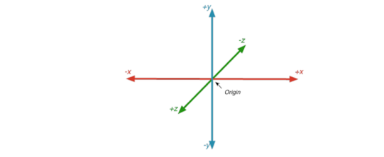

#制作你的第一个游戏场景

在为你的游戏创建第一个场景前，你应该熟悉一些Cocos2d的基础概念。如果你已经熟悉这些概念，你可以跳到下一个章节。

## 基础概念

在一个Cocos2d game游戏中，每一个元素都是一个节点。游戏通常是由三种节点构成的：

- 场景（Scene）

- 层（Layer) 

- 精灵（Sprite） 

现在我们关注这个游戏中的层，你可以在[这里](http://cocos2d-x.org/wiki/Director_Scene_Layer_and_Sprite)找到更多关于场景和精灵的细节。

#### 层（Layer）

一个cc.Layer是一个cc.Node，知道怎样去渲染自己，而且可能是半透明的， 能让玩家可以看见在当前层之下的其他层。cc.Layer在定义你的游戏外观和行为方面非常有用，所以你应该要花很多时间去对付cc.Layer子类以来达到你的预期。


因为复杂的应用程序会要求你去定义自定义cc.Layer子类，所以Cocos2d提供了几个预定义的层。这些例子包括cc.Menu（简单的菜单层），cc.ColorLayer（填充色层），还有cc.LayerMultiplex（可以复用它的子节点，每次激活其中的一个子节点，同时禁用其它子节点）。

层可以包含任意cc.Node作为子节点，包括cc.Sprite，cc.Label，甚至是其它的cc.Layer对象。因为层是cc.Node的子类，所以层可以手动或者使用cc.Action进行切换。

### 坐标系

Cocos2d-JS使用与OpenGl相同的坐标系，其被叫做笛卡尔右手系。它在游戏产业非常流行，但是它与网页设计所使用的传统的左上角坐标系是不同的。 



你可以在[这里](http://cocos2d-x.org/wiki/Coordinate_System)找到更多关于坐标系的细节。

####锚点（Anchor Point）

锚点被用在一个对象的定位和旋转。锚点坐标是相对坐标，举例来说，在（0，1）位置的锚点（我们经常在Cocos2d中简化定义为cc.p(0,0)）对应于那个对象的左下角， 同时cc.p(0.5,0.5)对应于对象的中心。当设置一个对象的位置时，这个对象被定位以致于锚点会位于setPosition()函数调用所指定的坐标。同样地，当旋转一个对象，它是绕着锚点旋转的。

这些性质（properties）可以在Cocos2d-JS v3.0作为属性（attribute）被设置。
   
例如，这个精灵有一个cc.p(0,0)的锚点和一个cc.p(0,0)的位置。

 	// create sprite 
    var sprite = new cc.Sprite ( "bottomleft.png" ) ; 
    sprite.attr({
            x: 0,
            y: 0,
            anchorX: 0,
            anchorY: 0
        });
    this.addChild ( sprite ) ;


### 动作（Action）

更多关于动作的细节请看[这里](http://cocos2d-x.org/wiki/Actions)。

运行cc.MoveBy动作的例子：

	// Move a sprite 50 pixels to the right, and 10 pixels to the top over 2 seconds.
	sprite.runAction(new cc.MoveBy(2, cc.p(50, 10)));

### 动画（Animation）

更多关于动画的细节请看[这里](http://cocos2d-x.org/wiki/Animations)。

播放动画的例子：

	var animation = new cc.Animation ( ) ;
 	for ( var i = 1 ; i < 15 ; i ++ ) {         
 		var frameName = "res/Images/grossini_dance_" + ( ( i < 10 ) ? ( "0" + i ) : i ) + ".png" ; 
		animation.addSpriteFrameWithFile ( frameName ) ;
 	}
 
 	animation.setDelayPerUnit ( 2.8 / 14 ) ; 
	animation.setRestoreOriginalFrame ( true ) ; 
 	var action = new cc.Animate ( animation ) ; 
 	sprite.runAction ( new cc.Sequence( action, action.reverse ( ) ) ) ;


### 调度器（Scheduler）和定时器回调（Timer Callback）

更多关于调度器和定时器回调的细节请看[这里](http://cocos2d-x.org/wiki/Scheduler_and_Timer_Callback)。

### 事件管理器（EventManager）

Cocos2d-JS v3.0移植了一种对用户事件响应的新机制。

基本要素：

- **事件监听器（Event listeners）** 封装事件处理代码。
- **事件管理器（Event Manager）** 管理用户事件的监听器。
- **事件对象（Event objects）** 含有有关事件的信息。
 
为了响应事件，你必须首先创建一个cc.EventListener。这里有五种不同的事件监听器：

- cc.EventListenerTouch - 响应触摸事件
- cc.EventListenerKeyboard - 响应键盘事件
- cc.EventListenerAcceleration - 响应加速计事件
- cc.EventListenMouse - 响应鼠标事件
- cc.EventListenerCustom - 响应自定义事件
 
然后，添加你的事件处理代码到事件监听器上恰当的回调（例如，`onTouchBegan`对应`EventListenerTouch`监听器，或者`onKeyPressed`对应键盘事件监听器）。

接下来，利用**cc.eventManager**注册你的事件监听器。

当事件出现（例如，用户触摸屏幕，或者在键盘打字），`cc.eventManager`通过调用你的回调来分发**事件对象（Event objects）**（比如 `EventTouch`， `EventKeyboard`）到恰当的事件监听器。每个事件对象包含有关事件的信息（比如触摸的坐标）。

请参考[事件处理器（EventManager）](http://www.cocos2d-x.org/docs/manual/framework/html5/v3/eventManager/en)来获得更多细节。

## 制作你的第一个游戏场景

在上一篇教程，我们已经分析一个Cocos2d-JS游戏的执行通路。我们知道在main.js里我们利用**cc.game.onStart**加载我们的第一个游戏场景，这是起作用的代码片段：

	cc.game.onStart = function(){
    cc.view.setDesignResolutionSize(480, 320, cc.ResolutionPolicy.SHOW_ALL);
	cc.view.resizeWithBrowserSize(true);
    //load resources
    cc.LoaderScene.preload(g_resources, function () {
        cc.director.runScene(new HelloWorldScene());
    }, this);
	};


这里，我们使用cc.LoaderScene来预加载我们游戏的资源，而在加载完成后，导演则会运行我们的第一个游戏场景。 

**注意：**

**cc.game**是真正的，会初始化游戏配置和启动游戏的游戏对象。

#### 清理工作（Cleanup Work）

好了,我认为背景信息已经足够。让我们做些清理工作。

##### 清理myApp.js

这个过程非常简单。首先，我们应该删除myApp.js的全部内容。因为我们会从头开始写这些代码。

其次，我们应该改变main.js中的这一行：

```
cc.director.runScene(new HelloWorldScene());
```

成 

```
cc.director.runScene(new MenuScene());
```

没错，我猜你已经抓住要点了。我们会定义我们的第一个类，名为MenuScene。

最后，我们应该添加需要的资源和定义一些资源变量以便于简单的访问。


打开resource.js然后改变它的内容成这样： 
    
	var res = {
    helloBG_png : "res/helloBG.png",
    start_n_png : "res/start_n.png",
    start_s_png : "res/start_s.png"
    };

	var g_resources = [
    //image
    res.helloBG_png,
    res.start_n_png,
    res.start_s_png
	];

#### 定义你的第一个场景-MenuScene

打开app.js然后开始定义菜单层（MenuLayer）：

	var MenuLayer = cc.Layer.extend({
    ctor : function(){
        //1. call super class's ctor function
        this._super();
    },
    init:function(){
        //call super class's super function
        this._super();

        //2. get the screen size of your game canvas
        var winsize = cc.director.getWinSize();

        //3. calculate the center point
        var centerpos = cc.p(winsize.width / 2, winsize.height / 2);

        //4. create a background image and set it's position at the center of the screen
        var spritebg = new cc.Sprite(res.helloBG_png);
        spritebg.setPosition(centerpos);
        this.addChild(spritebg);

        //5.
        cc.MenuItemFont.setFontSize(60);

        //6.create a menu and assign onPlay event callback to it
        var menuItemPlay = new cc.MenuItemSprite(
            new cc.Sprite(res.start_n_png), // normal state image
            new cc.Sprite(res.start_s_png), //select state image
            this.onPlay, this);
        var menu = new cc.Menu(menuItemPlay);  //7. create the menu
        menu.setPosition(centerpos);
        this.addChild(menu);
    },

    onPlay : function(){
        cc.log("==onplay clicked");
    }
	});

让我们从1-6回顾全部细节：

1. 它调用它超类的初始函数。
2. 得到你游戏的屏幕大小。
3. 计算你的屏幕的中心点，这将会被用于将背景图片放于中心。
4. 利用文件名创建一个背景图片然后设置它到屏幕中央的位置。最后，作为子节点添加这个精灵到菜单层。
5. 调用MenuItemFont的setFontSize函数来调整字体大小。在这个例子，它是无效的。但如果你想要使用MenuItemFont来创建一些菜单项，它会影响菜单项的标签大小。
6. 创建一个有两张图片的菜单，一张对应正常状态而另一张对应选中状态。然后我们设置菜单的位置到屏幕的中心。最后，添加它到当前的层中。

 
然后我们也应该定义一个Menu scene：

	var MenuScene = cc.Scene.extend({
    onEnter:function () {
        this._super();
        var layer = new MenuLayer();
        layer.init();
        this.addChild(layer);
    }
	});

创建一个菜单场景（MenuScene）的过程是非常直观的。你定义了一个从cc.Scene派生的变量。你应该记住**extend**这个符号，这被用于继承类（extenal classes）。

一旦这个场景被创建，一个**onEnter**函数应该被定义。它定义菜单层作为它的孩子。我们也可以定义一个**ctor**函数代替onEnter函数。onEnter函数在ctor函数后被调用。


## 总结

在这篇教程，我已经向你展示了当你第一次开始编写Cocos2d-JS游戏所需要知道的基础概念。然后也给你详细解释了怎样建立你的第一个游戏场景。希望你享受它同时能快乐地编程！相关的样板工程可以在[这里](res/Parkour.zip)下载。它只包括用户部分而不包括框架。你可以使用它们去替代Cocos2d-JS模版的对应部分。

## 从这里要去哪（Where to go from here）

在下一章，我会向你展示怎样去定义你的游戏场景以及各种游戏层，怎样去设计这些层还有这些层的责任是什么。