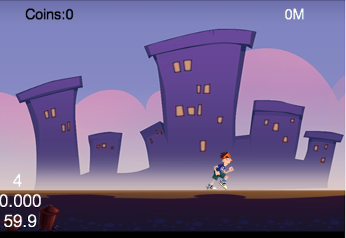
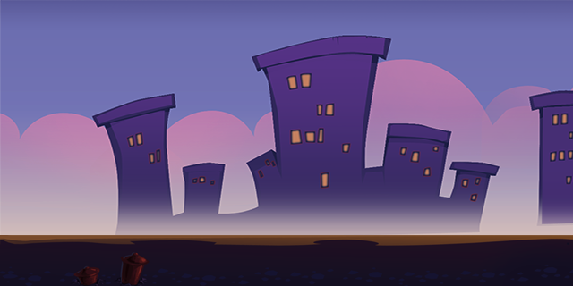

# Design and Make Your Gameplay Scene

## Introduction

In this tutorial, you will learn how to design and construct the gameplay scene. Every game needs some kind of gameplay scene. This tutorial will show the general scenario of a gameplay scene.

From the previous tutorial, we know that we can use different layers to separate the logic of a specified scene.

Here is the final result of our gameplay scene:



There is a background with some buildings, our hero and some HUD(heads-up display) elements to show some statistics about the current game. We divide the gameplay scene into three parts: the background layer, the animation layer and the status layer.

### Background Layer

Basically, every game needs a background of some sort. Sometimes the background is just a static image which occupies the entire screen. Other times you may want the background layer to move at a constant or varying speed. Sometimes the background even shows us parallax effects--different layers move at various speed, the nearest layer moves faster and the farthest layer moves slower to simulate that objects are near or far. 

In later tutorials, we will introduce tiled maps which are very useful to construct parallax background. In this tutorial, in order to keep things simple, we just use a simple static image to represent the game's background.

**Note**:
We can move the background to mimic the effect of our game hero running, keeping the hero at the center of the screen. We will see many such tricks during our development process.

### Animation Layer(Gameplay Layer)

The animation layer contains all game elements that animate, collision detection and other game logic. This layer is sometimes also called the **GameplayLayer**. You can choose to name it what you want. In this layer, we organize the key part of our gameplay. In general, we will design game objects, s level spawner(which are also called level managers), collision detection between different game objects and check if the player has won or lost the game.

In theory, we don't need to separate this layer into smaller layers. We can use composition and delegation to handle things properly. 

### Status Layer(HUD Layer)

In video gaming, the HUD (head-up display) is the method by which information is visually relayed to the player as part of a game's user interface. It takes its name from the head-up displays used in modern aircraft.

The HUD is frequently used to simultaneously display several pieces of information including the main character's health, items and an indication of game's progression (such as score or level). You can refer to [this link](http://en.wikipedia.org/wiki/HUD_(video_gaming)) for more information on HUDs.

To make things simpler, we put this information into a separate layer called StatusLayer. Because these items are always displayed on top of other game elements, placing them on a separate layer will make our life easier without caring about the Z-order display issues.

## Coding in action

### Preparation

Start by adding two images(**PlayBG.png** and **runner.png**) to the **res** directory.

In the previous tutorial, we have added all resources variables in **resource.js**. Since two more images have been added, **resource.js** should also be changed to this:

```
var res = {
    helloBG_png : "res/helloBG.png",
    start_n_png : "res/start_n.png",
    start_s_png : "res/start_s.png",
    PlayBG_png  : "res/PlayBG.png",
    runner_png  : "res/runner.png"
};

var g_resources = [
    //image
    res.helloBG_png,
    res.start_n_png,
    res.start_s_png,
    res.PlayBG_png,
    res.runner_png
];
``` 

Here we have added two global variables named **PlayBG_png** and **runner_png**. Now when we want to create a sprite in another js files, we can easily access these variables.

Since we will add four JavaScript files: PlayScene.js, AnimationLayer.js, BackgroundLayer.js and StatusLayer.js.  We need to tell the Cocos2d-x engine to load these files when the game starts. We do this by changing **project.json** to make it aware of the new source files:

```
 "jsList" : [
        "src/resource.js",
        "src/app.js",
        "src/AnimationLayer.js",
        "src/BackgroundLayer.js",
        "src/PlayScene.js",
        "src/StatusLayer.js"
    ]
```

In the future, each time when you add a new JavaScript file into your game, you should change the attribute **jsList** and add more source code file paths to the end of the array.

Lastly, we should display the PlayScene when we click the button in the first MenuScene. Here is the code snippet:

```
    //this is the callback when the menu is clicked
    onPlay : function(){
        cc.log("==onplay clicked");
        cc.director.runScene(new PlayScene());
    }
```


### Coding the PlayScene(PlayScene.js)

Since background layer, animation layer and status layer should be displayed in a different order. We can specify the order explicitly when calling the **addChild** method or we can add them as PlayScene's children in the right order. In this tutorial, we will add them in the right order.

Here is the code snippet of PlayScene:

```
var PlayScene = cc.Scene.extend({
    onEnter:function () {
        this._super();
        //add three layer in the right order
        this.addChild(new BackgroundLayer());
        this.addChild(new AnimationLayer());
        this.addChild(new StatusLayer());
    }
});
```

### Coding the BackgroundLayer(BackgroundLayer.js)

Here is our background image:


Here is the code snippet:

```
var BackgroundLayer = cc.Layer.extend({
    ctor:function () {
        this._super();
        this.init();
    },

    init:function () {
        this._super();
        var winsize = cc.director.getWinSize();

        //create the background image and position it at the center of screen
        var centerPos = cc.p(winsize.width / 2, winsize.height / 2);
        var spriteBG = new cc.Sprite(res.PlayBG_png);
        spriteBG.setPosition(centerPos);
        this.addChild(spriteBG);
    }
});

```
### Coding the AnimationLayer(AnimationLayer.js)

Here is our main character:


In this section, we will run actions on the hero. We will run the **MoveTo** action on the sprite to move the sprite from (80,85) to (300,85) in two seconds.

Here is the code snippet of AnimationLayer:

``` 
var AnimationLayer = cc.Layer.extend({
    ctor:function () {
        this._super();
        this.init();
    },
    init:function () {
        this._super();

        //create the hero sprite
        var spriteRunner = new cc.Sprite(res.runner_png);
        spriteRunner.attr({x: 80, y: 85});

        //create the move action
        var actionTo = new cc.MoveTo(2, cc.p(300, 85));
        spriteRunner.runAction(new cc.Sequence(actionTo));
        this.addChild(spriteRunner);
    }
});
```

### Coding the StatusLayer(StatusLayer.js)

In this section, we will add two indicators: the coin quantity indicator and the distance indicator. Both indicators are labels in Cocos2d-html5. Labels are very useful to display HUD information to players and the code to create and use labels is very easy thanks to cocos2d framework.

Here is the code snippet we need to set up the layer:

```
var StatusLayer = cc.Layer.extend({
    labelCoin:null,
    labelMeter:null,
    coins:0,

    ctor:function () {
        this._super();
        this.init();
    },

    init:function () {
        this._super();

        var winsize = cc.director.getWinSize();

        this.labelCoin = new cc.LabelTTF("Coins:0", "Helvetica", 20);
        this.labelCoin.setColor(cc.color(0,0,0));//black color
        this.labelCoin.setPosition(cc.p(70, winsize.height - 20));
        this.addChild(this.labelCoin);

        this.labelMeter = new cc.LabelTTF("0M", "Helvetica", 20);
        this.labelMeter.setPosition(cc.p(winsize.width - 70, winsize.height - 20));
        this.addChild(this.labelMeter);
    }
});
```
We can use **new cc.LabelTTF** for creating a text label. The first parameter is the displayed texts, the second parameter is the font family and the third parameter is the font size. We can also use the **setColor** function of LabelTTF to set the color of labels. **cc.color(0,0,0)** represents the color black.


## Summary 

In this tutorial, we have divided the game scene into different layers. Each layer has it's own logic and responsibility. You can download the entire project [here](res/Parkour.zip).

The code and logic are pretty straightforward, so we haven't cover them all in details. If you have any questions or suggestions, let us know and we will do our best to support you.

## Where to go from here

In the next tutorial, you will learn how to run animations on the runner and how to pack small images into a sprite sheet. You will also be introduced to an awesome tools named **TexturePacker**. 
