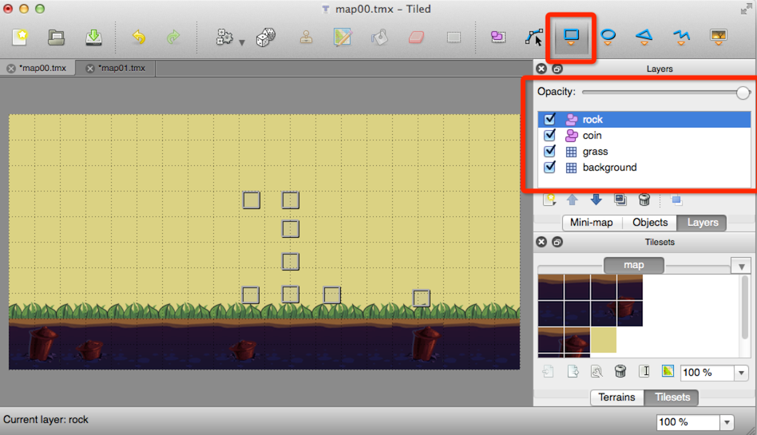

#在我们的游戏中添加硬币和障碍物

## 引言
在这个教程中，我们将试图在我们的跑酷游戏中添加硬币和障碍物。

学习完这个教程之后，我们的玩家将可以在跑步时候收集硬币并且当他碰撞到障碍物时候他将死亡。

我们也将涉及到如何用一个平铺的地图编辑器设计一个游戏等级。因为游戏逻辑与之前相比有些复杂，所以我们将在添加新的游戏组件之前重构代码。

##准备
在我们开始之前，让我们先完成一些准备工作。

### 设置Resource和Globals
因为我们将在跑酷游戏中再添加两个游戏元素。所以我们需要再添加一些全局整型标记来标识每一个游戏项。

让我们在*globals.js*底部添加以下代码片段
```
// 小花栗鼠的碰撞类型
if(typeof SpriteTag == "undefined") {
    var SpriteTag = {};
    SpriteTag.runner = 0;
    SpriteTag.coin = 1;
    SpriteTag.rock = 2;
};
```

这里我们使用 0,1,2来代表跑步者，硬币和岩石。

我们也介绍另一个名叫*background.png* 的spritesheet和*background.plist* 。我们已经将硬币和岩石精灵打包到叫做*background.png* 的spritesheet中。

如何打包这些精灵的细节将留在下一节讲述。

接下来，让我们复制资源文件到我们的*res*目录并且再添加两个变量来进一步参考。

```
var res = {
    helloBG_png : "res/helloBG.png",
    start_n_png : "res/start_n.png",
    start_s_png : "res/start_s.png",
    PlayBG_png  : "res/PlayBG.png",
    runner_png  : "res/running.png",
    runner_plist : "res/running.plist",
    map_png : "res/map.png",
    map00_tmx : "res/map00.tmx",
    map01_tmx : "res/map01.tmx",
    background_png :"res/background.png",
    background_plist : "res/background.plist"
};

var g_resources = [
    //图片
    res.helloBG_png,
    res.start_n_png,
    res.start_s_png,
    res.PlayBG_png,
    res.runner_png,
    res.runner_plist,
    res.map_png,
    res.map00_tmx,
    res.map01_tmx,
    res.background_png,
    res.background_plist
];
```


### 打包硬币和岩石到包含纹理图册的Spritesheet

在前一章中，我们已经学习了如何打包一串小精灵到一个大的压缩的spritesheet中。让我们打包另一个spritesheet。

首先，你应该启动TexturePacker 并且拖动所有的assets到*res/TexturePacker/coins and rocks*目录下。（注意：你可以获取到之前下载的所有游戏资源。）

在拖动资源之后，你应该详细说明*Data file* 和*Texture format*  ，他们的路径类似于*xxx/chapter8/res/background.png* 或者 *xxx/chapter8/res/background.plist*这样的格式。

如果你不想要任何spritesheet的最优化，只需要忽略他们并且按下*Publish*来产生最终的spritesheet。


## TiledMap Object Layer的介绍

我们已经为我们的平面地图使用TiledMap，但是它缺少游戏项。所以在这个章节中，我们将涉及如何使用TiledMap Object Layer来设计平面项。

###添加硬币Object Layer
首先，我们将添加硬币Object Layer。

1.启动Tiled 并且打开*map00.tmx* 和*map01.tmx*.
2.在map00.tmx 和map01.tmx中创建一个名为*coin*的Object layer。


3.通过拖放矩形对象到地图来设计object layer。
你可以改变矩形的尺寸和它的位置。你也可以复制或者删除对象。



4.设计object layer的一些小提示：
你可以改变平铺地图中图层的透明度以便你可以轻易地放置对象。

###添加岩石Object Layer
创建岩石object layer的过程和创建硬币 object layer的过程差不多一样。

所以我们将在你自己的实现中忽略这部分内容。

## 重构BackgroundLayer类并且添加一些有帮助的方法
有时候，当你在编码的时候，你可能发现在现有的结构中添加新功能是很困难的事。

这是一种很糟糕的代码风格，我们应该立刻停止它并且开始重构。
###重构BackgroundLayer 类
因为我们将添加Chipmunk 物体到我们的背景中，所以我们需要一个方法来获取在*PlayScene*中创建的*space*对象。

让我们改变Background Layer中的*ctor* 方法的名字，并且传递一个叫做*space*的参数到这个方法中。我们还应该在BackgroundLayer类中添加一个新的成员变量。这里是相关的代码片段：

```
    ctor:function (space) {
        this._super();

        // 这里清空旧数组
        this.objects = [];
        this.space = space;

        this.init();
    },
```

这里我们已经添加附加的初始化代码。我们添加一个名叫*objects*数组并且将它初始化为一个空数组。

（*注意：你应该在this.space = space的分配后调用this.init() 方法。因为我们将在初始化方法中创建物理对象*）

###添加有用的方法
1.再在BackgroundLayer中添加一些成员变量：
```
    space:null,
    spriteSheet:null,
    objects:[],
```

2.在*init*方法中初始化spritesheet
```
　　//创建sprite sheet
        cc.spriteFrameCache.addSpriteFrames(res.background_plist);
        this.spriteSheet = new cc.SpriteBatchNode(res.background_png);
        this.addChild(this.spriteSheet);
```

3.添加一个叫做*loadObject*的方法来初始化岩石和硬币。
```
 loadObjects:function (map, mapIndex) {
        //添加硬币
        var coinGroup = map.getObjectGroup("coin");
        var coinArray = coinGroup.getObjects();
        for (var i = 0; i < coinArray.length; i++) {
            var coin = new Coin(this.spriteSheet,
                this.space,
                cc.p(coinArray[i]["x"] + this.mapWidth * mapIndex,coinArray[i]["y"]));
            coin.mapIndex = mapIndex;
            this.objects.push(coin);
        }

        // 添加岩石
        var rockGroup = map.getObjectGroup("rock");
        var rockArray = rockGroup.getObjects();
        for (var i = 0; i < rockArray.length; i++) {
            var rock = new Rock(this.spriteSheet,
                this.space,
                rockArray[i]["x"] + this.mapWidth * mapIndex);
            rock.mapIndex = mapIndex;
            this.objects.push(rock);
        }
    },
```

这里我们在平铺地图中反复申明所有的对象信息并且创建响应的Chipmunk 刚体。最后我们在*objects*数组中存储这些对象。

所有这些代码是自我解释的。你应该只注意*mapIndex* 参数。我们使用这个参数来计算我们应该将刚体放在哪个位置。

我们需要在*init*方法底部调用*loadObject*方法来创建前两个屏幕地图中的物理对象。

```
this.loadObjects(this.map00, 0);
this.loadObjects(this.map01, 1);
```

4.再添加另两个有用的方法来移除没用的小花栗鼠刚体。

第一个方法叫做*removeObjects*。它通过*mapIndex*移除一个对象。这里是它的实现：

```
removeObjects:function (mapIndex) {
        while((function (obj, index) {
            for (var i = 0; i < obj.length; i++) {
                if (obj[i].mapIndex == index) {
                    obj[i].removeFromParent();
                    obj.splice(i, 1);
                    return true;
                }
            }
            return false;
        })(this.objects, mapIndex));
    },
```

另一个方法叫做*removeObjectByShape*:

```
   removeObjectByShape:function (shape) {
        for (var i = 0; i < this.objects.length; i++) {
            if (this.objects[i].getShape() == shape) {
                this.objects[i].removeFromParent();
                this.objects.splice(i, 1);
                break;
            }
        }
    },
```

这个方法将通过它的形状来移除小花栗鼠对象。

###包裹以上内容：在checkAndReload 方法中添加创建和废除的逻辑
当地图被移除，我们也应该调用*loadObject*方法来重建”Coins & Rocks”.

并且，我们应该通过调用*removeObjects*方法移除所有没用的对象

这里是代码片段：
```
  checkAndReload:function (eyeX) {
        var newMapIndex = parseInt(eyeX / this.mapWidth);
        if (this.mapIndex == newMapIndex) {
            return false;
        }

        if (0 == newMapIndex % 2) {
            // 改变mapSecond
            this.map01.setPositionX(this.mapWidth * (newMapIndex + 1));
            this.loadObjects(this.map01, newMapIndex + 1);
        } else {
            // 改变mapFirst
            this.map00.setPositionX(this.mapWidth * (newMapIndex + 1));
            this.loadObjects(this.map00, newMapIndex + 1);
        }
        this.removeObjects(newMapIndex - 1);
        this.mapIndex = newMapIndex;

        return true;
    },
```


##添加硬币和岩石
现在是时候添加硬币和岩石的实现了。除了实现细节外，你还应该注意这两个类背后的设计思想。这里我们更倾向于从cc.Class继承而不是cc.Sprite。我们让每个对象拥有一个cc.Sprite实例。
###设计并且实现Coin类
1.创建一个叫做*coin.js*的新文件。我们将在这个文件中定义我们的Coin类。确保将这个文件放在你的*src*目录下。
2. 从cc.Class中派生一个叫做*Coin*的类，让我们看看所有的实现:
```
var Coin = cc.Class.extend({
    space:null,
    sprite:null,
    shape:null,
    _mapIndex:0,// map属于这个参数
    get mapIndex() {
        return this._mapIndex;
    },
    set mapIndex(index) {
        this._mapIndex = index;
    },

    /** 构造器
     * @param {cc.SpriteBatchNode *}
     * @param {cp.Space *}
     * @param {cc.p}
     */
    ctor:function (spriteSheet, space, pos) {
        this.space = space;

        // 初始化硬币动画
        var animFrames = [];
        for (var i = 0; i < 8; i++) {
            var str = "coin" + i + ".png";
            var frame = cc.spriteFrameCache.getSpriteFrame(str);
            animFrames.push(frame);
        }

        var animation = new cc.Animation(animFrames, 0.2);
        var action = new cc.RepeatForever(new cc.Animate(animation));

        this.sprite = new cc.PhysicsSprite("#coin0.png");

        // 初始化physics
        var radius = 0.95 * this.sprite.getContentSize().width / 2;
        var body = new cp.StaticBody();
        body.setPos(pos);
        this.sprite.setBody(body);

        this.shape = new cp.CircleShape(body, radius, cp.vzero);
        this.shape.setCollisionType(SpriteTag.coin);
        //Sensors 只是调用碰撞机回调函数,并且永远不生成真实的碰撞机
        this.shape.setSensor(true);

        this.space.addStaticShape(this.shape);

        // 添加sprite 到sprite sheet
        this.sprite.runAction(action);
        spriteSheet.addChild(this.sprite, 1);
    },

    removeFromParent:function () {
        this.space.removeStaticShape(this.shape);
        this.shape = null;
        this.sprite.removeFromParent();
        this.sprite = null;
    },

    getShape:function () {
        return this.shape;
    }
});
```

让我们一段一段地解释一下代码。

首先，我们添加三个成员变量分别叫做：*space*, *sprite* 和*shape*.我们将使用这些变量来创建硬币对象的物理实体和它的显示属性。

然后，我们添加另一个成员变量*_mapIndex*。我们使用*get/set*语法糖来定义变量的存取。

*ctor*方法是Coin类的构造器。我们将使用spritesheet创建一个Coin类,spritesheet是接下来的空间和位置对象。

因为硬币是圆形的，所以我们创建了CircleShape 附加于刚体上。ctor 函数的剩余部分是自我解释的。

最后，我们需要定义一个方法来清理工作。它就是*removeFromParent*方法。它首先从空间移除刚体，然后从它的父类移除精灵。*getShape*方法只是一个用于访问存储于硬币对象中的形状对象的一个只读方法。

###设计并且实现Rock类
设计Rock类的原理和硬币类差不多，除了刚体形状类型部分。

因为我们的Rock类是一个矩形盒子。所以相比于Coin类，在Rock类中我们使用cp.BoxShape来替代cc.CircleShape。

这里是rock.js是所有源代码：

```
var Rock = cc.Class.extend({
    space:null,
    sprite:null,
    shape:null,
    _map:0,// map 属于这个参数
    get map() {
        return this._map;
    },
    set map(newMap) {
        this._map = newMap;
    },

    /** 构造器
     * @param {cc.SpriteBatchNode *}
     * @param {cp.Space *}
     * @param {cc.p}
     */
    ctor:function (spriteSheet, space, posX) {
        this.space = space;

        this.sprite = new cc.PhysicsSprite("#rock.png");
        var body = new cp.StaticBody();
        body.setPos(cc.p(posX, this.sprite.getContentSize().height / 2 + g_groundHeight));
        this.sprite.setBody(body);

        this.shape = new cp.BoxShape(body,
            this.sprite.getContentSize().width,
            this.sprite.getContentSize().height);
        this.shape.setCollisionType(SpriteTag.rock);

        this.space.addStaticShape(this.shape);
        spriteSheet.addChild(this.sprite);
    },

    removeFromParent:function () {
        this.space.removeStaticShape(this.shape);
        this.shape = null;
        this.sprite.removeFromParent();
        this.sprite = null;
    },

    getShape:function () {
        return this.shape;
    }
});
```

## 改善PlayScene
### 重构PlayScene的onEnter 函数
1. 首先, 让我们添加一个叫做*shapesToRemove*的额外数组并且在 PlayScene.js的*onEnter* 函数开头初始化它。

```
//以下这行在定义地区的初始成员变量中运行
shapesToRemove :[],

//以下这行在*onEnter* 函数开头运行.
this.shapesToRemove = [];
```

2.然后，修改BackgroundLayer的创建。这里我们简单地传递space对象给BackgroundLayer的构造器。

```
    this.gameLayer.addChild(new BackgroundLayer(this.space), 0, TagOfLayer.background);
```

### 添加碰撞检测函数
- 首先, 我们应该在*initPhyiscs* 方法末尾调用这两个函数:

```
 // 设置小花栗鼠CollisionHandler
        this.space.addCollisionHandler(SpriteTag.runner, SpriteTag.coin,
            this.collisionCoinBegin.bind(this), null, null, null);
        this.space.addCollisionHandler(SpriteTag.runner, SpriteTag.rock,
            this.collisionRockBegin.bind(this), null, null, null);
```

当碰撞发生时，*addCollisionHandler* 方法需要一个回调函数。

- 然后, 让我们定义这两个回调函数来操纵玩家与硬币和岩石的碰撞.

```
 collisionCoinBegin:function (arbiter, space) {
        var shapes = arbiter.getShapes();
        // shapes[0] is runner
        this.shapesToRemove.push(shapes[1]);
    },

    collisionRockBegin:function (arbiter, space) {
        cc.log("==game over");
    },
```

- 删除背景层中没用的刚体. 你应该在 *update* 方法末尾添加以下代码:

```
        // 模拟cpSpaceAddPostStepCallback
        for(var i = 0; i < this.shapesToRemove.length; i++) {
            var shape = this.shapesToRemove[i];
            this.gameLayer.getChildByTag(TagOfLayer.background).removeObjectByShape(shape);
        }
        this.shapesToRemove = [];
```

我们不能在物理模拟过程中删除物体。所以我们使用一个叫做*shapesToRemove*的额外的数组来存储需要被删除的临时数据。

##包裹以上所有这些东西
恭喜你!你快要成功了。在我们点击*debug*按钮来查看结果之前，让我们添加一些额外的胶水代码来将所有东西连接在一起。

打开*project.json*并且再在*jsList*数组末尾添加两个数组项。

```
    "jsList" : [
        "src/resource.js",
        "src/app.js",
        "src/AnimationLayer.js",
        "src/BackgroundLayer.js",
        "src/PlayScene.js",
        "src/StatusLayer.js",
        "src/globals.js",
        "src/coin.js",
        "src/rock.js"
    ]
```

编译运行!干杯，我们完成它了!:)

让我们看看我们最终的果实吧:


##总结
在这个教程中，我们已经度过了一个愉快的漫长的旅程，但是很值得，不是吗？

我们已经学习了如何使用TiledMap对象图层来设计复杂的游戏等级还有如何定制你自己的类来扩展你的代码结构。

你可以在[这里](res/Parkour.zip)下载全部的结构代码.

##接下来我们要学习什么呢？
在下一个教程中，我们将涉及如何连续更新游戏HUD，我们还将在游戏中添加游戏结束逻辑还有简单的手势识别器来使玩家可以跳过障碍物。保持调优状态!