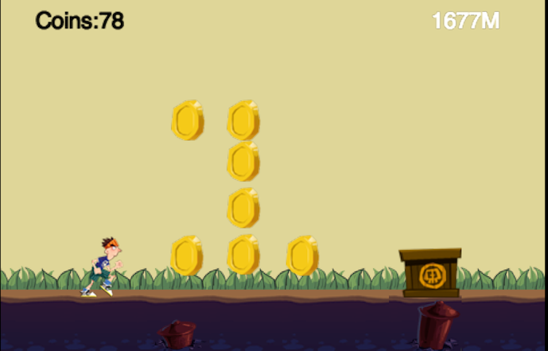
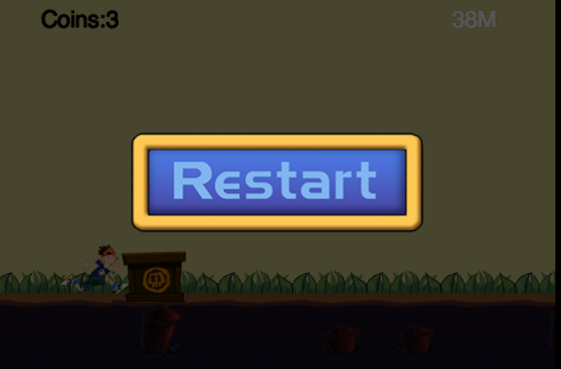

#实现游戏结束逻辑等

#介绍
在这篇教程中，我们将完成我们的游戏结束逻辑，更新HUD，并实现一个简单的手势识别器。

废话不多说，让我们开始吧。

##更新游戏HUD
###更新玩家奔跑的距离
首先，让我们在StatusLayer类中加入一个*updateMeter*方法：

```
    updateMeter:function (px) {
        this.labelMeter.setString(parseInt(px / 10) + "M");
    }
```

这个方法不断地改变*labelMeter*的值。我们使用*parseInt*函数来将结果转化为一个整型数据。

参数*px*代表像素，所以10个像素对应1米。

显然的，我们应该在每一帧中都调用这个方法。

打开AnimationLayer.js，在*update*方法的最前面加上如下几行代码：

```
        // update meter
        var statusLayer = this.getParent().getParent().getChildByTag(TagOfLayer.Status);
        statusLayer.updateMeter(this.sprite.getPositionX() - g_runnerStartX);
```

###更新金币数
当玩家获得了一个金币时，我们需要更新金币数显示器。

首先，让我们在StatusLayer中增加一个*addCoin*方法：

```
    addCoin:function (num) {
        this.coins += num;
        this.labelCoin.setString("Coins:" + this.coins);
    },
```

当玩家碰撞到金币时，我们将调用这个方法。

接下来我们就来实现它。

打开*PlayScene.js*，在*colisionCoinBegin*方法的最后加上如下几行代码：

```
        var statusLayer = this.getChildByTag(TagOfLayer.Status);
        statusLayer.addCoin(1);
```

这样每次玩家碰撞到金币时，*colisionCoinBegin*方法就会被调用，金币计数器就会自动加1。

保存文件，运行一下试试:)

截图如下：



##在游戏中加入游戏结束逻辑
###设计并实现游戏结束层
为了使事情尽可能简单，我们只在游戏结束层的中间放置一个菜单。

当你点击了*restart*菜单时，游戏就会重新开始。

所以这个设计还是很简单的，让我们来完成它。

这里是*GameOverLayer.js*的全部内容：

```
var GameOverLayer = cc.LayerColor.extend({
    // constructor
    ctor:function () {
        this._super();
        this.init();
    },
    init:function () {
        this._super(cc.color(0, 0, 0, 180));
        var winSize = cc.director.getWinSize();

        var centerPos = cc.p(winSize.width / 2, winSize.height / 2);
        cc.MenuItemFont.setFontSize(30);
        var menuItemRestart = new cc.MenuItemSprite(
            new cc.Sprite(res.restart_n_png),
            new cc.Sprite(res.restart_s_png),
            this.onRestart, this);
        var menu = new cc.Menu(menuItemRestart);
        menu.setPosition(centerPos);
        this.addChild(menu);
    },
    onRestart:function (sender) {
        cc.director.resume();
        cc.director.runScene(new PlayScene());
    }
});
```

这里我们用了两个sprite，*s_restart_n*和*s_restart_s*，来创建我们的restart菜单项。

因此我们需要将这些资源文件加入*res*目录中，并定义资源路径。

打开*resource.js*，添加如下几行代码：

```
    restart_n_png : "res/restart_n.png",
    restart_s_png : "res/restart_s.png"

//add the following two lines at the end of g_resources array.
    res.restart_n_png,
    res.restart_s_png
```

*init*方法的代码很容易理解，但你需要注意*onRestart*这个回调函数。

我们调用了cc.Director中的*resume*方法。为什么要这样做呢？因为当玩家死亡时我们会调用*pause*方法。

###当玩家撞到障碍物时，游戏结束
现在，让我们实现一下当玩家撞到障碍物时，显示游戏结束层。

打开*PlayScene*，在*collisionRockBegin*方法的最后加上如下几行代码：

```
  collisionRockBegin:function (arbiter, space) {
        cc.log("==game over");
        cc.director.pause();
        this.addChild(new GameOverLayer());
    },
```

好的，完成了。让我们再跑一下程序试试看。

这是最终的效果图：




##构造你自己的手势识别器
这一节中，我们将构造一个简单的手势识别器。

当我们用手指从屏幕下端划到上端时，识别器能够检测到它。

检测手势的算法很直观。当检测到触控开始时，我们将第一个触控点的坐标存入数组，当检测到触控移动时，我们将触控点的坐标存入数组的末尾。

这样我们只需要比较一下相邻两点的x和y坐标就能计算出划动的方向了。

代码如下：

```
function Point(x, y)
{
    this.X = x;
    this.Y = y;
}

// class define
function SimpleRecognizer()
{
    this.points = [];
    this.result = "";
}

// be called in onTouchBegan
SimpleRecognizer.prototype.beginPoint = function(x, y) {
    this.points = [];
    this.result = "";
    this.points.push(new Point(x, y));
}

// be called in onTouchMoved
SimpleRecognizer.prototype.movePoint = function(x, y) {
    this.points.push(new Point(x, y));

    if (this.result == "not support") {
        return;
    }

    var newRtn = "";
    var len = this.points.length;
    var dx = this.points[len - 1].X - this.points[len - 2].X;
    var dy = this.points[len - 1].Y - this.points[len - 2].Y;

    if (Math.abs(dx) > Math.abs(dy)) {
        if (dx > 0) {
            newRtn = "right";
        } else {
            newRtn = "left";
        }
    } else {
        if (dy > 0) {
            newRtn = "up";
        } else {
            newRtn = "down";
        }
    }

    // first set result
    if (this.result == "") {
        this.result = newRtn;
        return;
    }

    // if diretcory change, not support Recongnizer
    if (this.result != newRtn) {
        this.result = "not support";
    }
}

// be called in onTouchEnded
SimpleRecognizer.prototype.endPoint = function() {
    if (this.points.length < 3) {
        return "error";
    }
    return this.result;
}

SimpleRecognizer.prototype.getPoints = function() {
    return this.points;
}
```

当手势被成功识别后，我们可以调用SimpleRecognizer中的*endPoint*方法来得到最终的结果。

目前为止只支持四种简单的类型：上，下，左，右。你可以自行扩展。

##处理触控事件，玩家跳跃逻辑及动画
###添加玩家的跳跃动画
为了实现跳跃动画，我们先要做一些准备工作，这里我们已经为你做好了。

你可以从*总结*版块下载整个工程文件，将running.plist和running.png复制&粘贴进*res*目录。

当游戏开始后，玩家将不停地奔跑，直到撞上障碍物。我们希望能通过向上划动来使玩家跳跃。

这样或许每一局的游戏时间可以长一点。

当玩家向上跳或是向下落时，我们需要播放相应的动画。

所以我们第一步要做的，就是在AnimationLayer中添加两个animation action：

```
jumpUpAction:null,
jumpDownAction:null,
```

然后新建一个名为*initAction*的函数：

```
  initAction:function () {
        // init runningAction
        var animFrames = [];
        // num equal to spriteSheet
        for (var i = 0; i < 8; i++) {
            var str = "runner" + i + ".png";
            var frame = cc.spriteFrameCache.getSpriteFrame(str);
            animFrames.push(frame);
        }

        var animation = new cc.Animation(animFrames, 0.1);
        this.runningAction = new cc.RepeatForever(new cc.Animate(animation));
        this.runningAction.retain();

        // init jumpUpAction
        animFrames = [];
        for (var i = 0; i < 4; i++) {
            var str = "runnerJumpUp" + i + ".png";
            var frame = cc.spriteFrameCache.getSpriteFrame(str);
            animFrames.push(frame);
        }

        animation = new cc.Animation(animFrames, 0.2);
        this.jumpUpAction = new cc.Animate(animation);
        this.jumpUpAction.retain();

        // init jumpDownAction
        animFrames = [];
        for (var i = 0; i < 2; i++) {
            var str = "runnerJumpDown" + i + ".png";
            var frame = cc.spriteFrameCache.getSpriteFrame(str);
            animFrames.push(frame);
        }

        animation = new cc.Animation(animFrames, 0.3);
        this.jumpDownAction = new cc.Animate(animation);
        this.jumpDownAction.retain();
    },
```

在这个函数中，我们初始化了玩家所有的动画。

最后，让我们把之前在*init*函数中写的runningAction的初始化代码删掉，然后调用*initAction*方法。

```
//init  actions
this.initAction();
//        // init runningAction
//        var animFrames = [];
//        for (var i = 0; i < 8; i++) {
//            var str = "runner" + i + ".png";
//            var frame = cc.spriteFrameCache.getSpriteFrame(str);
//            animFrames.push(frame);
//        }
//        var animation = new cc.Animation(animFrames, 0.1);
//        this.runningAction = new cc.RepeatForever(new cc.Animate(animation));
```

###处理触控事件
是时候处理触控事件了。首先，我们先要开启AnimationLayer的触控。

将下面这几行代码插入*init*方法的末尾：

```
 cc.eventManager.addListener({
            event: cc.EventListener.TOUCH_ONE_BY_ONE,
            swallowTouches: true,
            onTouchBegan: this.onTouchBegan,
            onTouchMoved: this.onTouchMoved,
            onTouchEnded: this.onTouchEnded
        }, this)
```

这几行代码能够开启触控调度功能。

为了处理触控事件，需要添加三个回调函数:

```
 onTouchBegan:function(touch, event) {
        var pos = touch.getLocation();
        event.getCurrentTarget().recognizer.beginPoint(pos.x, pos.y);
        return true;
    },

    onTouchMoved:function(touch, event) {
        var pos = touch.getLocation();
        event.getCurrentTarget().recognizer.movePoint(pos.x, pos.y);
    },

    onTouchEnded:function(touch, event) {
        var rtn = event.getCurrentTarget().recognizer.endPoint();
        cc.log("rnt = " + rtn);
        switch (rtn) {
            case "up":
                event.getCurrentTarget().jump();
                break;
            default:
                break;
        }
    },
```

当你触控屏幕时，*onTouchBegan*方法会被调用。当你手指按住屏幕并拖动时，*onTouchMoved*方法会被调用。当你抬起手指时，*onTouchEnded*方法会被调用。

这里我们用自己构建的识别器来识别这些动作。

###把所有的东西拼起来
是时候把所有的东西拼起来了。

首先，在AnimationLayer的开头加入如下枚举：

```
// define enum for runner status
if(typeof RunnerStat == "undefined") {
    var RunnerStat = {};
    RunnerStat.running = 0;
    RunnerStat.jumpUp = 1;
    RunnerStat.jumpDown = 2;
};
```

我们用这些枚举来表示玩家的不同状态。

接下来我们需要在AnimationLayer加入另外两个变量：

```
 recognizer:null,
 stat:RunnerStat.running,// init with running status
```

在*init*方法的最后初始化识别器：

```
 this.recognizer = new SimpleRecognizer();
```

最后，完成我们的jump方法：

```
 jump:function () {
        cc.log("jump");
        if (this.stat == RunnerStat.running) {
            this.body.applyImpulse(cp.v(0, 250), cp.v(0, 0));
            this.stat = RunnerStat.jumpUp;
            this.sprite.stopAllActions();
            this.sprite.runAction(this.jumpUpAction);
        }
    },
```

在*update*方法中将他们拼凑起来：

```
//in the update method of AnimationLayer
    // check and update runner stat
        var vel = this.body.getVel();
        if (this.stat == RunnerStat.jumpUp) {
            if (vel.y < 0.1) {
                this.stat = RunnerStat.jumpDown;
                this.sprite.stopAllActions();
                this.sprite.runAction(this.jumpDownAction);
            }
        } else if (this.stat == RunnerStat.jumpDown) {
            if (vel.y == 0) {
                this.stat = RunnerStat.running;
                this.sprite.stopAllActions();
                this.sprite.runAction(this.runningAction);
            }
        }
```

别忘了清理工作，在AnimationLayer销毁时我们需要释放已创建的action。

```
    onExit:function() {
        this.runningAction.release();
        this.jumpUpAction.release();
        this.jumpDownAction.release();
        this._super();
    },
```

你可能还会想确认下是否创建的js文件都已在*cocos2d.js*文件中被装载。

##总结
恭喜，你离成功又近了一步！

让我们回顾一下这篇教程的内容。

首先，我们学会了怎么更新游戏hud元素。

然后我们加入了游戏结束逻辑。

最后，我们创建了一个简单的手势识别，用来处理玩家的跳跃动作。

你可以从[这里](res/Parkour.zip)下载最终的代码。

##下一步
在下一篇教程中， 我们将完成跑酷游戏最后的部分，敬请期待！
