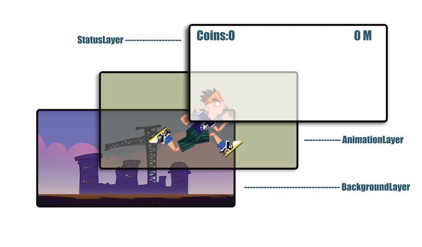

#制作你的第一个游戏场景

在为你的游戏创建第一个场景前，你应该熟悉一些Cocos2d-x的基本概念。如果你很熟悉这些概念，那你可以略过下一节。

## 基本概念

在一个Cocos2d游戏中，每一个元素都是一个结点。游戏大多数都是被以下三种结点构建的：

- 场景

- 层 

- 精灵 

现在我们可以关注这个游戏的层啦，更多你可以找到的关于场景和精灵的细节点击 [这里](http://cocos2d-x.org/wiki/Director_Scene_Layer_and_Sprite)

#### 层

一个cc.Layer就是一个知道如何处理触摸事件的cc.Node，层知道如何渲染它们自己，有可能渲染成半透明的，使用户在层之后能看到其他层。cc.Layer在定义你的游戏的外观和动作时是非常有用的，处理cc.Layer子类使它达到你的预期可能会花费你不少时间。



在cc.Layer你可以定义触摸事件的处理机制。通过执行一个处理触摸事件(ccTouchBegan， ccTouchMoved， ccTouchEnded， or ccTouchCancelled)的方法，一个cc.Layer可以和玩家相互影响。这些触摸事件发送信号给一个场景里从前到后的所有层，直到一些层抓获了事件。

然而复杂的应用可能会要求你定义用户cc.Layer子类，Cocos2d提供了这些预定义的层。一些例子包括cc.Menu (一个简单的菜单层)，cc.ColorLayer (一个渲染纯色的层)，和 cc.LayerMultiplex (一个让你可以多路复用它的子类，但一次只能使一个活动的层）。

层可以包含任何cc.Node作为它的子类，包括cc.Sprite， cc.Label和其他cc.Layer目标。因为层是cc.Node的子类，他们可以用手动或转化cc.Action的方式得到。

### 坐标系

Cocos2d-html5用同样的坐标系统作为OpenGL，被称为“右手直角坐标系”。它在游戏产业很流行，然而，它跟网页设计中常用的左上角的坐标系统又有不同。

更多关于坐标系的信息请点击[这里](http://cocos2d-x.org/wiki/Coordinate_System)

####锚点（Anchor point）

锚点既用来定位又用来作为物体的旋转点。锚点的坐标是相对坐标，例如，锚点定在（0,0），在Cocos2d-x我们总是将这个简短定为cc.p(0 , 0)与物体的左下一致，cc.p(0.5, 0.5)与物体的中心一致，当设置一个物体的坐标点时，物体会被设置就像锚点会被用setPosition()来设置。相似地，当物体旋转时，会绕着锚点。
   
例如，这里有个精灵有一个锚点cc.p(0, 0)和一个位置坐标cc.p(0,0)。

```
 // 创建精灵 
    var sprite = cc. Sprite.create ( "bottomleft.png" ) ; 
    sprite. setAnchorPoint ( cc.p ( 0 , 0 ) ) ; // Anchor Point 
    sprite. setPosition ( cc.p ( 0 , 0 ) ) ; 
    this.addChild ( sprite ) ;
```

### 动作（Action）

更多关于动作的细节请点击 [这里](http://cocos2d-x.org/wiki/Actions)

一个关于启动cc.MoveBy的动作的例子：

```
// 在2秒内移动精灵到距离右边50像素，距离上边10像素。
sprite.runAction(cc.MoveBy.create(2, cc.p(50, 10)));
```

### 动画创建（Animation）

更多关于Animation在[这里](http://cocos2d-x.org/wiki/Animations)

制作动画序列帧的例子：

```
 var animation = cc.Animation.create ( ) ; 
        for ( var i = 1 ; i < 15 ; i ++ ) {         
        var frameName = "res/Images/grossini_dance_" + ( ( i < 10 ) ? ( "0" + i ) : i ) + ".png" ; 
           animation. addSpriteFrameWithFile ( frameName ) ; 
        } 
        animation. setDelayPerUnit ( 2.8 / 14 ) ; 
        animation. setRestoreOriginalFrame ( true ) ; 
        var action = cc. Animate . create ( animation ) ; 
        sprite. runAction ( cc. Sequence . create ( action , action. reverse ( ) ) ) ;
```
### 调度器和Timer Callback（Scheduler and Timer Callback）

更多关于Scheduler and Timer Callback在[这里](http://cocos2d-x.org/wiki/Scheduler_and_Timer_Callback)

### 触摸事件

Cocos2d-html5有2个不同的处理触摸事件的方法。他们被俩种不同类型定义delegates-TargetedTouchDelegate和StandardTouchDelegate（他们都用CCTouchDelegateProtocol.js定义）。

用TargetedTouchDelegate有2个优势：

1.你不必用cc.Sets，调度将会结束这个工作。所以你可以每次都得到正确的cc.Touch。

2. 你可以声明一个cc.Touch，它可以在onTouchBegan中返回true。更新声明了的触摸只发送给声明他们的代理。所以如果你得到一个移动、结束或者取消更新，你可以确定那就是你的触摸响应。这为你在处理多触摸事件的时候节省了不少时间。

用StandardTouchDelegate有2个优势:

 1. 你可以手动处理cc.Sets，可以分开触摸事件。因此它处理大量触摸事件很方便。
   
 2. 那你不必在ccTouchesBegan中声明true或者false。并且你所有的触摸需求将会被唤醒当你触摸屏幕。

## 制作你第一个游戏场景

在上一个教程，我们已经分析了Cocos2d-html5游戏的执行路线。我们知道在main.js里，我们加载第一个游戏场景在**applicationDidFinishLaunching**，这里是处理trick的代码片段：

```
 //加载资源
        cc.LoaderScene.preload(g_resources, function () {
            director.replaceScene(new this.startScene());
        }, this);
```

这里，我们用cc.LoaderScene来预加载游戏资源，在加载完后，导演director将会运行我们的第一个场景。你应该注意到**replaceScene**的幅角。我们需要新的操作在**this.startScene**。它是类**cocos2dApp**的一个成员。

**注意:**

 **cocos2dApp**通常是一个函数，在面向程序设计语言里用来模拟类的行为。

```
var cocos2dApp = cc.Application.extend({
    config:document['ccConfig'],
    ctor:function (scene) {
        this._super();
        this.startScene = scene;
        cc.COCOS2D_DEBUG = this.config['COCOS2D_DEBUG'];
        cc.initDebugSetting();
        cc.setup(this.config['tag']);
        cc.AppController.shareAppController().didFinishLaunchingWithOptions();
    },
```

这里是 **ctor** 函数，在其他语言像c++, java or c#中模拟构造函数。

有两个段落在[这里](http://www.gamefromscratch.com/post/2012/06/06/Cocos2D-HTML5-tutorial-2-Why-its-Hello-World-of-course.aspx)。我强烈推荐你阅读整篇文章。

第一段:

>我们正在新建一个物体通过延伸cc.Application。如果熟悉C++，Java 或 C#，你可能有一点困惑在你看见这个代码的时候。因为他们有些很正常，期间有些又不同 。理由是，JavaScript不是真的像你熟悉的“面向对象”，它是[面向原型](http://en.wikipedia.org/wiki/Prototype-based)。我在这里不能解释所有细节，但是基本的，这里没有类。而有你可以复制和延伸的“原型”。所以你可以根本上定义一些东西，被用作原型或是你在未来再创建“物体”。

第二段:

> 本质上我们在这里要做的事定义我们的**cocos2dApp**来延伸cc.Application原型。用Cocos2d-x时这是很普通的动作，所以让你的心思放到这上来吧。然后我们执行ctor（构造函数）和applicationDidFinishingLaunching。再一次的，如果你习惯C++，你可以思考把cocos2dApp从cc.Application导出，然后覆盖默认构造函数和虚函数。如果你不是一个C++/C#或Java程序员，忘了饿哦刚刚讲的所有东西。 

#### 清理工作

好了，我认为背景知识已经足够。让我们清理素材（cleanup stuff）。

##### 删除大量解决方法素材

1. 删除 **res**目录下**HD**和**Normal** 文件。让它看起来像这样（资源文件夹可以向我们的样品工程中找到）

	

2. 删除接下来main.js中的代码段：

```
        var platform = cc.Application.getInstance().getTargetPlatform();
        if (platform == cc.TARGET_PLATFORM.MOBILE_BROWSER) {
            resDirOrders.push("HD");
        }
        else if (platform == cc.TARGET_PLATFORM.PC_BROWSER) {
            if (screenSize.height >= 800) {
                resDirOrders.push("HD");
            }
            else {
                resourceSize = cc.size(320, 480);
                designSize = cc.size(320, 480);
                resDirOrders.push("Normal");
            }
        }
       cc.FileUtils.getInstance().setSearchResolutionsOrder(resDirOrders);
       director.setContentScaleFactor(resourceSize.width / designSize.width);
```

删除接下来的代码:

```
   var screenSize = cc.EGLView.getInstance().getFrameSize();
   var resourceSize = cc.size(480, 800);
   var resDirOrders = [];
```


##### 清理myApp.js

这个步骤十分简单。首先，我们应该删除myApp.js所有的内容。因为我们将从头重写它。

然后，我们可以改变main.js的这一行：

```
var myApp = new cocos2dApp(MyScene);
```

到 

```
var myApp = new cocos2dApp(MenuScene);
```
好了，我猜我们抓住关键了。我们将定义第一个类为MenuScene。

最后，我们应该简单定义一些资源。

打开resource.js并且像这样改变内容：

```
  var s_HelloBG = "helloBG.png";
  var s_start_n = "start_n.png";
  var s_start_s = "start_s.png";

  var g_resources = [
    //image
    {src:s_HelloBG},
    {src:s_start_n},
    {src:s_start_s}
  ];
```

#### 定义你的第一个场景——MenuScene

打开myApp.js并开始定义MenuLayer：

```
var MenuLayer = cc.Layer.extend({
    ctor : function(){
    	//1. call super class's ctor function
        this._super();
    },
    init:function(){
    	//call super class's super function
    	this._super();
    	
    	//2. get the singleton director
        var director = cc.Director.getInstance();
        
        //3. get the screen size of your game canvas
        var winsize = director.getWinSize();
        //4. calculate the center point
        var centerpos = cc.p(winsize.width / 2, winsize.height / 2);

		//5. create a background image and set it's position at the center of the screen
        var spritebg = cc.Sprite.create(s_HelloBG);
        spritebg.setPosition(centerpos);
        this.addChild(spritebg);

		//6.
        cc.MenuItemFont.setFontSize(60);
        
        //7.create a menu and assign onPlay event callback to it
        var menuItemPlay= cc.MenuItemSprite.create(
            cc.Sprite.create(s_start_n), // normal state image
            cc.Sprite.create(s_start_s), //select state image
            this.onPlay, this);
        var menu = cc.Menu.create(menuItemPlay);  //7. create the menu
        menu.setPosition(centerpos);
        this.addChild(menu);
    },

    onPlay : function(){
        cc.log("==onplay clicked");
    }
});
```

让我们审查1-7的所有细节：

1.它需要在它的父类里初始化函数。
2.既然Director被设计为一个单态模式类，我们可以用getInstance()来实例化。
3. 获得你的游戏屏幕尺寸。
4.计算屏幕的中心点，这将会放中心背景图片。
5. 创建背景图利用名字并且设置在屏幕中心。最后，将精灵作为子类放入MenuLayer。
6. 用MenuItemFont's setFontSize函数调整前面的尺寸。在这个例子里不用。但是如果你想用MenuItemFont来创建新的菜单项，它会影响菜单项标签尺寸。
7.用2张图创建菜单，一个是正常状态，另一个是选择状态。然后我们把菜单设置到屏幕中间。最后，将它放到现在的层。

**注意:**

>不要试着复制这段代码或是记住所有。因为Cocos2d-html5正处于飞速发展阶段。由于一些原因API将微调。所以尝试着理解它。
 
我们也要定义一个Menu场景:

```
var MenuScene = cc.Scene.extend({
    onEnter:function () {
        this._super();
        var layer = new MenuLayer();
        layer.init();
        this.addChild(layer);
    }
});
```
创建一个 MenuScene的过程是很明确的。你定义一个从cc.Scene中导出的变量。应记住标志**extend**，这是用在外部类上的。

一旦场景被创建，一个**onEnter** 函数应被定义。它定义MenuLayer为子类。我们也可以定义一个**ctor**函数而不是onEnter函数。onEnter函数以ctor函数命名。


## 总结

在这个教程里，我已经向你展示了你第一次编程 Cocos2d-html5游戏需要知道的基本概念。也给你细节解释了如何建立第一个场景。希望你能享受它并且愉快的写代码！相关项目你可以在 [这里](res/Parkour.zip)下载。

## 从这去哪

在下一章节，我会向你展示如何定义游戏场景以及各种游戏的层。如何设计层和这些层的职能。 
