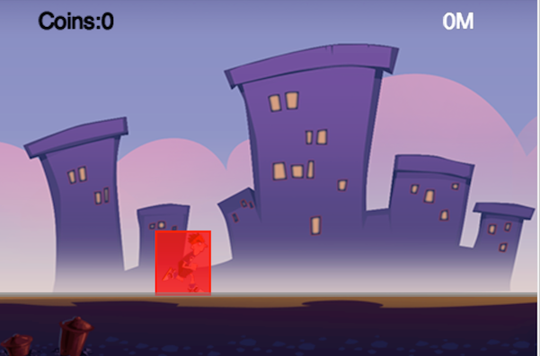

# TiledMap（瓦片地图）和Camera（摄像头）管理器

## 简介
在本教程中，我将告诉你如何将瓦片地图添加到跑酷游戏中作为新的背景。

我们还将学习如何让背景无限滚动和玩家无限移动。

这背后所有的魔力都是关于移动cocos2d的Camera。

## 做一些准备的东西
在我们亲手做之前，让我们先把资源文件和它们相应的名字加到游戏中。

### 设置Resource和Globals
由于我们在每个层中都会需要参考其它层，所以检索该层的最佳方法就是通过**标签**

添加以下代码到*globals.js*：

```
if(typeof TagOfLayer == "undefined") {
    var TagOfLayer = {};
    TagOfLayer.background = 0;
    TagOfLayer.Animation = 1;
    TagOfLayer.Status = 2;
};
```

在这里，我们给了背景层，动画层和状态层一个标签名，因此，我们可以通过标签检索其他层。

我们还需要在*resource.js*中添加资源变量：

```
//Our two tiled map are named s_map00 and s_map01.
var s_map = "map.png";
var s_map00 = "map00.tmx";
var s_map01 = "map01.tmx";
var g_resources = [
    //image
    //There are a lot of image defined here, we just omit it for clarifying.
    {src:s_map},
    {src:s_map00},
    {src:s_map01}
];
```

上面的代码都有注释，那么，让我们进入下一个章节。

### 启用Chipmunk调试绘图
如果我们要做Chipmunk物理引擎，最好启用调试绘图。这样我们将在调试过程中会更加得心应手。

添加以下代码到*AnimationLayer.js*的构造函数中：

```
this._debugNode = cc.PhysicsDebugNode.create(this.space);
// Parallax ratio and offset
this.addChild(this._debugNode, 10);
```

当你再次运行游戏时，您会看到在跑动的玩家上面有一个红色的框：



## TiledMap简介
TiledMap在2d游戏中是一个很常用的概念。这在建设大级别的地图和一些视差滚动背景中是很有用的。

TiledMap消耗比普通PNG文件更少的内存。如果你想建立一些巨大级别的地图，它绝对是你正确的选择。

事不宜迟，让我们深入到TiledMap.

### 设计和制作TiledMap背景
首先，你需要下载TiledMap。你可以从[这里](http://www.mapeditor.org/download.html)下载。由于TiledMap是一个跨平台的软件。这里有许多不同的版本。您可以根据你的操作系统选择一个版本。

下载瓦片编辑器后，您应该熟悉它的使用。你可能想看看它的[文档](https://github.com/bjorn/tiled/wiki)。

当你感到合适的瓦片，你可以用我们提供的tilesets设计自己的瓦片地图。

制作两个瓦片的地图的详细过程超出了本教程的范围。

（*注：如果你无法自行作出瓦片地图，你完全可以跳过这个过程，并使用我们提供的瓦片地图*）


### 用TiledMap替换先前的背景
现在，就是用我们棒极的瓦片地图替换旧的静态背景图的时候了。

我们将在*BackgroundLayer.js*实现这一点。首先，我们要加四个成员变量到BackgroundLayer类中：

```
map00:null,
map01:null,
mapWidth:0,
mapIndex:0,
```

我们应该删掉我们用来创建静态背景的旧代码。

（*注*：在这里，我注释掉的代码段，你可以安全地删除它们。）

```
//        var winSize = cc.Director.getInstance().getWinSize();
//
//        var centerPos = cc.p(winSize.width / 2, winSize.height / 2);
//        var spriteBG = cc.Sprite.create(s_PlayBG);
//        spriteBG.setPosition(centerPos);
//        this.addChild(spriteBG);
```

最后，我们将添加新的代码段来创建瓦片地图背景。

```
this.map00 = cc.TMXTiledMap.create(s_map00);
this.addChild(this.map00);
this.mapWidth = this.map00.getContentSize().width;
this.map01 = cc.TMXTiledMap.create(s_map01);
this.map01.setPosition(cc.p(this.mapWidth, 0));
this.addChild(this.map01);
```

保存所有修改并运行它：


在这里，我们添加两个地图。*map01*是*map00*右边的背景。在后面的章节中，我们将解释为什么我们要添加两个地图。

## Camera的简介
Camera似乎在3D图形编程中有点复杂。但它在2D游戏中是非常平凡的。在本节中，我们将不包括摄像头的理论。

我们也不去深入到移动节点的摄像头的实现细节。

我们只是告诉你如何实现移动节点的摄像头的逻辑。

### 移动Animation层的Camera
首先，我们需要移动动画层的摄像头。让玩家和chipmunk刚体会以同样的速度移动。

由于物理身体会向右无限移动并且精灵将同步它与物理身体的位置。

几秒钟后，玩家会在屏幕之外，只是因为它是在上一个教程。

因此，我们需要在每一帧都移动camear的X位置。以下是代码段:

```
getEyeX:function () {
    return this.sprite.getPositionX() - g_runnerStartX;
},
update:function (dt) {
    var eyeX = this.sprite.getPositionX() - g_runnerStartX;
    var camera = this.getCamera();
    var eyeZ = cc.Camera.getZEye();
    camera.setEye(eyeX, 0, eyeZ);
    camera.setCenter(eyeX, 0, 0);
}
```

这里,*getEyeX* 函数计算动画层摄像头的*增量*运动。并且在*update*函数中，每一帧我们都将修改该节点的camera。

你会发现，我们在调用camera的*setEye*和*setCenter*函数之前就已经存储了*EYEZ*变量。还有一个提示：你应该始终保持*setEye*和*setCenter*的第一个参数的值相同。否则你会受到一些有线显示问题。

最后，在AnimationLayer.js中，我们应该通过在*init*方法的末尾添加下面的代码来每一帧调用*update*方法：

```
this.scheduleUpdate();
```


### 移动Background层的Camera
设置的背景层运动的过程和我们在最后一节中做的几乎一样。除了我们需要做一些两个瓦片地图的计算。

那就让我们开始了吧。添加一个新的成员函数*checkAndReload*到BackgroundLayer：

```
    checkAndReload:function (eyeX) {
        var newMapIndex = parseInt(eyeX / this.mapWidth);
        if (this.mapIndex == newMapIndex) {
            return false;
        }
        if (0 == newMapIndex % 2) {
            // change mapSecond
            this.map01.setPositionX(this.mapWidth * (newMapIndex + 1));
        } else {
            // change mapFirst
            this.map00.setPositionX(this.mapWidth * (newMapIndex + 1));
        }
        this.mapIndex = newMapIndex;
        return true;
    },
```

当camera eyeX已经超过了屏幕的宽度时，表达式*parseInt(eyeX / this.mapWidth)*会得到一个大于0的值。

我们将使用*newMapIndex*来决定哪些地图需要移动，移动多少个像素。

那么，我们应该在每帧调用这个函数。

```
    update:function (dt) {
        var animationLayer = this.getParent().getChildByTag(TagOfLayer.Animation);
        var eyeX = animationLayer.getEyeX();
        this.checkAndReload(eyeX);
        var camera = this.getCamera();
        var eyeZ = cc.Camera.getZEye();
        camera.setEye(eyeX, 0, eyeZ);
        camera.setCenter(eyeX, 0, 0);
    }
```

最后，在background层的init方法的末尾，我们应该调用*scheduleUpdate*：

```
 this.scheduleUpdate();
```

## 封装
行。我们应该做一些最后的结束工作。

修改PlayScene的*onEnter*方法：

```
    onEnter:function () {
        this._super();
        this.initPhysics();
        this.addChild(new BackgroundLayer(), 0, TagOfLayer.background);
        this.addChild(new AnimationLayer(this.space),0, TagOfLayer.Animation );
        this.addChild(new StatusLayer(),0, TagOfLayer.Status);
        this.scheduleUpdate();
    },
```

恭喜！您已成功完成本教程。运行看试试。

*注*：如果您不希望显示chipmunk刚体的调试图纸信息。您可以放心地在PhysicsDebugNode的右后添加下面的代码：

```
this._debugNode.setVisible(false);
```

## 总结
在本教程中，我们已经了解了TiledMap和Cocos2d camera。当你开发一个物理上无限移动的游戏时，这两个概念是非常重要的。

您可以从[这里](res/Parkour.zip)下载整个项目。

## 下一章
在接下来的教程中，我们将添加金币和障碍到我们的游戏。在该教程中，我们也将学习如何重构我们的游戏代码，并使其更具可扩展性。

我们也会在PlayScene中做一些清理工作，还有封装Coin和Rock两个类。

在下一个教程中不断调整，编码快乐！