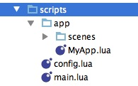
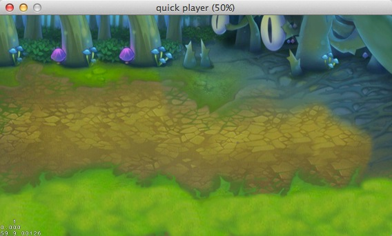
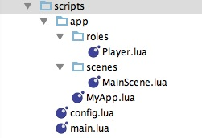
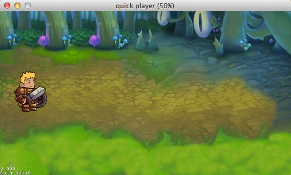
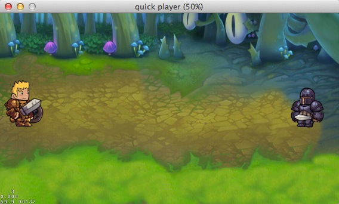

# 使用Quick-Cocos2d-x搭建一个横版过关游戏(一)
在前面的章节中我们讲解了Quick-Cocos2d-x的环境搭建和目录结构。接下来是动手自己做个游戏的时候了。我本人是比较喜欢横版过关类型的游戏的，这里就以搭建横版过关游戏来做讲解。

## 1. 创建工程
按照我们前面的文章描述的，用Quick的Player创建一个工程，我们这里取名叫做`Brave`。打开后看到的显示的还是一个HelloWorld界面。把我们的资源包中的背景图片拷贝到你自己工程的`res`目录下。

用编辑器打开scripts/下的lua文件，目录结构如下图所示：

我们打开config.lua文件，将里面的内容改成下面的：

	-- 0 - disable debug info, 1 - less debug info, 2 - verbose debug info
	DEBUG = 1

	-- display FPS stats on screen
	DEBUG_FPS = true

	-- dump memory info every 10 seconds
	DEBUG_MEM = false

	-- load deprecated API
	LOAD_DEPRECATED_API = false

	-- load shortcodes API
	LOAD_SHORTCODES_API = true

	-- screen orientation
	CONFIG_SCREEN_ORIENTATION = "landscape"

	-- design resolution
	CONFIG_SCREEN_WIDTH  = 1136
	CONFIG_SCREEN_HEIGHT = 640

	-- auto scale mode
	CONFIG_SCREEN_AUTOSCALE = "FIXED_HEIGHT"

在Quick中有关屏幕等内容的适配基本上都是通过config.lua文件来做的。我们来讲下这几个参数的意义。

- DEBUG: 这个参数是配置Quick工程的调试信息状态。0表示关闭调试信息，1表示打印少量调试信息，2表示打印标准调试信息。
- DEBUG_FPS: 是否显示FPS信息
- DEBUG_MEM: 是否要每10秒钟打印一次内存信息
- LOAD_DEPRECATED_API: 是否加载已经废弃了的API
- LOAD_SHORTCODES_API: 是否加载短代码
- CONFIG_SCREEN_ORIENTATION: 游戏中的屏幕方向，这个配置改变不了游戏对系统的屏幕方向，比如你在Android的工程中配置的是横屏，在这里设置竖屏，游戏运行后还会是竖屏。这里的参数是拿来适配的时候使用的。
- CONFIG_SCREEN_WIDTH: 屏幕宽度，横屏时是手机屏幕的高度
- CONFIG_SCREEN_HEIGHT: 屏幕高度，横屏时是手机屏幕的宽度
- CONFIG_SCREEN_AUTOSCALE: 屏幕适配的方式，比如FIXED_WIDTH和FIXED_HEIGHT

## 给游戏添加角色

### 添加背景

这样的话游戏的适配就做好了，接下来打开scenes下的MainScene.lua文件。
在MainScene.lua文件的ctor()中添加下面两行代码

	 -- 背景
    local background = display.newSprite("image/background.png", display.cx, display.cy)
    self:addChild(background)
    
打开Quick的Player，然后刷新Player，就能看到下面的图片了。

在上一篇文章中我们讲到过Quick框架中的display文件，里面放的是与显示相关的部分接口。比如我们想要新建一个精灵，我们会调用`display.newSprite`，类似的接口还有`display.newLayer`。基本的格式都是`display.newXXX`，"XXX"包括sprite、layer、node、scene等，详细的可以查看display文件。另外在display中还提供了很多实用的、方便的配置属性。比如：

- `display.width`和`display.height`表示屏幕宽度
- `display.cx`和`display.cy`表示屏幕的x轴中间位置和y轴中间位置
- `display.left`和`display.right`表示屏幕的最左边和最右边(x轴坐标为0和display.width的点)
- `display.top`和`display.bottom`表示屏幕的顶部和底部(y轴坐标为0和display.height的点)
- `display.CENTER、display.LEFT_TOP、display.CENTER_TOP`等分别表示node的锚点位置。

另外还有scene切换的效果、游戏的暂停和恢复等等一系列我们经常使用，代码重复量较多的方法，都在Quick中进行了一定程度的封装，大大方便了我们在开发过程中的使用。

**在Quick中使用图片有个规则，如果使用的图片是以`#`开头的话表示是从SpriteFrameCache中读取，如果没有使用`#`开头的话表示是直接从文件读取。**

### 添加玩家角色

作为一个横版过关游戏，玩家和敌人当然都是必不可少的。在scripts/app下添加一个文件夹，取名roles,在roles下添加一个Player.lua文件。添加后的文件结构是这样的：

打开Player.lua文件，添加以下内容：

	local Player = class("Player", function()
        local sprite = display.newSprite("#player1-1-1.png")
        return sprite
    end)

    function Player:ctor()
        
    end
    
    return Player
    
上面的代码中添加了一个以CCSprite为基类的Player类。在Quick中添加新的类的方式就是这么简单。是不是有点小激动呢。好了，添加完玩家类之后，我们要把玩家添加到当前场景中了。

在Quick中创建一个类很简单，廖大已经给我们留好了一个class方法，只需要使用这个方法就能轻松的创建一个类。我们来看下具体的创建方式：
首先第一句:

	local Player = class("Player", function()
    
如果有同学对实现比较感兴趣的话可以打开Quick的functions.lua文件，里面有class方法的具体实现。我们这里只做使用的讲解。class方法有两个参数，第一个参数是类名。第二参数可以通过两种形式传递参数，一种是传入一个函数，另一种方式是传入一个Quick的类或者是Lua对象。当传入函数时，新创建的类会以传入的函数作为构造函数。当传入的是一个对象时，会以传入的对象为父类派生下来。

在类创建完成后必须要返回你所创建的类变量，这样外部的脚本调用时才能知道这个类的存在。

#### 添加玩家角色到场景中

打开MainScene.lua文件，在MainScenen:ctor()中添加下面代码：

    self.player = Player.new() -- display.newSprite("#player1-1-1.png")
    self.player:setPosition(display.left + self.player:getContentSize().width/2, display.cy)
    self:addChild(self.player)
    
在文件开始的地方添加:

	local Player = import("..roles.Player")
    
打开Quick的Player，刷新显示，你会看到这样的结果：

### 添加敌人

和添加玩家角色类似，我们添加一个敌人角色，在roles下新建个Enemy1.lua，将`display.newSprite('#player1-1-1.png')`改成`display.newSprite('#enemy1-1-1.png')`,其他同Player.lua中的代码一样，完成后的代码如下：
	
	local Enemy1 = class("Enemy1", function()
    	return display.newSprite("#enemy1-1-1.png")
	end)

	function Enemy1:ctor()

	end

	return Enemy1
	
在MainScene.lua的文件头加入

	local Enemy1 = import("..roles.Enemy1")
	
在MainScene:ctor()中加入

	self.enemy = Enemy1.new()
    self.enemy:setPosition(display.right - self.enemy:getContentSize().width/2, display.cy)
    self:addChild(self.enemy)

添加完后，刷新Quick的Player，你将会看到下面的画面：

## 总结

这篇文章里主要讲到了Quick里工程的结构，怎样创建新的类，和添加精灵到场景中。刚入门的同学可以参考着加入更多的元素到场景中。
下篇文章我们会介绍怎么在场景里添加触摸事件、给角色添加动画等功能。