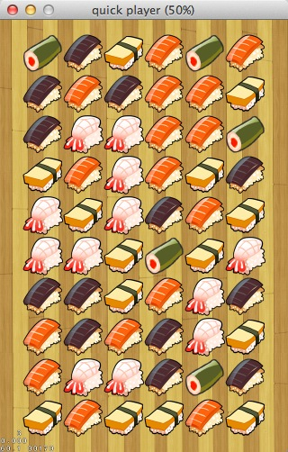
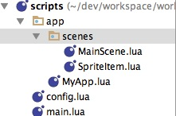
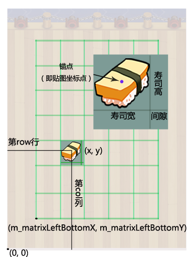

# Quick-Cocos2d-x实现三消游戏

在前面我们讲过了基本的游戏界面的搭建，我们在这章里讲讲游戏行业里常见的三消游戏的写法。因为UI元素之类的编写我们已经讲过，我们就不多讲了，我们在这一章里主要讲Quick来实现三消游戏的算法。下面是游戏运行起来后的效果图：



## 基本结构

我们先来了解下基本的结构，下图为我们游戏写出来后的基本文件结构图：



其中SpriteItem为我们点击的寿司精灵类，包含阵列中每个寿司精灵元素的信息。MainScene是我们游戏的主界面，包含所有界面的操作。接下来我们来介绍下SpriteItem吧！

## SpriteItem类

SpriteItem是我们游戏里的寿司精灵。比如下面就是游戏中的一个寿司精灵。


我们来看下寿司精灵类是怎么定义的。打开SpriteItem.lua文件，我们可以看到下面的代码：

```
local SpriteItem = class("SpriteItem", function(batchNode, row, col, imageIndex)
    math.newrandomseed()
    imageIndex = imageIndex or math.round(math.random()*1000)%5 + 1
    local item = display.newSprite("#sushi_"  .. imageIndex .. 'n.png')
    item.m_imageIndex, item.m_row, item.m_col = imageIndex, row, col
    item.m_batchNode = batchNode
    item.m_isActive = false
    return item end
)
```

我们从上面的代码可以看出，在创建SpriteItem类的对象的时候我们给他传入了4个参数：

* batchNode: 精灵类在创建完成后会加入到CCSpriteBatchNode中来提高绘制速度，这个参数传入的就是要加入的batchNode;
* row: 精灵所处的行;
* col: 精灵所处的列;
* imageIndex: 图片id

在没有指定imageIndex的情况下，我们会随机的生成一个图片id。接下来我们把所有的传入的信息记录到创建的精灵中，并返回。

```
function SpriteItem:setActive(active)
    self.m_isActive = active

    local frame
    if (active) then
        frame = display.newSpriteFrame("sushi_"  .. self.m_imageIndex .. 'h.png')
    else
        frame = display.newSpriteFrame("sushi_"  .. self.m_imageIndex .. 'n.png')
    end

    self:setDisplayFrame(frame)

    if (active) then
        self:stopAllActions()
        local scaleTo1 = CCScaleTo:create(0.1, 1.1)
        local scaleTo2 = CCScaleTo:create(0.05, 1.0)
        self:runAction(transition.sequence({scaleTo1, scaleTo2}))
    end
end
```

`setActive`函数用于在点中后切换图片，比如我们最开始的精灵图片为sushi_1n.png，在选中后会切换为sushi_1h.png，比如下面的图，我们选中了两个黑色的寿司，图片也就切换成下面的图片那样了：


为了更形象和生动，我们给图片增加了两个缩放的动画。

接下来的几个函数是获取SpriteItem的一些成员变量的信息，包括`active`、`col`、`row`、`ImageIndex`信息。`getContentWidth`返回的是每个元素的宽度。事实上，上面的写法更类似于C/C++中的写法，在Lua中更多的会使用table的写法。

## 主场景

我们在文章开始的时候看到的大图就是我们游戏启动之后的游戏界面。从主界面的图中可以看出，我们游戏所需要的功能和元素。


### 初始化寿司精灵阵型

我们打开MainScene.lua文件，找到MainScene:ctor()，可以看到如下的代码

```
function MainScene:ctor()

    display.newSprite("background.png"):pos(display.cx,display.cy):addTo(self)
    display.addSpriteFramesWithFile("sushi.plist", "sushi.pvr.ccz")

    self.m_level = 1
    self.m_rowLenght = 10
    self.m_colLenght = 6
    self.m_goalScore = 100
    self.m_leftMovements = 10
    self.m_levelScore = 0

    self.m_matrixLeftBottomX = (display.width - SpriteItem.getContentWidth() * self.m_colLenght - (self.m_colLenght - 1) * ITEM_GAP) / 2
    self.m_matrixLeftBottomY = (display.height - SpriteItem.getContentWidth() * self.m_rowLenght - (self.m_rowLenght - 1) * ITEM_GAP) / 2

    -- 创建BatchNode
    self.m_batchNode = display.newBatchNode("sushi.pvr.ccz")
    self:addChild(self.m_batchNode)

    -- init array
    local arraySize = self.m_rowLenght * self.m_colLenght
    self.m_matrix = {}
    self.m_acticves = {}

    -- active score lable
    self.m_labelActiveScore = ui.newTTFLabel({text="", font="", size=26})
    self.m_labelActiveScore:setColor(display.COLOR_WHITE)
    self.m_labelActiveScore:setPosition(ccp(display.width / 2, 55))
    self:addChild(self.m_labelActiveScore)

    local touchLayer = display.newLayer()
    touchLayer:setTouchEnabled(true)
    touchLayer:addNodeEventListener(cc.NODE_TOUCH_EVENT, function (event)
        print(event.name, event.x, event.y)
        if(event.name == "ended") then
            self:touchEndEvent(event.x, event.y)
        else
            return true
        end
    end)
    self:addChild(touchLayer)
    self:initMartix()
end
```

#### 插入背景图

首先，我们要给游戏添加个背景图：

	display.newSprite("background.png"):pos(display.cx,display.cy):addTo(self)
	
`display.newSprite`创建了一个background.png为纹理的精灵，pos是quick里给CCNode设置位置的函数，addTo将创建的精灵添加到场景中。相对于Cocos2d-x中添加精灵的方法，这样的编写方式相对来说更加简单明了。

#### 添加数据到缓存中

在游戏处理中经常使用的有两种缓存

1. CCSpriteFrameCache
2. CCSpriteBatchNode

接下来，我们来讲解下着两种缓存。

游戏中一般会有比较多的图片资源，如果有很多很多的资源，那加载这些资源是非常费时间和内存的，所以如何高效地使用图片资源对于一款游戏是相当重要的。在Cocos2d中，我们一般会将图片资源打包成一张大图，这样加载图片不仅节省了空间，而且还提升了速度。

在Cocos2d-x引擎开发中，常又到的两种图片编辑打包工具，即 Zwoptex 和 Texturepacker。我们的教程里用到的是Texturepacker，你可以到它的官方网站下载并安装。

我们用TexturePacker工具打包生成了plist和pvr.ccz文件，那么下一步，我们就该获取plist中的信息了。 

Cocos2d中SpriteFrameCache通常用来处理plist文件，并能与SpriteBatchNode结合使用来达到批处理渲染精灵的目的。

* 精灵帧缓存类SpriteFrameCache 

精灵帧缓存类SpriteFrameCache 用来存储精灵帧，缓存精灵帧有助于提高程序的效率。 SpriteFrameCache是一个单例模式，不属于某个精灵，是所有精灵共享使用的。

* 精灵批处理节点SpriteBatchNode 

当你需要渲染显示两个或两个以上相同的精灵时，如果逐个渲染精灵，每一次渲染都会调用 OpenGL ES 的 draw 函数，这样做自然降低了渲染效率。不过幸好，Cocos2d为开发者提供了一个SpriteBatchNode类，它能一次渲染多个精灵。并可以用来批处理这些精灵，比如我们游戏中的寿司精灵。用SpriteBatchNode作为父层来创建子精灵，并且使用它来管理精灵类，这样可以提高程序的效率。

在init()方法中调用SpriteFrameCache的addSpriteFramesWithFile方法，传入plist文件名称，它会从plist属性列表文件的元数据部分获取各个纹理的纹理名，载入到纹理缓存中。并解析属性列表文件，使用SpriteFrame对象来内部地跟踪所有精灵的信息。

在Cocos2d中高效使用图片总结：

**使用TexturePacker打包图片成pvr.ccz文件，使用SpriteBatchNode优化绘制，使用SpriteFrameCache缓存读取，使用spriteWithFrameName获取单张图片。**

#### 寿司矩阵起始点的初始化

在游戏中，我们用来存储SushiSprite的数据结构是一个指针数组，其实它也就相当于一个矩阵。寿司矩阵的起始点其实就是寿司精灵开始布局的起始点，在我们的游戏教程中，它位于屏幕的左下角，它由左下角的点开始逐行逐列的初始化寿司精灵。计算该点的代码位于MainScene中的positonOfItem方法中，具体如下：

	local x = self.m_matrixLeftBottomX + (SpriteItem.getContentWidth() + ITEM_GAP) * (col-1) + SpriteItem.getContentWidth() / 2
    local y = self.m_matrixLeftBottomY + (SpriteItem.getContentWidth() + ITEM_GAP) * (row) + SpriteItem.getContentWidth() / 2

其原理可简单描述为下图所示的过程（只以计算m_matrixLeftBottomX的值为例，即X轴方向坐标值）： 


看原理图其实就已经一目了然了，上图N代表的是横向布局的寿司精灵数，m_matrixLeftBottomX的值 ＝ （ 屏幕的宽 － 寿司的宽＊N个寿司 － （ N-1 ）＊寿司之间的间隙） ／ 2。

#### 如何布局

加载完寿司精灵图片，计算好寿司精灵布局的起始点以后，我们就可以开始寿司精灵的布局和它的下落显示了，下面是代码行：

	function MainScene:initMartix()
	    for row = 0, self.m_rowLenght-1 do
	        for col = 1, self.m_colLenght do
	            if (1 == row and 1 == col) then
	                self:createAndDropItem(row, col)
	            else
	                self:createAndDropItem(row, col)
	            end
	        end
	    end
	end
	
	function MainScene:createAndDropItem(row, col, imgIndex)
	    local newItem = SpriteItem.new(self.m_batchNode, row, col, imgIndex)
	    local endPosition = self:positionOfItem(row, col)
	    local startPosition = ccp(endPosition.x, endPosition.y + display.height / 2)
	    newItem:setPosition(startPosition)
	    local speed = startPosition.y / (2 * display.height)
	    newItem:runAction(CCMoveTo:create(speed, endPosition))
	    self.m_matrix[row * self.m_colLenght + col] = newItem
	    self.m_batchNode:addChild(newItem)
	end
	
	function MainScene:positionOfItem(row, col)
	    local x = self.m_matrixLeftBottomX + (SpriteItem.getContentWidth() + ITEM_GAP) * (col-1) + SpriteItem.getContentWidth() / 2
	    local y = self.m_matrixLeftBottomY + (SpriteItem.getContentWidth() + ITEM_GAP) * (row) + SpriteItem.getContentWidth() / 2
	    return ccp(x, y)
	end


我们先来看怎样获取指定行列精灵在屏幕上的坐标值，即positionOfItem(row, col)方法的实现。同样附上原理图，方便理解。 



上图矩阵的起始点已知（m_matrixLeftBottomX，m_matrixLeftBottomY），计算第row行col列的寿司精灵的坐标值。 

需要说明的是，精灵图片的锚点默认在图片的中心位置，锚点关系到纹理贴图的位置。例如：如果把一个精灵设置在（0，0）点的位置，那么它的锚点也就会和（0，0）点重合，在屏幕上也就只能显示四分之一的精灵。所以往往为了避免这种问题，在贴精灵图片的时候我们会加上它宽高的一半。 

言归正传，结合上面的原理图，你将很容易理解（x, y）是如何计算的。

最后，寿司精灵的创建和下落方法：createAndDropSushi(row, col)。
寿司精灵的创建一幕了然，它的下落是通过让寿司精灵执行MoveTo动作来实现的，具体方法是把寿司精灵的起点设置在比终点（可以通过positionOfItem方法获取）高size.height / 2的地方，再让其以一定的速度从起点移动到终点。原理如下图所示：

