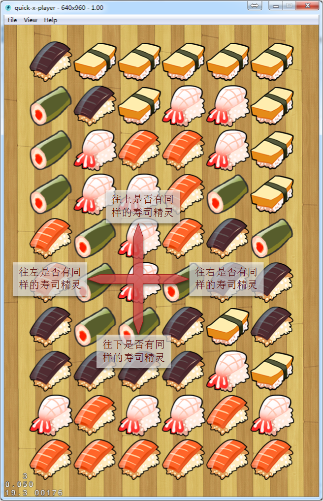

# Quick-cocos2d-x实现三消游戏(二)

> 本章介绍
在上一节《使用Cocos2d-x制作三消类游戏Sushi Crush——第一部分》中，我们完成了分辨率的适配和寿司精灵的创建、布局、下落。按照三消游戏的游戏制作流程，接下来我们实现寿司精灵的消除操作。本节中我们将设计整个游戏的主要逻辑算法。


在实现消除算法之前先来整理整理逻辑！我们点中屏幕后，如果相邻的两个或两个以上的寿司精灵是一样的，那么我们会把这些寿司精灵都消除掉，并“播放”爆炸特效，同时新建寿司精灵填补空位。

整理好逻辑后，现在就开始我们的工作吧。

## 游戏主逻辑
对于一个游戏而言，只存在场景、层、精灵等实际的元素往往是不够的，我们需要对这些元素进行必要的逻辑检测和处理，例如精灵的移动、碰撞、动作等等，而且这些逻辑检测一般情况下是需要及时做出反馈的。这些检测我们有的通过游戏的update方法来处理，有的通过外部事件的响应来处理。

在这个游戏中，我们是通过触摸事件来检测是否能够消除的。首先，我们注册一个触摸事件。

``` lua
local touchLayer = display.newLayer()
touchLayer:setTouchEnabled(true)
touchLayer:addNodeEventListener(cc.NODE_TOUCH_EVENT, function (event)
    print(event.name, event.x, event.y)
    if(event.name == "ended") then
        self:touchEndEvent(event.x, event.y)
    else
        return true
    end
end)
```
我们给Scene添加了一个可以触摸的层，在有触摸事件时会调用注册的匿名函数，匿名函数的参数会把当前的触摸事件名称和触摸位置下发过来。当我们检测到触摸的事件为"ended"时，调用MainScene的touchEndEvent函数。

``` lua
function MainScene:touchEndEvent(x,y)
    local item = self:itemOfPoint(ccp(x,y))
    if (item) then
        if (item:isActive()) then
            -- 1. clean actived items, remove from array, explosion animation, score animation.
            self:removeActivedItems();
            -- 2. reform metrix
            self:dropItems();
            -- 3. check for gameover logic.
        else
            -- 1. clean old actived items
            self:inactiveItems();
            -- 2. active Neighbor all items
            self:activeNeighborItems(item);
        end
    end
end
```

在Quick中触摸的类型有如下几种：

- "began": 手指按下，这个处理是要返回true或者false，返回false不继续往下执行
- "moved": 手指移动
- "ended": 手指离开屏幕
- "cancelled": 取消触摸事件

像我们上面的代码只处理了触摸结束的事件，所以只判断了event.name == "ended"的情况。在按下后，我们首先判断点中的是哪一个寿司精灵，精灵是不是首次点中，如果是首次点中的话将旁边的相同的寿司精灵全部变成选中状态，如果不是首次选中的话，将寿司精灵消除并且生成新的寿司精灵。

我们先通过item:isActive()函数来判断item是否是选中状态，如果选中状态我们就调用removeActiveItems()函数来把选中的精灵删除掉，并且通过dropItems()产生新的寿司精灵掉落。如果不是选中状态，我们就会让点中的寿司精灵和旁边一样的寿司精灵处于选中状态。

首先我们来看下判断触摸位置的精灵是哪个的函数
``` lua
function MainScene:itemOfPoint(point)
    local item = nil
    local rect = CCRectMake(0, 0, 0, 0)

    for row = 0, self.m_rowLenght-1 do
        for col = 1, self.m_colLenght do
            item = self.m_matrix[row * self.m_colLenght + col]
            if (item) then
                rect.origin.x = item:getPositionX() - (item:getContentSize().width / 2)
                rect.origin.y = item:getPositionY() - (item:getContentSize().height / 2)
                rect.size = item:getContentSize()
                if (rect:containsPoint(point)) then
                    return item
                end
            end
        end
    end
end
```

在点下后，触摸响应函数会传一个触摸位置的值给itemOfPoint，我们根据point的值和列表中的寿司精灵逐一比对，如果有包含该点的寿司精灵，就表示这个寿司精灵是我们要选中的寿司精灵，把它返回给上一层的函数。

接下来我们判断到点中的寿司精灵没有被选中的话，会选中点中的精灵和他旁边一样的精灵，算法简单可以通过下面的图简单的描述下：



我们来看下具体的实现代码，打开MainScene:activeNeighborItems函数，我们可以看到如下的代码：

```lua
function MainScene:activeNeighborItems(item)
    self.m_activeCount = 0
    local toCheck = nil
    local temp = nil

    local checkList = {}
    table.insert(checkList, item)

    -- before check, active item itself.
    item:setActive(true)
    while (#checkList > 0) do

        toCheck = checkList[1]
        table.remove(checkList, 1)

        -- get and remove the front of list and check its neighbor
        self.m_activeCount = self.m_activeCount + 1
        -- add to activeItems array
        table.insert(self.m_acticves,toCheck)

        print("ToCheck's row, col", toCheck:getRow(), toCheck:getCol())
        -- check left
        if (toCheck:getCol() > 1) then
            temp = self.m_matrix[toCheck:getRow() * self.m_colLenght + toCheck:getCol() - 1]
            print(toCheck:getCol() .. "", temp:getImgIndex() .. "")
            if (false == temp:isActive() and toCheck:getImgIndex() == temp:getImgIndex()) then
                temp:setActive(true)
                -- just avoid double add to checklist, do NOT m_activeCount++ here.
                table.insert(checkList,temp)
            end
        end

        -- check right
        if (toCheck:getCol() < (self.m_colLenght)) then
            temp = self.m_matrix[toCheck:getRow() * self.m_colLenght + toCheck:getCol() + 1]
            if (false == temp:isActive() and toCheck:getImgIndex() == temp:getImgIndex()) then
                temp:setActive(true)-- just avoid double add to checklist, do NOT m_activeCount++ here.
                table.insert(checkList, temp)
            end
        end

        -- check up
        if (toCheck:getRow() > 0) then
            temp = self.m_matrix[(toCheck:getRow() - 1) * self.m_colLenght + toCheck:getCol()]
            if (false == temp:isActive() and toCheck:getImgIndex() == temp:getImgIndex()) then
                temp:setActive(true) -- just avoid double add to checklist, do NOT m_activeCount++ here.
                table.insert(checkList, temp)
            end
        end

        -- check down
        if (toCheck:getRow() < (self.m_rowLenght-1)) then
            temp = self.m_matrix[(toCheck:getRow() + 1) * self.m_colLenght + toCheck:getCol()]
            if (false == temp:isActive() and toCheck:getImgIndex() == temp:getImgIndex()) then
                temp:setActive(true)-- just avoid double add to checklist, do NOT m_activeCount++ here.
                table.insert(checkList, temp)
            end
        end
    end

    if (self.m_activeCount < 2) then
        item:setActive(false)
        self.m_activeCount = 0
--        self.m_acticves:removeAllObjects()
        self.m_acticves = nil
        self.m_acticves = {}
    else
        SimpleAudioEngine:sharedEngine():playEffect("music/itemSelect.mp3")
        self:countAvtices()
        self:displayActiveScore()
    end
end
```

从上面的代码中，我们可以看出，程序的逻辑和我们前面说描述的完全一致，都是从点中位置往四个方向分别判断是否有相同的寿司精灵，如果有的话就选中并且以这个寿司精灵为基础，往它的其他三个方向找，循环执行。

当然，如果我们点击的是已经被选中的寿司精灵的话，我们会把他们都移除掉，在移除的同时，我们会播放对应的音效。移除功能的代码可以参看MainScene:removeActivedItems(minusStep)。

关于这个游戏我们就介绍到这里，代码的地址是：[https://github.com/rainswan/Crush.git](https://github.com/rainswan/Crush.git)，使用的Quick版本为2.2.5plus。