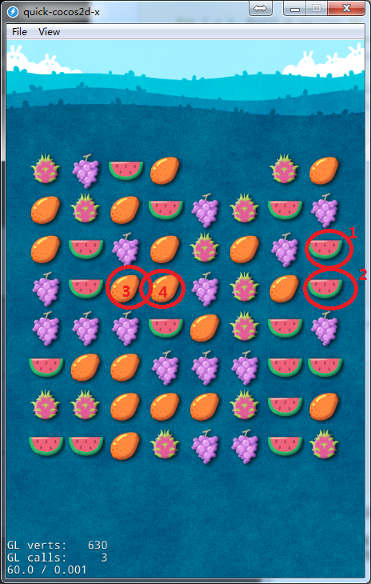
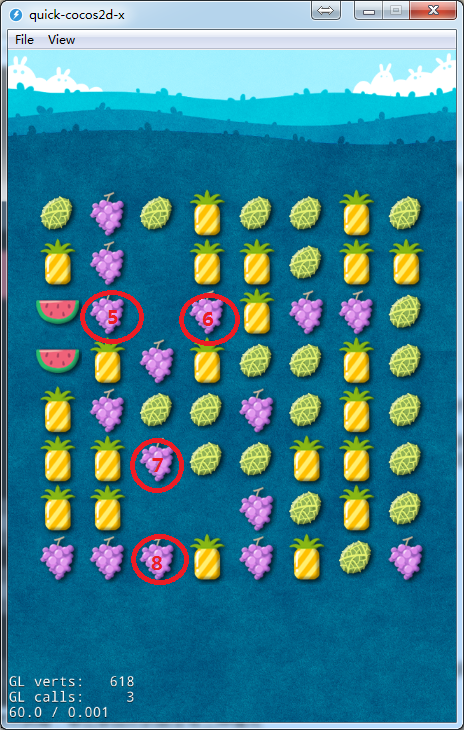
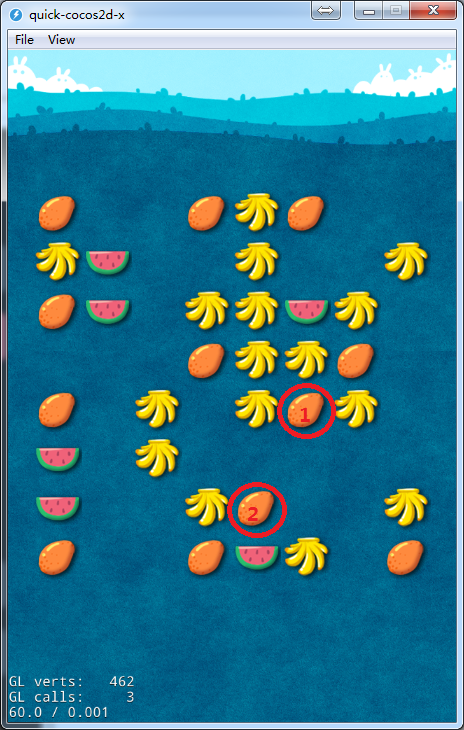
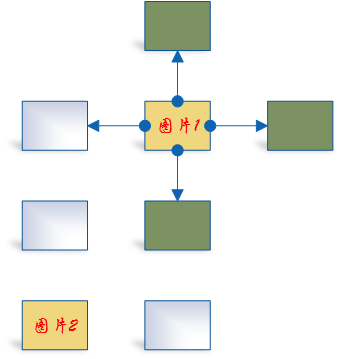

# Quick-Cocos2d-x连连看之一——连连看算法分析

> 开发环境:
Windows 7 64bit
Quick-Cocos2d-x 3.2rc0

>章节内容:
本章主要是介绍连连看常用的算法，包括连连看的地图生成算法，连连看的匹配和消除算法。不涉及具体的代码实现。

相信很多同学在自己的游戏生涯里面都玩过连连看游戏，那么连连看游戏是怎么做的呢？用Quick-Cocos2d-x怎么来实现一个连连看游戏呢？我们接下来的几篇文章为大家介绍一下简单的连连看游戏是怎么做的。

在这章里，我们先来介绍连连看常用的一些算法。其实连连看使用的算法并不多，主要还是集中在地图生成算法、匹配消除算法。我们先来看看地图生成算法

## 地图生成算法

连连看的地图其实可以简单的看成一个二维数组，数组的大小取决于所要绘制的元素的个数。但是我们我们必须要保证元素是成对出现的，也就是说，假如显示的数组的长为m，宽为n，那么必须要保证** m \* n / 2 == 0 **。

现在我们来看下地图生成的几种算法(以5*6)的数组为例：

1. 生成一个m*n/2的数组，然后再把数组的前一半拷贝到数组的后一半，随机进行打乱。

    我们用lua来演示下吧:

    ```lua
    matrix = {}
    total_row = 5
    total_col = 6
    total_type = 5

    for i = 1, (total_row*total_col)/2 do
        matrix[i] = math.random(1, 5)
    end

    for i = 1, (total_row*total_col)/2 do
        table.insert(matrix, matrix[i])
    end
    
    ==> 1,3,1,5,3,3,
        2,5,5,4,1,5,
        4,3,2,1,3,1,
        5,3,3,2,5,5,
        4,1,5,4,3,2,
    ```
    从生成的数据可以看出，这种方法离散度并不是太强。我们还需要再随机一次，将原有的数据打乱。
    
    ```lua
    for seq = 1, 13*2 do

        for i = 1, #self.m_sprites do
            local row_org = math.random(1, total_row)
            local col_org = math.random(1, total_col)

            local row_dest = math.random(1, total_row)
            local col_dest = math.random(1, total_col)

            matrix[(row_org-1)*total_col + col_org], matrix[(row_dest-1)*total_col + col_dest]
            = matrix[(row_dest-1)*total_col + col_dest], matrix[(row_org-1)*total_col + col_org]
        end
    end
    
    ==> 5,2,1,3,1,3,
        3,5,1,3,3,4,
        3,5,4,1,2,4,
        3,2,1,1,5,5,
        5,2,3,5,5,4,
    
	```

2. 模板法。所谓模板就是手动或者用工具建立一个模板，在生成地图时，根据模板的设置来生成地图。比如我们生成一个地图格式如下:

	```lua
    map = {
    	1,2,3,4,5,6,
        5,4,3,2,1,6,
        1,2,3,4,5,5,
        3,5,4,2,1,6,
        2,4,3,5,2,1
    }
    ```
    我们可以根据上面的地图模板生成对应的精灵并且显示出来。其实这个方法应该是最有效的生成地图的方法，能适应各种需求。

上面描述的方法中，我们都没有确定地图是否有解。对于模板法其实我们在生成地图的时候就可以生成一个有解的地图；对于随机生成法来说就比较麻烦了，我们必须要去解地图。而解地图就要用到我们下面要讲述的匹配消除算法了。

##匹配和消除算法

玩过连连看游戏的同学都知道，连连看游戏的基本规则有两条：

* 两个图片相同
* 两个图片之间的连接拐角不能超过两次

满足这两个条件才能够消除。我们就以这两个条件作为入口来进行判断。两个图片相同这个条件其实很好判断，这里就不多说了，我们主要还是来看怎么判断两个图片的连接是否超过两次拐角。

既然不能超过两次拐角，那么很自然的就会有三种情况

* 一条直线直接连通
* 一个拐角，两条直线连通
* 两个拐角，三条直线连通

我们一条一条来分析：

1. 一条直线直接连通

	一条连通有下面的几种情况，分别是纵向相邻(1,2)，横向相邻(3,4)，横向中间为空(5,6)，纵向中间为空(7,8)。
    
     
    
    如果是相邻的话我们只要判断两个元素在行或者列上是否只差1就可以了。同样的，对于中间为空的两个元素，我们只需要判断两个之间是否有元素存在就可以了。
    
2. 一个拐角，两条直线连通
	
    两个图片通过一个拐角连接的例子可以看下面的图片中的1,2。
    
    
    
    对于这种情况，我们可以这样做：
	
    * 检查图片1的左边挨着的元素是否为空，如果为空(为空的项表示中间没有图片了)，检查该元素是否和2能直接连通，如果能够直接连通，那么两个元素能够经过一个拐角连通，如果不能连通，继续往左执行本操作；
    * 检查图片1的右边挨着的元素是否为空，如果为空(为空的项表示中间没有图片了)，检查该元素是否和2能直接连通，如果能够直接连通，那么两个元素能够经过一个拐角连通，如果不能连通，继续往右执行本操作；
    * 检查图片1的上面挨着的元素是否为空，如果为空(为空的项表示中间没有图片了)，检查该元素是否和2能直接连通，如果能够直接连通，那么两个元素能够经过一个拐角连通，如果不能连通，继续往上执行本操作；
    * 检查图片1的下面挨着的元素是否为空，如果为空(为空的项表示中间没有图片了)，检查该元素是否和2能直接连通，如果能够直接连通，那么两个元素能够经过一个拐角连通，如果不能连通，继续往下执行本操作。

	上面的描述可能有点抽象，我们以一个图片作为例子来讲述：
    
    
    
    上面的图中，背景为白色的方框表示没有元素，背景为黄色的方框表示起点和重点，绿色的方框表示有图片。图中，我们从左边开始找，找到的第一个图片为空，再检测它是否能和图片2连通，如果能连通，说明图片1和图片2可以通过一个拐角连通。其他的情况都可以按照我们上面的步骤向四面去扩展来检查。
    
3. 两个拐角，三条直线连通

	对于两个拐角的情况，我们可以通过上面的介绍的步骤来做扩展。比如我们现在图片摆在图片1的正下方第二个图片位置。这时我们可以分别从图片1和图片2出发，往四个方向来执行上面的2的步骤。
    * 从图片1往左判断是否为空，为空的话，就根据上面2中的方法来判断这个位置和图片2是否能经过一个拐角连通。如果不能连通的话，就继续往左遍历；
    * 从图片1往右判断是否为空，为空的话，就根据上面2中的方法来判断这个位置和图片2是否能经过一个拐角连通。如果不能连通的话，就继续往右遍历；
    * 从图片1往上判断是否为空，为空的话，就根据上面2中的方法来判断这个位置和图片2是否能经过一个拐角连通。如果不能连通的话，就继续往上遍历；
    * 从图片1往下判断是否为空，为空的话，就根据上面2中的方法来判断这个位置和图片2是否能经过一个拐角连通。如果不能连通的话，就继续往下遍历。

上面的这些内容基本上就把基本的连连看的算法提出来了，如果还有更高阶的算法也欢迎大家提出来。在下一篇文章中，会给大家讲下怎么基于以上的算法来实现一个连连看游戏。